# AgriSense AI — Project Report

**Project Title:** AgriSense AI: Intelligent Farm Management and Decision Support Platform for Small-Scale Farmers

| Field              | Details                                                    |
| ------------------ | ---------------------------------------------------------- |
| **Document Type**  | Project Report                                             |
| **Version**        | 1.0                                                        |
| **Date**           | June 2026                                                  |
| **Project Domain** | Agriculture Technology (AgriTech) / Artificial Intelligence |
| **Target Users**   | Small-scale farmers, Village-level coordinators             |

---

## Table of Contents

1. [Abstract](#1-abstract)
2. [Introduction](#2-introduction)
3. [Problem Statement](#3-problem-statement)
4. [Project Objectives](#4-project-objectives)
5. [Scope of the Project](#5-scope-of-the-project)
6. [Literature Survey](#6-literature-survey)
7. [System Architecture](#7-system-architecture)
8. [Core Modules](#8-core-modules)
9. [Data Design](#9-data-design)
10. [User Roles & Access Control](#10-user-roles--access-control)
11. [Functional Requirements](#11-functional-requirements)
12. [Non-Functional Requirements](#12-non-functional-requirements)
13. [User Workflows](#13-user-workflows)
14. [Suggested Technology Stack](#14-suggested-technology-stack)
15. [Feasibility Analysis](#15-feasibility-analysis)
16. [Risk Analysis](#16-risk-analysis)
17. [Future Scope](#17-future-scope)
18. [Conclusion](#18-conclusion)
19. [References](#19-references)

---

## 1. Abstract

AgriSense AI is a cloud-enabled, AI-powered agricultural management platform purpose-built for village-level and small-scale farming communities. The platform empowers farmers and local coordinators to digitally manage farm plots, crop records, agricultural inputs, crop health reports, weather alerts, expense tracking, and AI-based recommendations — all through an intuitive, multilingual, and voice-enabled interface.

The system integrates map-based land marking, image-based crop health analysis using artificial intelligence, OCR-powered label reading from fertilizer and pesticide packets, real-time weather intelligence, a comprehensive recommendation engine, and a simulation module for testing and demonstration. Designed as a practical, implementable project, AgriSense AI leverages free tools, locally generated data, and a demo-ready architecture to address the critical gap between modern agricultural technology and the farmers who need it most.

> [!NOTE]
> This project is designed as a college-level implementation that can be deployed locally using free tools and a spare system as a server, while maintaining a future-ready architecture for cloud deployment.

---

## 2. Introduction

### 2.1 Background

Agriculture remains the backbone of rural economies, yet small-scale farmers continue to face significant challenges in managing their farming operations. Traditional methods of record-keeping are manual, error-prone, and result in the loss of critical historical data that could otherwise inform better decision-making.

The rapid advancement of Artificial Intelligence, computer vision, natural language processing, and Internet of Things (IoT) technologies presents a unique opportunity to bridge this gap. However, most existing smart agriculture solutions are designed for large-scale commercial farms and are prohibitively expensive for small-scale farming communities.

### 2.2 Motivation

AgriSense AI was conceived to democratize access to intelligent agricultural tools. The platform is motivated by the following observations:

- **Manual record-keeping** leads to poor tracking of crop cycles, input usage, and expenses.
- **Delayed detection** of crop diseases and pest infestations causes significant yield loss.
- **Weak planning** of irrigation, fertilizer application, and spraying schedules reduces efficiency.
- **Language barriers** and **low digital literacy** prevent farmers from accessing existing digital tools.
- **Lack of centralized data** makes it impossible for coordinators to provide effective group-level guidance.

### 2.3 Project Overview

AgriSense AI addresses these challenges through a modular, extensible platform that combines:

| Capability                 | Description                                                    |
| -------------------------- | -------------------------------------------------------------- |
| **Digital Record-Keeping** | Farm plots, crops, inputs, expenses, and irrigation logs       |
| **AI-Powered Analysis**    | Crop health assessment via image upload and computer vision     |
| **Weather Intelligence**   | Location-based forecasts, alerts, and actionable advisories     |
| **Smart Recommendations**  | Context-aware suggestions based on crop history and conditions  |
| **Multilingual & Voice**   | Regional language support with text-to-speech for accessibility |
| **Simulation Module**      | Controlled testing of weather and crop disease scenarios        |

---

## 3. Problem Statement

Farmers — particularly those operating at small scale in rural and village-level communities — often manage their cultivation activities entirely through manual, informal methods. This leads to:

1. **Poor Record-Keeping:** No structured storage of crop histories, input applications, or expense data.
2. **Delayed Problem Detection:** Crop diseases, pest damage, and nutrient deficiencies are often noticed too late for effective intervention.
3. **Weak Planning:** Irrigation schedules, fertilizer timing, and pesticide application are based on intuition rather than data.
4. **Loss of Historical Data:** Valuable farming insights accumulated over seasons are never captured or analyzed.
5. **Language & Literacy Barriers:** Many farmers struggle to interact with technology-based solutions due to language limitations and low digital literacy.
6. **Limited Expert Access:** Access to agricultural consultants and expert advice is geographically constrained and often expensive.

> [!IMPORTANT]
> There is a critical need for a **simple, affordable, and scalable** digital platform that helps farmers and local coordinators organize farming data, monitor crop health, receive timely alerts, and make better decisions using AI-powered support.

---

## 4. Project Objectives

The primary objectives of AgriSense AI are:

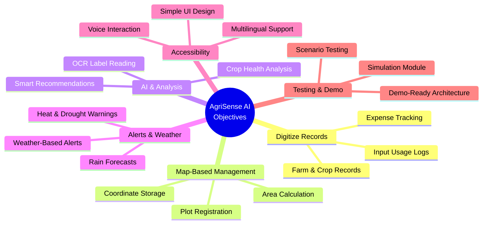

### Detailed Objectives

| # | Objective                                                        | Priority |
| - | ---------------------------------------------------------------- | -------- |
| 1 | Digitize farm and crop records for structured data management    | High     |
| 2 | Enable map-based plot registration and verification              | High     |
| 3 | Track fertilizer and pesticide usage with OCR-powered input      | High     |
| 4 | Provide weather-based alerts and actionable recommendations      | High     |
| 5 | Analyze crop health using uploaded images and AI                 | High     |
| 6 | Support multilingual text output and voice-based interaction     | Medium   |
| 7 | Track expenses and maintain cultivation history                  | Medium   |
| 8 | Provide simulation scenarios for demo, testing, and training     | Medium   |
| 9 | Build a future-ready foundation for smart agriculture and IoT    | Low      |

---

## 5. Scope of the Project

### 5.1 In-Scope Features (Current Version)

| Module                          | Key Features                                                            |
| ------------------------------- | ----------------------------------------------------------------------- |
| **Authentication**              | Admin/coordinator login, role-based access, secure sessions             |
| **Farmer Management**           | Registration, profile management, activity history                      |
| **Plot Management**             | Map-based land marking, coordinate storage, admin verification          |
| **Crop Management**             | Crop lifecycle tracking, seed variety recording, crop history           |
| **Input Tracking**              | Fertilizer/pesticide logging, packet image upload, OCR label reading    |
| **Crop Health Monitoring**      | Image upload, AI-based analysis, health scoring, analysis history       |
| **Weather Intelligence**        | API integration, forecasts, alerts for rain/heat/drought                |
| **Irrigation Tracking**         | Manual entry, motor run logging, water usage estimation                 |
| **Expense Management**          | Category-wise expense tracking, crop-level cost summaries               |
| **Recommendation Engine**       | Context-aware suggestions based on history, weather, and inputs         |
| **Multilingual Support**        | English + regional language, localized UI and alerts                    |
| **Voice Support**               | Text-to-speech for recommendations, voice notes                        |
| **Simulation Module**           | Simulated weather, disease, pest, and irrigation scenarios              |
| **Dashboard & Reporting**       | Overview cards, seasonal summaries, expense and input reports           |

### 5.2 Out-of-Scope (Current Version)

- Real IoT sensor network deployment
- Automatic pump control in live fields
- Large-scale production hosting
- Paid enterprise cloud infrastructure
- Real-time drone surveillance
- Full village-wide predictive analytics

### 5.3 Future Scope

- Smart sensor poles (moisture, pH, humidity, temperature, nutrients)
- Remote motor control for irrigation
- Predictive fertilizer and pesticide suggestions
- Yield estimation and disease forecasting
- Research dashboard for academic analysis
- Village-level digital twin for agricultural monitoring

---

## 6. Literature Survey

| # | Topic                               | Summary                                                                                                                                                                        | Relevance to AgriSense AI                        |
| - | ----------------------------------- | ------------------------------------------------------------------------------------------------------------------------------------------------------------------------------ | ------------------------------------------------- |
| 1 | **Precision Agriculture**           | The application of technology for field-level management, including GPS-based field mapping, variable-rate application of inputs, and data-driven decision-making.               | Core concept for plot management and input tracking |
| 2 | **CNN-Based Plant Disease Detection** | Convolutional Neural Networks trained on datasets like PlantVillage achieve >95% accuracy in identifying crop diseases from leaf images.                                        | Foundation for the Crop Health Monitoring module   |
| 3 | **OCR in Agriculture**              | Optical Character Recognition technology can extract text from product labels, enabling automated data entry from fertilizer and pesticide packets.                              | Powers the Agricultural Input Tracking module     |
| 4 | **Weather API Integration**         | Services like OpenWeatherMap and WeatherAPI provide free-tier access to real-time and forecast weather data via RESTful APIs.                                                    | Drives the Weather Intelligence module            |
| 5 | **Multilingual NLP**                | Translation APIs (Google Translate, LibreTranslate) and TTS engines enable multilingual output for low-literacy and non-English-speaking users.                                 | Enables Multilingual and Voice Support modules    |
| 6 | **Farm Management Information Systems (FMIS)** | Existing FMIS solutions focus on large-scale commercial farming; few target small-scale, village-level operations with multilingual and voice-enabled interfaces.         | AgriSense AI fills this gap                       |
| 7 | **Simulation in Agriculture**       | Agricultural simulation models (e.g., DSSAT, AquaCrop) are used for scenario testing; simplified versions can be adapted for demo and educational purposes.                     | Inspires the Simulation Module design             |

---

## 7. System Architecture

### 7.1 High-Level Architecture

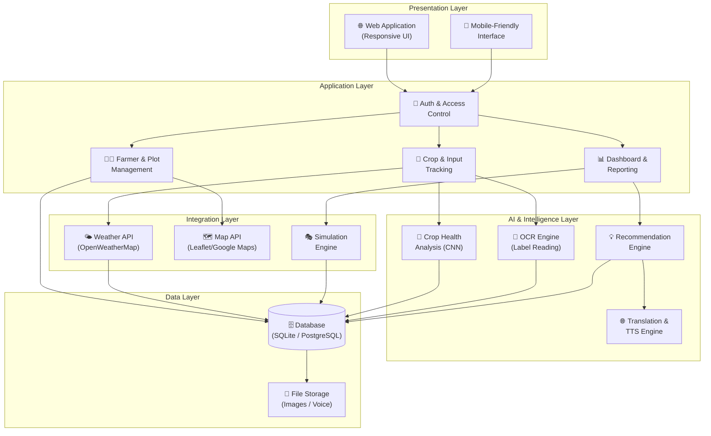

### 7.2 Component Interaction Flow

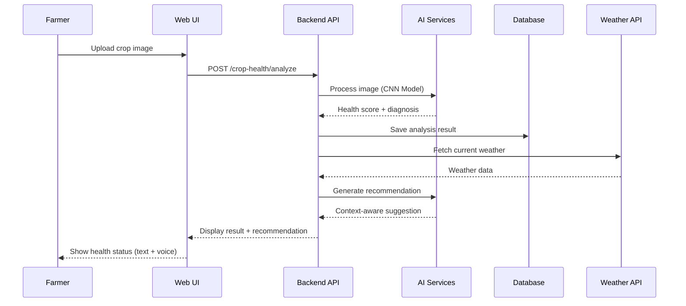

---

## 8. Core Modules

### 8.1 Authentication and Access Control

| Feature              | Description                                                |
| -------------------- | ---------------------------------------------------------- |
| Login / Logout       | Secure credential-based authentication                     |
| Role-Based Access    | Admin and Farmer roles with distinct permissions           |
| Session Management   | Secure session handling with timeout                       |
| Password Protection  | Hashed password storage with basic validation              |

---

### 8.2 Farmer Management

| Feature                 | Description                                                         |
| ----------------------- | ------------------------------------------------------------------- |
| Profile Creation        | Name, contact, village, language preference, and optional notes     |
| Profile Updates         | Edit and modify farmer details                                      |
| Activity History        | View chronological record of farmer's actions and events            |
| Admin Oversight         | Coordinator can view and manage all registered farmers              |

---

### 8.3 Plot / Farm Land Management

| Feature                 | Description                                                         |
| ----------------------- | ------------------------------------------------------------------- |
| Map-Based Registration  | Mark farm boundaries on an interactive map                          |
| Multi-Plot Support      | Store multiple plots per farmer                                     |
| Coordinate Storage      | Save GPS coordinates for each plot                                  |
| Area Calculation        | Capture approximate area and boundary dimensions                    |
| Admin Verification      | Coordinator reviews and verifies plot entries                       |

---

### 8.4 Crop Management

| Feature              | Description                                                    |
| -------------------- | -------------------------------------------------------------- |
| Crop Registration    | Add crop name, seed variety, and brand                         |
| Lifecycle Tracking   | Record sowing date, expected harvest, and current crop stage   |
| Crop History         | Maintain historical crop records for each plot                 |

---

### 8.5 Agricultural Input Tracking

| Feature               | Description                                                        |
| --------------------- | ------------------------------------------------------------------ |
| Input Logging         | Record fertilizer/pesticide name, quantity, spray date, and notes  |
| Packet Image Upload   | Capture product label images for reference                         |
| OCR Extraction        | Automatically extract text from packet images using OCR            |
| Confirmation Workflow | Farmer reviews and edits OCR-extracted data before saving          |

---

### 8.6 Crop Health Monitoring

| Feature              | Description                                                       |
| -------------------- | ----------------------------------------------------------------- |
| Image Upload         | Upload crop images at regular intervals                           |
| AI Analysis          | CNN-based detection of stress, pest damage, disease, deficiency   |
| Health Scoring       | Generate a health score or status indicator                       |
| Analysis History     | Save and view past analyses for trend tracking                    |

---

### 8.7 Weather Intelligence

| Feature               | Description                                                    |
| --------------------- | -------------------------------------------------------------- |
| Location-Based Fetch  | Retrieve weather data based on farmer's plot coordinates       |
| Forecast Display      | Show temperature, humidity, rain probability                   |
| Alert Generation      | Automated alerts for rain, heat waves, and drought conditions  |
| Advisory Messages     | Contextual messages (e.g., "Delay spraying — rain expected")   |

---

### 8.8 Irrigation / Water Tracking

| Feature                 | Description                                                   |
| ----------------------- | ------------------------------------------------------------- |
| Manual Entry            | Log irrigation events with date and duration                  |
| Motor Run Logging       | Record start/stop times for motorized pumps                   |
| Water Usage Estimation  | Calculate approximate water consumption                       |
| Future Sensor Ready     | Architecture supports future IoT sensor integration           |

---

### 8.9 Expense Management

| Category        | Tracked Items                              |
| --------------- | ------------------------------------------ |
| Seeds           | Purchase cost of seeds and planting material |
| Fertilizers     | Cost of all fertilizer applications        |
| Pesticides      | Cost of pest and disease control products  |
| Labor           | Wages for farm workers                     |
| Irrigation      | Water and electricity costs                |
| Miscellaneous   | Transport, tools, and other farming costs  |
| **Summaries**   | Crop-wise total cost aggregation           |

---

### 8.10 Recommendation Engine

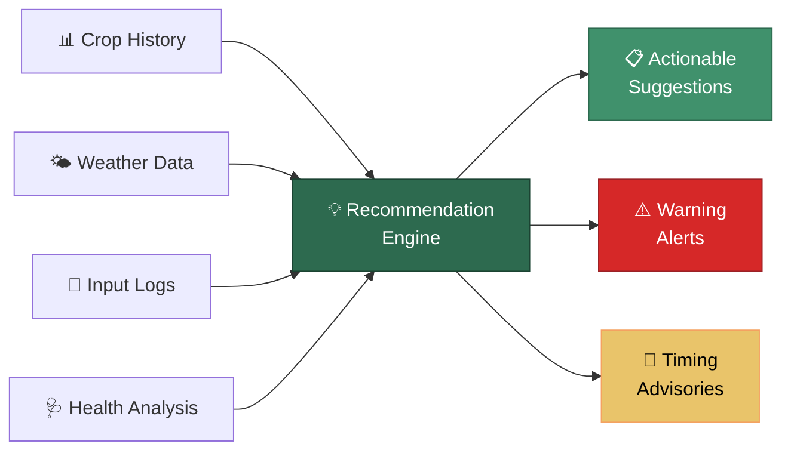

**Example Recommendations:**
- *"Postpone fertilizer application — rain forecast in next 24 hours."*
- *"Possible nitrogen deficiency detected in Plot #3 — consider urea application."*
- *"Crop stage approaching harvest — schedule labor and transportation."*

---

### 8.11 Multilingual Support

- English and regional language support
- Localized UI labels, navigation, and form fields
- Localized alert messages and notifications
- Localized AI recommendations and advisory text

---

### 8.12 Voice Support

- **Text-to-Speech:** AI recommendations and alerts read aloud
- **Voice Notes:** Quick voice-based input for farmers
- **Spoken Alerts:** Weather and crop health warnings in audio form
- **Accessibility Focus:** Designed for elderly and low-literacy users

---

### 8.13 Simulation Module

| Scenario                | Purpose                                                      |
| ----------------------- | ------------------------------------------------------------ |
| Simulated Rainfall      | Test rain alerts and irrigation recommendations              |
| Simulated Drought       | Test water stress advisories and irrigation scheduling       |
| Simulated Crop Disease  | Test AI health analysis and treatment recommendations        |
| Simulated Pest Outbreak | Test pest detection alerts and pesticide suggestions         |
| Simulated Irrigation    | Test water tracking and motor logging                        |
| Simulated Power Outage  | Test load-shedding scenarios and backup recommendations      |

> [!TIP]
> The simulation module enables comprehensive demo and testing without dependency on real-world weather events or crop conditions, making it ideal for project presentations and academic evaluation.

---

### 8.14 Reporting and Dashboard

| Dashboard Element         | Content                                              |
| ------------------------- | ---------------------------------------------------- |
| Overview Cards            | Total farmers, plots, active crops, pending alerts   |
| Seasonal Crop Summary     | Crop distribution, stage-wise breakdown              |
| Input Usage Summary       | Fertilizer and pesticide usage per plot/crop         |
| Expense Summary           | Category-wise and crop-wise cost analysis            |
| Recent Analysis           | Latest health reports and AI recommendations         |
| Warning Panel             | Active weather and crop health warnings              |

---

## 9. Data Design

### 9.1 Entity-Relationship Overview

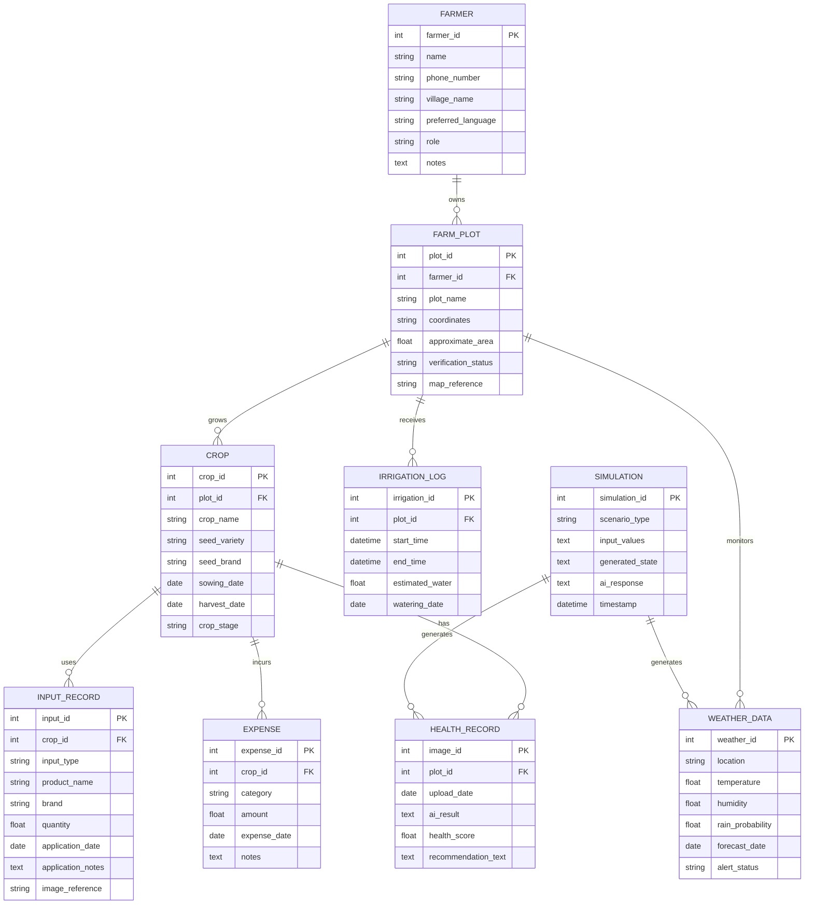

### 9.2 Data Entities Summary

| Entity             | Key Fields                                                                      | Relationships          |
| ------------------ | ------------------------------------------------------------------------------- | ---------------------- |
| **Farmer**         | ID, Name, Phone, Village, Language, Role, Notes                                 | Has many Plots         |
| **Farm Plot**      | ID, Farmer ID, Name, Coordinates, Area, Verification Status, Map Ref           | Has many Crops         |
| **Crop**           | ID, Plot ID, Name, Seed Variety, Brand, Sowing Date, Harvest Date, Stage       | Has Inputs, Health, Expenses |
| **Input Record**   | Type, Product Name, Brand, Quantity, Application Date, Notes, Image             | Belongs to Crop        |
| **Health Record**  | Image ID, Plot ID, Upload Date, AI Result, Health Score, Recommendation         | Belongs to Plot        |
| **Weather Data**   | Location, Temperature, Humidity, Rain Probability, Forecast Date, Alert Status  | Linked to Plot         |
| **Expense**        | ID, Crop ID, Category, Amount, Date, Notes                                      | Belongs to Crop        |
| **Simulation**     | Scenario Type, Input Values, Generated State, AI Response, Timestamp           | Generates Weather/Health |

---

## 10. User Roles & Access Control

### 10.1 Role Definitions

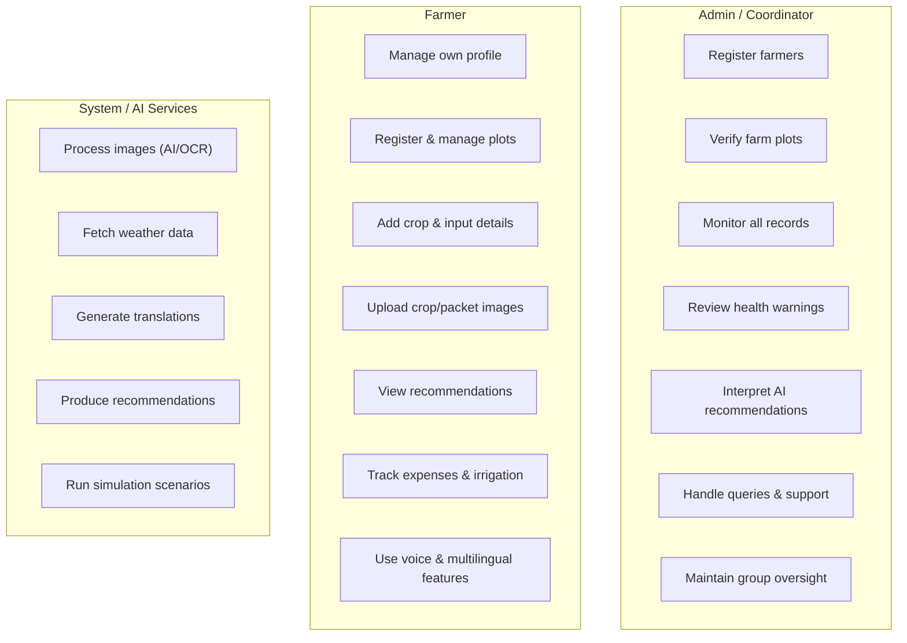

### 10.2 Permission Matrix

| Feature                     | Admin | Farmer | System |
| --------------------------- | :---: | :----: | :----: |
| Create farmer accounts      | ✅    | ❌     | ❌     |
| Verify farm plots           | ✅    | ❌     | ❌     |
| View all farmer records     | ✅    | ❌     | ❌     |
| Review simulation output    | ✅    | ❌     | ❌     |
| Manage own profile          | ✅    | ✅     | ❌     |
| Add/manage plots            | ✅    | ✅     | ❌     |
| Add crop details            | ❌    | ✅     | ❌     |
| Upload images               | ❌    | ✅     | ❌     |
| View AI suggestions         | ✅    | ✅     | ❌     |
| Track expenses              | ❌    | ✅     | ❌     |
| Process images (AI/OCR)     | ❌    | ❌     | ✅     |
| Fetch weather data          | ❌    | ❌     | ✅     |
| Generate recommendations    | ❌    | ❌     | ✅     |
| Run simulations             | ❌    | ❌     | ✅     |

---

## 11. Functional Requirements

### 11.1 Admin-Side Requirements

| ID     | Requirement                                                |
| ------ | ---------------------------------------------------------- |
| FR-A01 | Admin shall be able to create farmer accounts              |
| FR-A02 | Admin shall be able to verify farm plots                   |
| FR-A03 | Admin shall be able to see all registered farmers          |
| FR-A04 | Admin shall be able to see crop and alert history          |
| FR-A05 | Admin shall be able to review simulation output            |
| FR-A06 | Admin shall be able to respond to farmer queries           |

### 11.2 Farmer-Side Requirements

| ID     | Requirement                                                          |
| ------ | -------------------------------------------------------------------- |
| FR-F01 | Farmer shall be able to create and update profile                    |
| FR-F02 | Farmer shall be able to add farm plots                               |
| FR-F03 | Farmer shall be able to add crop details                             |
| FR-F04 | Farmer shall be able to upload crop images                           |
| FR-F05 | Farmer shall be able to upload fertilizer/pesticide packet images    |
| FR-F06 | Farmer shall be able to view AI suggestions                         |
| FR-F07 | Farmer shall be able to hear recommendations in voice form           |
| FR-F08 | Farmer shall be able to see weather alerts                           |
| FR-F09 | Farmer shall be able to view expense records                         |

### 11.3 System Requirements

| ID     | Requirement                                                          |
| ------ | -------------------------------------------------------------------- |
| FR-S01 | System shall store all records in a database                         |
| FR-S02 | System shall process images through AI/OCR                           |
| FR-S03 | System shall fetch weather data through API                          |
| FR-S04 | System shall translate/localize output based on user language         |
| FR-S05 | System shall generate demo scenarios in simulation mode              |

---

## 12. Non-Functional Requirements

### 12.1 Summary Table

| Category          | Requirement                                                                          | Priority |
| ----------------- | ------------------------------------------------------------------------------------ | -------- |
| **Usability**     | Simple enough for non-technical users; important actions within a few clicks         | High     |
| **Usability**     | Voice support to reduce typing effort for low-literacy users                         | High     |
| **Performance**   | Dashboard data loads quickly; image analysis within acceptable demo time             | High     |
| **Performance**   | Weather and recommendation updates should not block the main application             | Medium   |
| **Scalability**   | Architecture supports adding more farmers, plots, and modules                        | Medium   |
| **Scalability**   | Future cloud deployment and IoT sensor integration should be possible                | Low      |
| **Reliability**   | Records must not be lost easily; core functions work in local-server mode            | High     |
| **Reliability**   | System handles missing weather data gracefully with fallback messages                | Medium   |
| **Security**      | Role-based login with protected access to farmer records                             | High     |
| **Security**      | Basic form validation and safe storage of uploaded images                            | Medium   |
| **Maintainability** | Modular code structure with separate UI, API, AI, and database layers              | Medium   |
| **Maintainability** | Clear naming conventions and comprehensive documentation                           | Medium   |

### 12.2 Quality Attributes Radar

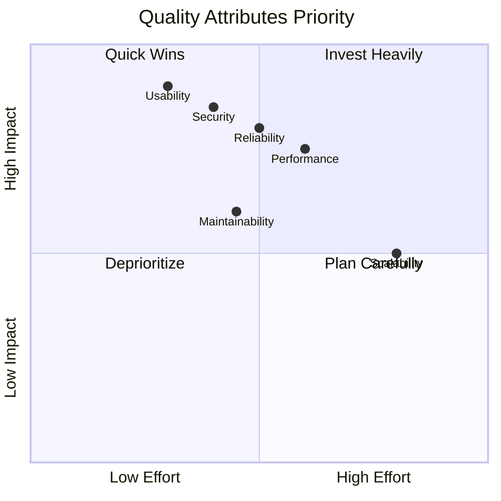

---

## 13. User Workflows

### 13.1 Farmer Onboarding Flow

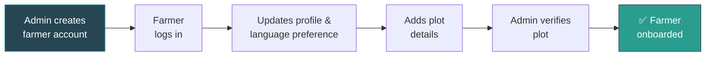

### 13.2 Crop Registration Flow

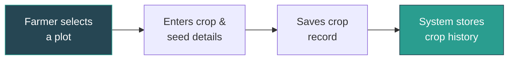

### 13.3 Fertilizer / Pesticide Logging Flow

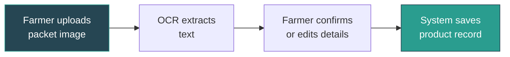

### 13.4 Crop Monitoring Flow

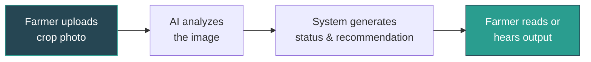

### 13.5 Weather Alert Flow

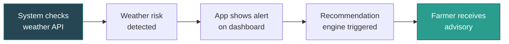

---

## 14. Suggested Technology Stack

> [!NOTE]
> The following stack is suggested for a college-level implementation using free tools and local deployment. It can be scaled to cloud-based services for production deployment.

| Layer                   | Technology                           | Rationale                                          |
| ----------------------- | ------------------------------------ | -------------------------------------------------- |
| **Frontend**            | React.js / HTML + CSS + JavaScript   | Responsive, component-based UI                     |
| **Backend**             | Python (Flask / FastAPI)             | Lightweight, excellent AI/ML library ecosystem     |
| **Database**            | SQLite (dev) / PostgreSQL (prod)     | Free, reliable, easy to set up locally             |
| **AI - Crop Health**    | TensorFlow / PyTorch (CNN)           | Pre-trained models available (PlantVillage dataset) |
| **AI - OCR**            | Tesseract OCR / EasyOCR              | Free, open-source OCR engines                      |
| **Weather API**         | OpenWeatherMap (Free Tier)           | Reliable, free tier sufficient for demo            |
| **Maps**                | Leaflet.js + OpenStreetMap           | Free, open-source map rendering                    |
| **Translation**         | Google Translate API / LibreTranslate | Multilingual output support                       |
| **Text-to-Speech**      | Web Speech API / gTTS               | Browser-native or Python-based TTS                 |
| **File Storage**        | Local filesystem                     | Simple, no cloud dependency for demo               |
| **Deployment (Local)**  | Spare system / laptop as server      | Zero-cost local demo environment                   |
| **Version Control**     | Git + GitHub                         | Standard code management                           |

---

## 15. Feasibility Analysis

### 15.1 Technical Feasibility

| Aspect                   | Assessment                                                                      | Status |
| ------------------------ | ------------------------------------------------------------------------------- | :----: |
| Frontend Development     | React/HTML+JS are well-documented; extensive community support                  | ✅     |
| Backend Development      | Python Flask/FastAPI are lightweight and suitable for rapid development          | ✅     |
| AI Crop Health Analysis  | Pre-trained CNN models and PlantVillage dataset freely available                | ✅     |
| OCR Processing           | Tesseract OCR and EasyOCR are mature, free, open-source tools                  | ✅     |
| Weather Integration      | OpenWeatherMap free tier provides sufficient API calls for demo                 | ✅     |
| Map Integration          | Leaflet.js + OpenStreetMap require no API key and are fully free                | ✅     |
| Multilingual Support     | Translation APIs and TTS engines are readily available                          | ✅     |
| Local Deployment         | Can run on any laptop/PC with Python and a web browser                          | ✅     |

### 15.2 Economic Feasibility

| Cost Item                | Estimated Cost | Notes                                    |
| ------------------------ | -------------- | ---------------------------------------- |
| Development Tools        | ₹0             | All open-source / free-tier tools        |
| Cloud Hosting (demo)     | ₹0             | Local server deployment                  |
| Weather API              | ₹0             | Free tier (60 calls/minute)              |
| Domain / SSL             | ₹0             | Not required for local demo              |
| Hardware                 | ₹0             | Uses existing laptop/PC                  |
| **Total Estimated Cost** | **₹0**         | **Fully implementable at zero cost**     |

### 15.3 Operational Feasibility

- Target users (farmers) are the primary beneficiaries, and the UI is designed for simplicity.
- Voice and multilingual support address literacy and language barriers.
- The coordinator/admin role ensures farmers have local support.
- Simulation mode enables demonstrations without waiting for real-world conditions.

---

## 16. Risk Analysis

| # | Risk                                        | Impact   | Likelihood | Mitigation Strategy                                            |
| - | ------------------------------------------- | -------- | ---------- | -------------------------------------------------------------- |
| 1 | Low smartphone adoption among farmers       | High     | Medium     | Design for shared devices; coordinator-assisted usage          |
| 2 | Inaccurate AI crop health analysis          | High     | Medium     | Use validated models; allow manual override; improve over time |
| 3 | OCR fails on damaged or low-quality labels  | Medium   | High       | Allow manual input as fallback; improve image guidance         |
| 4 | Weather API downtime or rate limits         | Medium   | Low        | Cache recent data; show "last updated" timestamps              |
| 5 | Language translation inaccuracies           | Medium   | Medium     | Use agricultural domain-specific term glossaries               |
| 6 | Data loss on local server                   | High     | Medium     | Regular database backups; export functionality                 |
| 7 | Users resistant to technology adoption      | Medium   | Medium     | Training sessions; voice-first interface; coordinator support  |
| 8 | Network connectivity issues in rural areas  | High     | High       | Offline-capable core features; sync when connected             |

---

## 17. Future Scope

The current version of AgriSense AI establishes a foundation that can be extended with the following advanced capabilities:

```mermaid
timeline
    title AgriSense AI — Future Roadmap
    section Phase 2 : IoT Integration
        Smart Sensor Poles : Moisture, pH, humidity, temperature, nutrient sensors
        Remote Motor Control : Automated irrigation via mobile/web interface
    section Phase 3 : Advanced AI
        Predictive Analytics : Fertilizer & pesticide timing predictions
        Yield Estimation : ML-based harvest forecasting
        Disease Forecasting : Early warning system using historical patterns
    section Phase 4 : Scale & Research
        Cloud Deployment : Production-grade hosting on AWS/GCP/Azure
        Research Dashboard : Academic analysis and agricultural research tools
        Village Digital Twin : Complete digital representation of village agriculture
```

---

## 18. Conclusion

AgriSense AI presents a comprehensive, practical, and implementable solution to the challenges faced by small-scale farming communities. By combining digital record-keeping, AI-powered crop health analysis, weather intelligence, smart recommendations, and multilingual voice support into a single unified platform, the project addresses the real-world needs of farmers who currently lack access to modern agricultural technology.

The platform's key strengths include:

- **Zero-cost implementation** using entirely free and open-source tools
- **AI-powered intelligence** for crop health monitoring and smart recommendations
- **Inclusive design** with multilingual text, voice support, and simple UI for non-technical users
- **Simulation capability** for comprehensive testing and demonstration
- **Future-ready architecture** that supports IoT integration, cloud deployment, and advanced analytics

As a college project, AgriSense AI demonstrates the practical application of web development, artificial intelligence, computer vision, API integration, and database management in solving a real-world problem. The modular architecture ensures that the system can grow from a demo-ready prototype to a village-level deployment as resources and requirements evolve.

> [!IMPORTANT]
> AgriSense AI is not just a technology project — it is a step toward empowering farming communities with the tools they need to make better decisions, reduce losses, and build a more sustainable agricultural future.

---

## 19. References

| # | Reference                                                                                               |
| - | ------------------------------------------------------------------------------------------------------- |
| 1 | PlantVillage Dataset — Hughes, D.P. and Salathé, M. (2015). *An open access repository of images on plant health.* |
| 2 | OpenWeatherMap API Documentation — https://openweathermap.org/api                                       |
| 3 | Tesseract OCR — https://github.com/tesseract-ocr/tesseract                                              |
| 4 | Leaflet.js Documentation — https://leafletjs.com/                                                        |
| 5 | Flask Web Framework — https://flask.palletsprojects.com/                                                 |
| 6 | TensorFlow — https://www.tensorflow.org/                                                                 |
| 7 | Web Speech API — https://developer.mozilla.org/en-US/docs/Web/API/Web_Speech_API                        |
| 8 | FAO — *The State of Food and Agriculture 2024*                                                          |
| 9 | Google Translate API — https://cloud.google.com/translate                                                |
| 10 | React.js Documentation — https://react.dev/                                                             |

---

*Document generated from [Project Requirements Document](file:///c:/Users/HEMANT/AgriSense%20AI/Project%20Requirements%20Document.md)*
