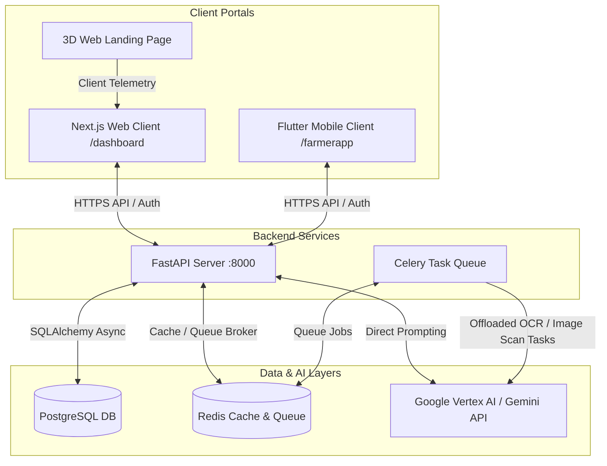

# AgriSense AI: Complete Project Structure

This document outlines the directory structure and role of every core module within the **AgriSense AI** project. AgriSense AI is an intelligent farm management and decision support system consisting of a FastAPI backend, a Next.js web client, a Flutter mobile app, and immersive 3D landing pages.

---

## Workspace Root Overview

Below is the high-level tree structure of the workspace root and documentation of key configuration files:

```text
AgriSense AI/
├── .agents/                    # Custom AI agent skill and configuration directory
├── .impeccable/                # Visual styling configurations
├── 3d-landing-page/            # Three.js-powered animated 3D landing page (client portal)
│   ├── assets/                 # Textures, models, and assets for 3D renderings
│   ├── frames/                 # Pre-rendered animation/transition frames
│   ├── 3d-assets.html          # Interactive 3D component catalog / asset showroom
│   ├── index.html              # Landing page entry point HTML
│   ├── app.js                  # Scroll-driven animation controller using Three.js & ScrollTrigger
│   └── style.css               # Styling for the immersive 3D portal
├── client/                     # Next.js web dashboard frontend application (see detail below)
├── server/                     # FastAPI backend application & services (see detail below)
├── farmerapp/                  # Flutter mobile application for offline field work (see detail below)
├── Image-Generator/            # Asset generation configurations and local skill metadata
├── AgriSense_AI_Project_Report.md # Full project technical documentation and API schemas
├── BRANDING.md                 # Brand style guidelines ("The Agrarian Codex" color tokens & font guidelines)
├── DESIGN.md                   # Detail on component styles, design system tokens, and states
├── PRODUCT.md                  # Features list, user stories, and product roadmap
├── Project Requirements Document.md # Comprehensive product requirements document (PRD)
├── docker-compose.yml          # Container configuration for local PostgreSQL, Redis, backend, & frontend
├── logo-transparent.png        # Transparent high-resolution brand logo image
├── .env / .env.example         # System-wide and environment-specific credentials
└── README.md                   # Core project introduction and quick start instructions
```

---

## 1. Backend Service (`server/`)

The backend is built as a modular monolithic service using **Python 3.12** and **FastAPI**, backed by a **PostgreSQL** database (via SQLAlchemy 2.0 async engine) and **Redis/Celery** for background task execution.

```text
server/
├── alembic/                    # Database migrations history and version scripts
├── app/                        # Main FastAPI backend codebase
│   ├── models/                 # SQLAlchemy core models mapping to SQL tables
│   │   ├── __init__.py         # Imports and exposes models for engine auto-discovery
│   │   ├── crop.py             # Crop cycles, types, and planting logs
│   │   ├── expense.py          # Financial ledger records mapped by crop/plot category
│   │   ├── health_record.py    # AI crop disease scanner results and diagnostic severity
│   │   ├── input_record.py     # Logged pesticide, fertilizer, and seed applications
│   │   ├── irrigation.py       # Moisture levels and scheduled irrigation events
│   │   ├── mixins.py           # Standardized audit fields (Soft-delete, UUID keys, timestamps)
│   │   ├── plot.py             # Farm spatial configurations (coordinates, soil characteristics)
│   │   ├── simulation.py       # Saved offline sandbox scenarios
│   │   ├── user.py             # User accounts, authentication metadata, and role mappings
│   │   └── weather.py          # Historical telemetry and weather metrics cached locally
│   │
│   ├── repositories/           # Repository Pattern - direct SQL database query logic
│   │   ├── __init__.py         # Access helper exports
│   │   ├── base.py             # Generic base repo providing CRUD operations with soft-delete
│   │   ├── crop_repository.py
│   │   ├── expense_repository.py
│   │   ├── health_repository.py
│   │   ├── input_repository.py
│   │   ├── plot_repository.py
│   │   └── user_repository.py
│   │
│   ├── routers/                # API Endpoints (FastAPI Routers)
│   │   ├── __init__.py
│   │   ├── auth.py             # User register, login, session validation, and JWT issuing
│   │   ├── crops.py            # Crop lifecycle tracking CRUD
│   │   ├── dashboard.py        # Centralized stats, KPIs, aggregates, and charts
│   │   ├── expenses.py         # Budget tracker and financial endpoints
│   │   ├── farmers.py          # Administrator management interface for farm operators
│   │   ├── health.py           # Disease diagnosis scanner logs and severity ratings
│   │   ├── inputs.py           # Chemical, seed, and fertilizer log endpoints
│   │   ├── plots.py            # Plot boundaries, crop attachments, and telemetry mapping
│   │   ├── recommendations.py  # Vertex AI decision engine interface (crop advice)
│   │   ├── simulation.py       # Scenarios engine (trigger climate mock/disease scans)
│   │   └── weather.py          # Live micro-climate forecasting feeds and alerts
│   │
│   ├── services/               # Heavy domain logic, integration handlers, and business rules
│   │   ├── ai/                 # Multi-provider LLM decision system
│   │   │   ├── __init__.py     # Service exporter
│   │   │   ├── base.py         # Abstract base class for AI prompt execution models
│   │   │   ├── factory.py      # Provider selector (Vertex AI, Gemini, or Mock Provider)
│   │   │   ├── gemini_provider.py # Direct Gemini API integrations via Google AI Studio
│   │   │   ├── vertex_provider.py # Enterprise GCP Native Vertex AI SDK implementation
│   │   │   ├── mock_provider.py # Offline deterministic provider for local dry-runs
│   │   │   └── master_documentation.md # Detailed notes on prompt structures and schemas
│   │   ├── ai_service.py       # Unified orchestration layer interfacing routers with AI providers
│   │   ├── simulation_service.py # Core simulator managing demo sandboxes
│   │   └── weather_service.py  # Coordinates public telemetry feeds and processes thresholds
│   │
│   ├── utils/                  # Common auxiliary functions (time formatters, geometric math)
│   ├── config.py               # Settings loader reading from environments (FastAPI Pydantic settings)
│   ├── database.py             # Async connection session generator
│   ├── dependencies.py         # Request validators (authentication check, role verify, database session inject)
│   ├── exceptions.py           # Global middleware exception catcher and standard JSON error responses
│   ├── main.py                 # Core application config (Middlewares, CORS, Routing mounting, startup tasks)
│   ├── security.py             # BCrypt hashing, JWT encoders/decoders, and secure signature checking
│   └── worker.py               # Celery runner configured to receive offloaded queues (OCR tasks, scans)
│
├── Dockerfile                  # Production-ready backend container builder instructions
├── requirements.txt            # Python environment packages listing
├── seed_db.py                  # CLI script to flush and seed local Postgres with test data
└── alembic.ini                 # Alembic configuration defining DB migration target connections
```

---

## 2. Web Client Dashboard (`client/`)

The web client is built on **Next.js 16** using the modern **App Router** paradigm. It manages global state via **Zustand**, utilizes **React Query (TanStack)** for fetching, and implements **TailwindCSS** for styles.

```text
client/
├── public/                     # Static media files, logos, and public vectors
├── src/                        # Main web application sources
│   ├── app/                    # Routing boundaries (Next.js App Router)
│   │   ├── dashboard/          # Primary farmer/admin dashboard portal
│   │   │   ├── crops/          # Page and sub-sections tracking active crops
│   │   │   ├── expenses/       # Financial analysis dashboard with Recharts graphs
│   │   │   ├── farmers/        # Admin management tables for farm agents
│   │   │   ├── health/         # Disease tracking details and diagnosis dashboard
│   │   │   ├── inputs/         # Fertilizer, seed, and pesticide registry interface
│   │   │   ├── plots/          # Visual interactive GIS mapping of land plots
│   │   │   ├── settings/       # System customization settings and profile managers
│   │   │   ├── simulation/     # Control console for running dry-runs and scenario trials
│   │   │   ├── weather/        # Interactive telemetry grids and alerts list
│   │   │   ├── layout.tsx      # Sidebar, top nav header, and workspace shell
│   │   │   └── page.tsx        # Overview page showing telemetry grids and recent alerts
│   │   ├── farmer/             # Simplified mobile-optimized portal for on-field actions
│   │   │   ├── logs/           # Activity logging portal
│   │   │   ├── plots/          # List of assigned plot sections
│   │   │   ├── scan/           # Camera upload interface for plant disease diagnostics
│   │   │   ├── layout.tsx      # Responsive mobile-optimized page container layout
│   │   │   └── page.tsx        # Mobile overview landing page for operators
│   │   ├── login/              # Secure sign-in page with validations
│   │   ├── globals.css         # Baseline global stylesheet declaring CSS variable tokens
│   │   ├── layout.tsx          # Root HTML frame embedding React Query, CSS variables, & fonts
│   │   └── page.tsx            # Static marketing and features page loader
│   │
│   ├── components/             # Global reusable React widgets
│   │   ├── BackgroundCanvas.tsx # WebGL particle visualization engine (Agrarian Codex overlay)
│   │   └── MapComponent.tsx    # Leaflet/GIS map component for field visual boundaries
│   │
│   ├── hooks/                  # Custom React hooks (React Query integrations with API hooks)
│   ├── lib/                    # HTTP Axios clients and client-side formatting utilities
│   ├── stores/                 # Zustand global client-side state stores (Auth, Theme, UI)
│   └── types/                  # TypeScript interface mappings corresponding to Backend schemas
│
├── Dockerfile                  # Multi-stage Docker builder for static client compilation
├── tsconfig.json               # TypeScript compiler config rules
├── next.config.ts              # Next.js bundler settings, proxy routes, and assets domain permissions
├── package.json                # Project dependencies, build actions, and dev server configurations
├── postcss.config.mjs          # Tailwind CSS style transformer configuration
└── eslint.config.mjs           # Code guidelines and rules enforcement config
```

---

## 3. Flutter Mobile App (`farmerapp/`)

A cross-platform mobile application compiled for Android and iOS using **Flutter** and Dart, utilizing Clean Architecture principles with BLoC for state management.

```text
farmerapp/
├── android/                    # Android-specific Gradle configuration files and assets
├── ios/                        # iOS-specific build properties and assets
├── lib/                        # Flutter source files
│   ├── screens/                # Core user interfaces (screens)
│   │   ├── dashboard_screen.dart # Main app dashboard displaying telemetry cards and action buttons
│   │   ├── login_screen.dart   # Sign-in portal with device credential authentication
│   │   ├── logs_screen.dart    # Operational logs, entry registers, and activity tracking
│   │   ├── plots_screen.dart   # Graphical plot selector displaying field information
│   │   └── scan_screen.dart    # High-performance scanner integrating camera for crop scans
│   │
│   ├── services/               # Communications layer
│   │   └── api_service.dart    # HTTP Dart client mapping and communicating with FastAPI endpoints
│   │
│   └── main.dart               # App initializer setting up application configurations & BLoC providers
│
├── test/                       # Unit and widget test files
├── pubspec.yaml                # Package dependencies declaration (Camera, HTTP, Local Storage)
└── pubspec.lock                # Pinned dependency trees for reproducible builds
```

---

## Inter-Component Architecture

The diagram below details the data flow between components of the AgriSense AI project:


