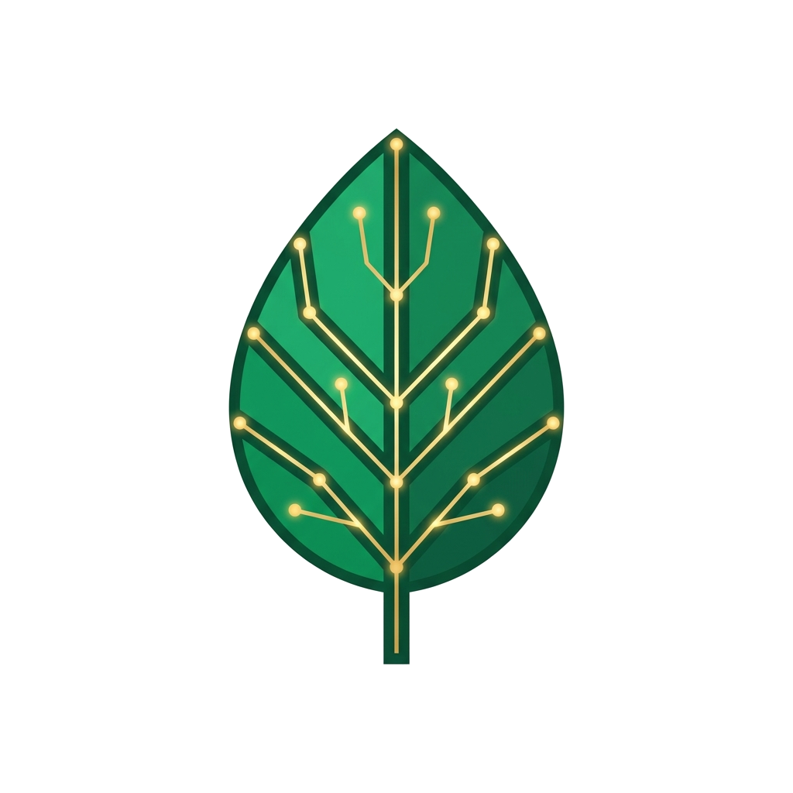

<p align="center">
  
</p>

<h1 align="center">AgriSense AI</h1>

<p align="center">
  <strong>Intelligence Rooted in Every Field</strong>
</p>

<p align="center">
  <a href="#about">About</a> •
  <a href="#features">Key Features</a> •
  <a href="#architecture">Architecture</a> •
  <a href="#technology-stack">Tech Stack</a> •
  <a href="#getting-started">Getting Started</a> •
  <a href="#branding-and-design">Branding</a>
</p>

---

## About

**AgriSense AI** is a state-of-the-art, high-precision Intelligent Farm Management and Decision Support Platform designed for small-scale and enterprise farmers. By combining local environmental telemetry with Google Cloud Vertex AI, AgriSense AI provides farmers with crop-specific recommendations, disease scanning, weather advisories, and financial management tools.

---

## Key Features

- 📸 **Crop Disease Scanner:** Upload crop images for immediate AI diagnosis, severity classification, and treatment plans.
- ⛅ **Micro-Climate Telemetry:** Live meteorological forecast integration with automated weather alert systems.
- 📋 **AI Packaging OCR:** Scan pesticide/fertilizer labels to extract dosage instructions, application techniques, and safety warnings.
- 💰 **Expense & Log Tracking:** Automated crop-scaffold financial tracking with category-wise cost-breakdown visualizations.
- ⚡ **Simulation Sandbox:** Run demo weather and crop disease scenarios to evaluate platform responses offline.

---

## Architecture

AgriSense AI uses a decoupled **Clean/Modular Monolith** architecture optimized for deployment on Google Cloud Platform (GCP).

### Design Patterns Implemented:
1. **Strategy Pattern for AI Providers:** Run seamlessly via Vertex AI (GCP Native), Google AI Studio (Gemini), or a deterministic Mock Provider offline.
2. **Repository Pattern:** Centralized data access layer with soft-delete, pagination, and role-based scoping.
3. **Event-Driven Architecture:** In-process event bus for Celery background tasks (decoupling HTTP routers from task runners).
4. **Dependency Injection:** Powered by FastAPI's `Depends()` framework for loose coupling.
5. **ORM Mixins:** Standardized audit fields (timestamps, UUID primary keys, soft-delete flag) across all database models.

---

## Technology Stack

### Backend
- **Core:** Python 3.12 / FastAPI (async/await)
- **Database:** PostgreSQL 16 (SQLAlchemy 2.0 Async engine)
- **Caching & Queue:** Redis 7 / Celery 5
- **ML & AI:** Google Cloud Vertex AI SDK / Generative AI Studio (Gemini-2.0-flash)

### Frontend
- **Framework:** Next.js 16 (App Router)
- **State Management:** Zustand
- **Data Fetching:** React Query (TanStack Query) / Axios
- **Iconography:** Lucide React / Recharts

### Mobile
- **Framework:** Flutter (Clean Architecture + BLoC pattern)

---

## Getting Started

### Prerequisites
- Docker & Docker Compose
- Node.js & npm (for local frontend development)
- Python 3.12 (for local backend development)

### One-Command Docker Setup
Start all services (Database, Redis, FastAPI backend, Next.js frontend):
```bash
docker-compose up -d
```
Access the application at:
- **Frontend Dashboard:** [http://localhost:3000](http://localhost:3000)
- **API Swagger Documentation:** [http://localhost:8000/docs](http://localhost:8000/docs)

---

## Branding and Design

AgriSense AI follows **The Agrarian Codex** design language — a nature-inspired, high-contrast, accessibility-focused visual design.

- **Primary Colors:** Living Emerald (`#10B981`), Absolute Soil (`#030303`), Agrarian Gold (`#F59E0B`).
- **Logo Asset:** Transparent vector brand asset located at [logo-transparent.png](logo-transparent.png).
- **Guidelines:** Detailed brand guidelines are located in the [BRANDING.md](BRANDING.md) file.
