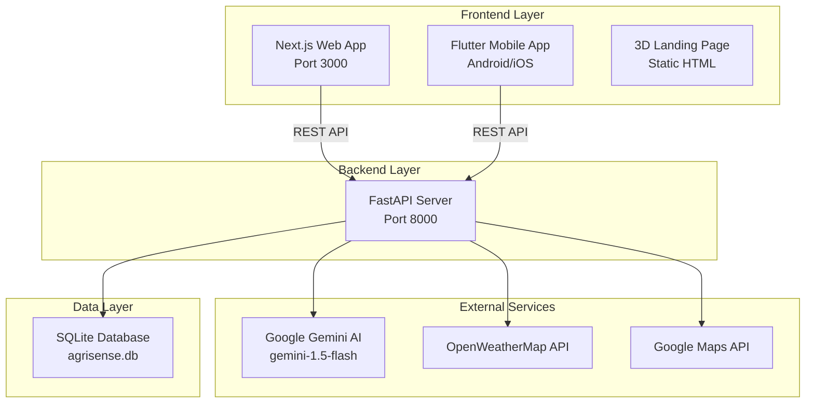
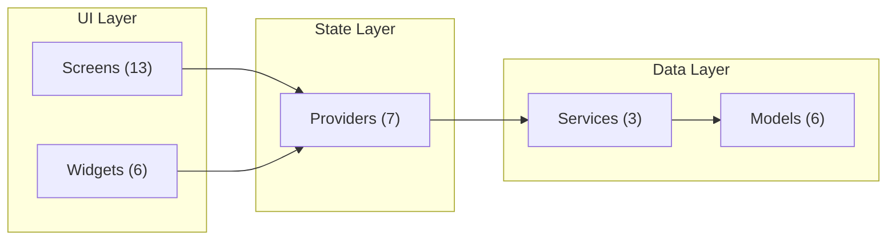
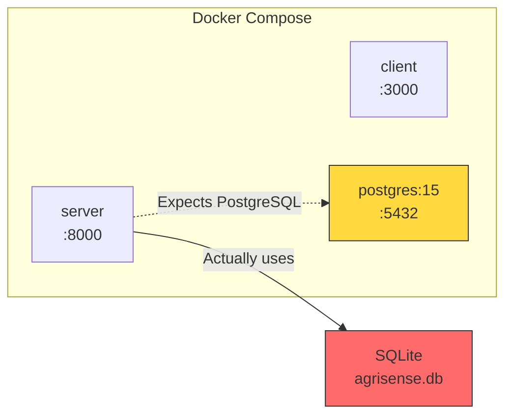

# 🔬 AgriSense AI — Complete Codebase Audit Report

**Date**: July 13, 2026  
**Scope**: Full project — Server, Client, Mobile App, 3D Landing Page, Infrastructure, Documentation  
**Files Examined**: 130+ files across 4 major components

---

## Table of Contents

1. [Project Overview](#project-overview)
2. [Technology Stack Summary](#technology-stack-summary)
3. [Component-by-Component Breakdown](#component-breakdown)
   - [Server Backend (Python/FastAPI)](#1-server-backend)
   - [Client Frontend (Next.js/React)](#2-client-frontend)
   - [Mobile App (Flutter/Dart)](#3-mobile-app)
   - [3D Landing Page (HTML/CSS/JS)](#4-3d-landing-page)
   - [Infrastructure & DevOps](#5-infrastructure--devops)
   - [Documentation](#6-documentation)
4. [Feature Completeness Matrix](#feature-completeness-matrix)
5. [API Endpoint Audit](#api-endpoint-audit)
6. [Security Audit](#security-audit)
7. [Code Quality Assessment](#code-quality-assessment)
8. [Critical Issues](#critical-issues)
9. [Recommendations](#recommendations)

---

## Project Overview

AgriSense AI is an **Intelligent Agricultural Advisory Platform** targeting Indian farmers. It provides AI-powered crop advice, soil analysis, weather integration, market intelligence, and community features across three interfaces: a web dashboard, a mobile app, and a 3D landing page.

### Architecture

---

## Technology Stack Summary

| Layer | Technology | Version | Status |
|-------|-----------|---------|--------|
| **Web Frontend** | Next.js | 15.3.3 | ✅ Functional |
| | React | 19.1.0 | ✅ Functional |
| | TypeScript | 5.x | ⚠️ Errors suppressed |
| | Chart.js | 4.5.0 | ✅ Functional |
| | Leaflet | 1.9.4 | ✅ Functional |
| | Lucide React | 0.513.0 | ✅ Functional |
| | TailwindCSS | 4.x | ⚠️ Installed but barely used |
| **Mobile App** | Flutter/Dart | Latest | ✅ Functional |
| | Provider | 6.1.5 | ✅ Functional |
| | fl_chart | 0.70.2 | ✅ Functional |
| | Google Maps Flutter | 2.12.1 | ⚠️ Needs API key |
| | speech_to_text | 7.0.0 | ✅ Functional |
| | flutter_tts | 4.2.0 | ✅ Functional |
| | geolocator | 13.0.2 | ✅ Functional |
| **Backend** | FastAPI | 0.115.12 | ✅ Functional |
| | SQLAlchemy | 2.0.41 | ✅ Functional |
| | Pydantic | 2.11.3 | ✅ Functional |
| | Google Generative AI | 0.8.5 | ✅ Functional |
| | python-jose | 3.4.0 | ✅ Functional |
| | passlib + bcrypt | 1.7.4 | ✅ Functional |
| | httpx | 0.28.1 | ✅ Functional |
| **Database** | SQLite (aiosqlite) | 0.21.0 | ✅ Functional |
| **3D Landing** | Three.js | r158 | ⚠️ Missing assets |
| | Vanilla JS/CSS | ES6+ | ✅ Code functional |
| **DevOps** | Docker Compose | — | ⚠️ Partially broken |
| | PostgreSQL (Docker) | 15 | ❌ Not connected |

---

## Component Breakdown

### 1. Server Backend

**Location**: [server/](file:///c:/Users/HEMANT/AgriSense%20AI/server)

#### File-by-File Audit

| File | Purpose | Status | Issues |
|------|---------|--------|--------|
| [main.py](file:///c:/Users/HEMANT/AgriSense%20AI/server/app/main.py) | FastAPI app entry, CORS, router registration | ✅ Working | CORS allows `*` |
| [config.py](file:///c:/Users/HEMANT/AgriSense%20AI/server/app/config.py) | Pydantic settings, env loading | ✅ Working | — |
| [database.py](file:///c:/Users/HEMANT/AgriSense%20AI/server/app/database.py) | Async SQLAlchemy engine, session factory | ✅ Working | Hardcoded SQLite |
| [dependencies.py](file:///c:/Users/HEMANT/AgriSense%20AI/server/app/dependencies.py) | JWT auth dependency | ✅ Working | — |
| [Dockerfile](file:///c:/Users/HEMANT/AgriSense%20AI/server/Dockerfile) | Container config | ✅ Working | No multi-stage build |
| [requirements.txt](file:///c:/Users/HEMANT/AgriSense%20AI/server/requirements.txt) | Python deps (18 packages) | ✅ Working | No PostgreSQL driver |
| [seed_db.py](file:///c:/Users/HEMANT/AgriSense%20AI/server/seed_db.py) | Demo data seeder | ✅ Working | Uses sync SQLAlchemy |
| [seed_knowledge.py](file:///c:/Users/HEMANT/AgriSense%20AI/server/seed_knowledge.py) | Knowledge base seeder (36KB) | ✅ Working | Impressive content |

##### Models (ORM)

| Model File | Tables Created | Status |
|-----------|---------------|--------|
| [user.py](file:///c:/Users/HEMANT/AgriSense%20AI/server/app/models/user.py) | `users` | ✅ Complete |
| [crop.py](file:///c:/Users/HEMANT/AgriSense%20AI/server/app/models/crop.py) | `crops`, `crop_recommendations` | ✅ Complete |
| [soil.py](file:///c:/Users/HEMANT/AgriSense%20AI/server/app/models/soil.py) | `soil_analyses` | ✅ Complete |
| [advisory.py](file:///c:/Users/HEMANT/AgriSense%20AI/server/app/models/advisory.py) | `advisory_sessions`, `advisory_messages` | ✅ Complete |
| [community.py](file:///c:/Users/HEMANT/AgriSense%20AI/server/app/models/community.py) | `community_posts`, `community_comments` | ✅ Complete |
| [knowledge.py](file:///c:/Users/HEMANT/AgriSense%20AI/server/app/models/knowledge.py) | `knowledge_articles`, `knowledge_categories` | ✅ Complete |

##### Routes (API)

| Route File | Endpoints | Auth Required | Status |
|-----------|-----------|---------------|--------|
| [auth.py](file:///c:/Users/HEMANT/AgriSense%20AI/server/app/routes/auth.py) | `POST /register`, `POST /login` | ❌ Public | ✅ Working |
| [users.py](file:///c:/Users/HEMANT/AgriSense%20AI/server/app/routes/users.py) | `GET /me`, `PUT /me`, `GET /me/dashboard` | ✅ Yes | ✅ Working |
| [advisory.py](file:///c:/Users/HEMANT/AgriSense%20AI/server/app/routes/advisory.py) | `POST /query`, `GET /history` | ✅ Yes | ✅ Working (needs Gemini key) |
| [soil.py](file:///c:/Users/HEMANT/AgriSense%20AI/server/app/routes/soil.py) | `POST /analyze`, `GET /history` | ✅ Yes | ✅ Working (needs Gemini key) |
| [weather.py](file:///c:/Users/HEMANT/AgriSense%20AI/server/app/routes/weather.py) | `GET /{city}`, `GET /{city}/alerts` | ❌ Public | ✅ Working (needs OWM key) |
| [market.py](file:///c:/Users/HEMANT/AgriSense%20AI/server/app/routes/market.py) | `GET /prices`, `GET /trends`, `GET /prices/{crop}` | ❌ Public | ⚠️ Fake data |
| [community.py](file:///c:/Users/HEMANT/AgriSense%20AI/server/app/routes/community.py) | Full CRUD + comments + likes | ✅ Yes | ✅ Working |
| [knowledge.py](file:///c:/Users/HEMANT/AgriSense%20AI/server/app/routes/knowledge.py) | `GET /articles`, `GET /articles/{id}`, `GET /categories` | ❌ Public | ✅ Working |
| [crops.py](file:///c:/Users/HEMANT/AgriSense%20AI/server/app/routes/crops.py) | Full CRUD + `GET /recommendations` | ✅ Yes | ✅ Working |

##### Services (Business Logic)

| Service File | Purpose | External APIs | Status |
|-------------|---------|---------------|--------|
| [ai_service.py](file:///c:/Users/HEMANT/AgriSense%20AI/server/app/services/ai_service.py) | Google Gemini integration | Google Generative AI | ✅ Working |
| [weather_service.py](file:///c:/Users/HEMANT/AgriSense%20AI/server/app/services/weather_service.py) | Weather data fetching | OpenWeatherMap | ✅ Working |
| [market_service.py](file:///c:/Users/HEMANT/AgriSense%20AI/server/app/services/market_service.py) | Market price data | ❌ None (hardcoded) | ⚠️ Fake data |
| [soil_service.py](file:///c:/Users/HEMANT/AgriSense%20AI/server/app/services/soil_service.py) | Soil analysis via AI | Google Generative AI | ✅ Working |
| [knowledge_service.py](file:///c:/Users/HEMANT/AgriSense%20AI/server/app/services/knowledge_service.py) | Knowledge base CRUD | ❌ None (DB only) | ✅ Working |

##### AI Prompts

| File | Quality |
|------|---------|
| [advisory_system.txt](file:///c:/Users/HEMANT/AgriSense%20AI/server/prompts/advisory_system.txt) | ⭐ Excellent — detailed, domain-specific |
| [soil_analysis.txt](file:///c:/Users/HEMANT/AgriSense%20AI/server/prompts/soil_analysis.txt) | ⭐ Excellent — structured output format |
| [crop_recommendation.txt](file:///c:/Users/HEMANT/AgriSense%20AI/server/prompts/crop_recommendation.txt) | ⭐ Excellent — multi-factor analysis |

##### Tests

| Test File | Cases | Status |
|----------|-------|--------|
| [conftest.py](file:///c:/Users/HEMANT/AgriSense%20AI/server/tests/conftest.py) | Fixtures | ✅ Working setup |
| [test_auth.py](file:///c:/Users/HEMANT/AgriSense%20AI/server/tests/test_auth.py) | 4 tests | ✅ Working |
| [test_advisory.py](file:///c:/Users/HEMANT/AgriSense%20AI/server/tests/test_advisory.py) | 2 tests | ⚠️ Needs API key |
| [test_weather.py](file:///c:/Users/HEMANT/AgriSense%20AI/server/tests/test_weather.py) | 2 tests | ⚠️ Needs API key |

> [!WARNING]
> **Total test coverage: Only 8 tests** across the entire backend. Community, knowledge, crops, soil, market, and user routes have **zero tests**.

---

### 2. Client Frontend

**Location**: [client/](file:///c:/Users/HEMANT/AgriSense%20AI/client)

#### Configuration

| File | Status | Issues |
|------|--------|--------|
| [package.json](file:///c:/Users/HEMANT/AgriSense%20AI/client/package.json) | ✅ | TailwindCSS 4 installed but barely used |
| [next.config.ts](file:///c:/Users/HEMANT/AgriSense%20AI/client/next.config.ts) | ⚠️ | `ignoreBuildErrors: true` for TS & ESLint |
| [tsconfig.json](file:///c:/Users/HEMANT/AgriSense%20AI/client/tsconfig.json) | ✅ | Standard Next.js config |
| [Dockerfile](file:///c:/Users/HEMANT/AgriSense%20AI/client/Dockerfile) | ❌ | **Missing CMD instruction** — won't run |
| [.env](file:///c:/Users/HEMANT/AgriSense%20AI/client/.env) | ⚠️ | Contains real API keys |

#### Pages

| Page | File | Features | API Calls | Status |
|------|------|----------|-----------|--------|
| **Landing** | [page.tsx](file:///c:/Users/HEMANT/AgriSense%20AI/client/src/app/page.tsx) | Hero, stats, features, testimonials | None | ✅ Static, hardcoded |
| **Login** | [login/page.tsx](file:///c:/Users/HEMANT/AgriSense%20AI/client/src/app/login/page.tsx) | Email/password form | POST /auth/login | ✅ Working |
| **Register** | [register/page.tsx](file:///c:/Users/HEMANT/AgriSense%20AI/client/src/app/register/page.tsx) | Multi-field registration | POST /auth/register | ✅ Working |
| **Dashboard** | [dashboard/page.tsx](file:///c:/Users/HEMANT/AgriSense%20AI/client/src/app/dashboard/page.tsx) | Stats, chart, weather, alerts | GET /users/me/dashboard | ✅ With mock fallback |
| **Advisory** | [advisory/page.tsx](file:///c:/Users/HEMANT/AgriSense%20AI/client/src/app/advisory/page.tsx) | AI chat, language selector | POST /advisory/query | ✅ Core feature |
| **Soil** | [soil/page.tsx](file:///c:/Users/HEMANT/AgriSense%20AI/client/src/app/soil/page.tsx) | Map, soil params, analysis | POST /soil/analyze | ✅ Working |
| **Weather** | [weather/page.tsx](file:///c:/Users/HEMANT/AgriSense%20AI/client/src/app/weather/page.tsx) | Current + forecast | GET /weather/{city} | ✅ Working |
| **Market** | [market/page.tsx](file:///c:/Users/HEMANT/AgriSense%20AI/client/src/app/market/page.tsx) | Prices, trends chart | GET /market/prices, /trends | ✅ Mock fallback |
| **Community** | [community/page.tsx](file:///c:/Users/HEMANT/AgriSense%20AI/client/src/app/community/page.tsx) | Posts, create, topics | GET/POST /community/posts | ⚠️ Partial (no comments UI) |
| **Knowledge** | [knowledge/page.tsx](file:///c:/Users/HEMANT/AgriSense%20AI/client/src/app/knowledge/page.tsx) | Articles, search, categories | GET /knowledge/articles | ⚠️ No detail view |
| **Settings** | [settings/page.tsx](file:///c:/Users/HEMANT/AgriSense%20AI/client/src/app/settings/page.tsx) | Profile, notifications, language, security | None | ❌ **Purely visual mockup** |

#### Components

| Component | File | Status |
|----------|------|--------|
| Sidebar Navigation | [AppSidebar.tsx](file:///c:/Users/HEMANT/AgriSense%20AI/client/src/components/AppSidebar.tsx) | ✅ Working |
| Dashboard Layout | [DashboardLayout.tsx](file:///c:/Users/HEMANT/AgriSense%20AI/client/src/components/DashboardLayout.tsx) | ✅ Working |
| Error Boundary | [ErrorBoundary.tsx](file:///c:/Users/HEMANT/AgriSense%20AI/client/src/components/ErrorBoundary.tsx) | ✅ Working |
| Language Selector | [LanguageSelector.tsx](file:///c:/Users/HEMANT/AgriSense%20AI/client/src/components/LanguageSelector.tsx) | ⚠️ UI only, no i18n |
| Mobile Header | [MobileHeader.tsx](file:///c:/Users/HEMANT/AgriSense%20AI/client/src/components/MobileHeader.tsx) | ✅ Working |
| Protected Route | [ProtectedRoute.tsx](file:///c:/Users/HEMANT/AgriSense%20AI/client/src/components/ProtectedRoute.tsx) | ✅ Working |
| Weather Widget | [WeatherWidget.tsx](file:///c:/Users/HEMANT/AgriSense%20AI/client/src/components/WeatherWidget.tsx) | ✅ Working |

#### Core Libraries

| File | Purpose | Status |
|------|---------|--------|
| [AuthContext.tsx](file:///c:/Users/HEMANT/AgriSense%20AI/client/src/contexts/AuthContext.tsx) | Authentication state, JWT management | ✅ Working (JWT in localStorage) |
| [api.ts](file:///c:/Users/HEMANT/AgriSense%20AI/client/src/lib/api.ts) | Axios HTTP client with auth interceptor | ✅ Working |
| [globals.css](file:///c:/Users/HEMANT/AgriSense%20AI/client/src/app/globals.css) | 40KB design system (CSS custom properties) | ✅ Working but massive |
| [layout.tsx](file:///c:/Users/HEMANT/AgriSense%20AI/client/src/app/layout.tsx) | Root layout with fonts & auth provider | ✅ Working |

---

### 3. Mobile App

**Location**: [farmerapp/](file:///c:/Users/HEMANT/AgriSense%20AI/farmerapp)

#### Architecture

#### Screens

| Screen | File | Features | Status |
|--------|------|----------|--------|
| Splash | [splash_screen.dart](file:///c:/Users/HEMANT/AgriSense%20AI/farmerapp/lib/screens/splash/splash_screen.dart) | Animated logo, auth check | ✅ Working |
| Onboarding | [onboarding_screen.dart](file:///c:/Users/HEMANT/AgriSense%20AI/farmerapp/lib/screens/onboarding/onboarding_screen.dart) | 3-page carousel | ✅ Working |
| Login | [login_screen.dart](file:///c:/Users/HEMANT/AgriSense%20AI/farmerapp/lib/screens/auth/login_screen.dart) | Email/password + validation | ✅ Working |
| Register | [register_screen.dart](file:///c:/Users/HEMANT/AgriSense%20AI/farmerapp/lib/screens/auth/register_screen.dart) | Full registration form | ✅ Working |
| Home | [home_screen.dart](file:///c:/Users/HEMANT/AgriSense%20AI/farmerapp/lib/screens/home/home_screen.dart) | Bottom nav with 5 tabs | ✅ Working |
| Dashboard | [dashboard_screen.dart](file:///c:/Users/HEMANT/AgriSense%20AI/farmerapp/lib/screens/dashboard/dashboard_screen.dart) | Stats, quick actions, alerts | ✅ Working |
| Advisory | [advisory_screen.dart](file:///c:/Users/HEMANT/AgriSense%20AI/farmerapp/lib/screens/advisory/advisory_screen.dart) | AI chat + **real voice input** | ✅ Working |
| Soil | [soil_analysis_screen.dart](file:///c:/Users/HEMANT/AgriSense%20AI/farmerapp/lib/screens/soil/soil_analysis_screen.dart) | Soil params + GPS + AI results | ✅ Working |
| Weather | [weather_screen.dart](file:///c:/Users/HEMANT/AgriSense%20AI/farmerapp/lib/screens/weather/weather_screen.dart) | Current + forecast + GPS | ✅ Working |
| Market | [market_screen.dart](file:///c:/Users/HEMANT/AgriSense%20AI/farmerapp/lib/screens/market/market_screen.dart) | Price cards + trend charts | ✅ Working |
| Community | [community_screen.dart](file:///c:/Users/HEMANT/AgriSense%20AI/farmerapp/lib/screens/community/community_screen.dart) | Posts, create, likes | ⚠️ Mostly working |
| Knowledge | [knowledge_screen.dart](file:///c:/Users/HEMANT/AgriSense%20AI/farmerapp/lib/screens/knowledge/knowledge_screen.dart) | Categories + article detail | ✅ **Better than web** |
| Crop List | [crop_list_screen.dart](file:///c:/Users/HEMANT/AgriSense%20AI/farmerapp/lib/screens/crop/crop_list_screen.dart) | Crops + swipe delete | ✅ Working |
| Add Crop | [add_crop_screen.dart](file:///c:/Users/HEMANT/AgriSense%20AI/farmerapp/lib/screens/crop/add_crop_screen.dart) | Full crop form | ✅ Working |
| Settings | [settings_screen.dart](file:///c:/Users/HEMANT/AgriSense%20AI/farmerapp/lib/screens/settings/settings_screen.dart) | Language, theme, about | ⚠️ Profile/notifications incomplete |

#### Providers

| Provider | Features | Status |
|---------|----------|--------|
| [auth_provider.dart](file:///c:/Users/HEMANT/AgriSense%20AI/farmerapp/lib/providers/auth_provider.dart) | Login, register, logout, auto-check | ✅ |
| [language_provider.dart](file:///c:/Users/HEMANT/AgriSense%20AI/farmerapp/lib/providers/language_provider.dart) | 7 languages, persistence | ⚠️ No translations |
| [advisory_provider.dart](file:///c:/Users/HEMANT/AgriSense%20AI/farmerapp/lib/providers/advisory_provider.dart) | Chat management, context | ✅ |
| [crop_provider.dart](file:///c:/Users/HEMANT/AgriSense%20AI/farmerapp/lib/providers/crop_provider.dart) | Full CRUD | ✅ |
| [soil_provider.dart](file:///c:/Users/HEMANT/AgriSense%20AI/farmerapp/lib/providers/soil_provider.dart) | Submit + history | ✅ |
| [weather_provider.dart](file:///c:/Users/HEMANT/AgriSense%20AI/farmerapp/lib/providers/weather_provider.dart) | City + GPS weather | ✅ |
| [market_provider.dart](file:///c:/Users/HEMANT/AgriSense%20AI/farmerapp/lib/providers/market_provider.dart) | Prices + trends | ✅ |

#### Platform Configuration

| Platform | Status | Key Issues |
|----------|--------|-----------|
| Android | ✅ Buildable | `usesCleartextTraffic=true`, minSdk 21 |
| iOS | ⚠️ Needs config | Google Maps API key placeholder |
| Web | ✅ Runs | Not primary target |
| Windows/Linux/macOS | ❓ Untested | Default Flutter setup |

> [!IMPORTANT]
> **The Flutter app has NO real tests** — only the default placeholder `widget_test.dart` exists.

---

### 4. 3D Landing Page

**Location**: [3d-landing-page/](file:///c:/Users/HEMANT/AgriSense%20AI/3d-landing-page)

| File | Purpose | Status |
|------|---------|--------|
| [index.html](file:///c:/Users/HEMANT/AgriSense%20AI/3d-landing-page/index.html) | Multi-section landing with canvas scrubbing | ⚠️ Broken (missing frames) |
| [style.css](file:///c:/Users/HEMANT/AgriSense%20AI/3d-landing-page/style.css) | 750+ line design system with glassmorphism | ✅ Excellent quality |
| [app.js](file:///c:/Users/HEMANT/AgriSense%20AI/3d-landing-page/app.js) | Frame player, Three.js particles, overlays | ⚠️ Code good, assets missing |
| [3d-assets.html](file:///c:/Users/HEMANT/AgriSense%20AI/3d-landing-page/3d-assets.html) | Dev tool — prompt generator dashboard | ✅ Working |
| `assets/` | Logo SVG only | ⚠️ Minimal |
| `frames/` | Should have 180 .webp frames | ❌ **EMPTY** |

> [!CAUTION]
> **The 3D scroll animation is completely non-functional** because the `frames/` directory is empty. It needs 180 `.webp` frame images (`frame_0000.webp` to `frame_0179.webp`) to work.

Also, [3d-assets.html](file:///c:/Users/HEMANT/AgriSense%20AI/3d-assets.html) exists as an **identical duplicate** in the root directory.

---

### 5. Infrastructure & DevOps

#### Docker Setup

| File | Status | Issues |
|------|--------|--------|
| [docker-compose.yml](file:///c:/Users/HEMANT/AgriSense%20AI/docker-compose.yml) | ⚠️ Partial | DB mismatch, no health checks |
| [server/Dockerfile](file:///c:/Users/HEMANT/AgriSense%20AI/server/Dockerfile) | ✅ Working | No multi-stage, no non-root user |
| [client/Dockerfile](file:///c:/Users/HEMANT/AgriSense%20AI/client/Dockerfile) | ❌ **Broken** | Missing `CMD` instruction |

> [!WARNING]
> **Database Mismatch**: Docker Compose configures PostgreSQL 15, but the FastAPI app is hardcoded to SQLite. No PostgreSQL driver (`psycopg2`/`asyncpg`) is in `requirements.txt`.

#### Environment Configuration

| File | Contains | Sensitive Data? |
|------|----------|----------------|
| [.env](file:///c:/Users/HEMANT/AgriSense%20AI/.env) | Gemini, OWM, Google Maps keys, JWT secret | ⚠️ Yes — real keys |
| [.env.example](file:///c:/Users/HEMANT/AgriSense%20AI/.env.example) | All vars with placeholders | ✅ Safe |
| `.gitignore` | Covers `.env` | ✅ Configured |

> [!NOTE]
> `.env` is in `.gitignore`, but if it was committed before `.gitignore` was added, the keys remain in git history. Run `git log --all -- .env` to verify.

---

### 6. Documentation

| Document | Purpose | Quality |
|----------|---------|---------|
| [README.md](file:///c:/Users/HEMANT/AgriSense%20AI/README.md) | Project overview, quick start | ⚠️ Doesn't mention Flutter app |
| [BRANDING.md](file:///c:/Users/HEMANT/AgriSense%20AI/BRANDING.md) | Brand identity guide | ✅ Well-defined |
| [DESIGN.md](file:///c:/Users/HEMANT/AgriSense%20AI/DESIGN.md) | Design system specification | ✅ Thorough |
| [PRODUCT.md](file:///c:/Users/HEMANT/AgriSense%20AI/PRODUCT.md) | Product vision & roadmap | ✅ Good |
| [PROJECT_STRUCTURE.md](file:///c:/Users/HEMANT/AgriSense%20AI/PROJECT_STRUCTURE.md) | Planned architecture | ⚠️ Many listed files don't exist |
| [farmerapp.md](file:///c:/Users/HEMANT/AgriSense%20AI/farmerapp.md) | Mobile app spec | ✅ Detailed |
| [natural_laguage.md](file:///c:/Users/HEMANT/AgriSense%20AI/natural_laguage.md) | NLP features spec | ⚠️ Filename typo ("laguage") |
| [docs/](file:///c:/Users/HEMANT/AgriSense%20AI/docs) | Documentation hub | ✅ Well-organized |

---

## Feature Completeness Matrix

| Feature | Server API | Web UI | Mobile UI | Overall |
|---------|-----------|--------|-----------|---------|
| **User Registration** | ✅ | ✅ | ✅ | ✅ Complete |
| **User Login** | ✅ | ✅ | ✅ | ✅ Complete |
| **JWT Authentication** | ✅ | ✅ | ✅ | ✅ Complete |
| **AI Advisory Chat** | ✅ Gemini | ✅ | ✅ + Voice | ✅ Complete |
| **Soil Analysis** | ✅ Gemini | ✅ + Map | ✅ + GPS | ✅ Complete |
| **Weather Data** | ✅ OWM API | ✅ | ✅ + GPS | ✅ Complete |
| **Market Prices** | ⚠️ Fake data | ✅ Mock fallback | ✅ | ⚠️ No real data |
| **Community Posts** | ✅ Full CRUD | ⚠️ No comments UI | ⚠️ Partial | ⚠️ Incomplete |
| **Knowledge Base** | ✅ Full CRUD | ⚠️ No detail view | ✅ Detail view | ⚠️ Web incomplete |
| **Crop Management** | ✅ Full CRUD | ❌ No UI | ✅ Full CRUD | ⚠️ Web missing |
| **Crop Recommendations** | ✅ AI-powered | ❌ No UI | ✅ | ⚠️ Web missing |
| **Settings/Profile** | ✅ Update API | ❌ Visual only | ⚠️ Partial | ❌ Incomplete |
| **Multi-Language** | ✅ In advisory | ⚠️ Selector only | ⚠️ Selector only | ❌ No i18n |
| **Voice Input** | N/A | ❌ Simulated | ✅ Real STT | ⚠️ Web fake |
| **Push Notifications** | ❌ None | ❌ None | ⚠️ Package only | ❌ Not implemented |
| **File Uploads** | ❌ Dir exists only | ❌ None | ❌ Package only | ❌ Not implemented |
| **Forgot Password** | ❌ None | ❌ Dead link | ❌ None | ❌ Not implemented |
| **Email Verification** | ❌ None | ❌ None | ❌ None | ❌ Not implemented |

---

## API Endpoint Audit

### Server Endpoints vs Client Usage

| Endpoint | Server Exists? | Web Calls It? | Mobile Calls It? |
|----------|---------------|---------------|-------------------|
| `POST /api/v1/auth/register` | ✅ | ✅ | ✅ |
| `POST /api/v1/auth/login` | ✅ | ✅ | ✅ |
| `GET /api/v1/users/me` | ✅ | ✅ | ✅ |
| `PUT /api/v1/users/me` | ✅ | ❌ | ❌ |
| `GET /api/v1/users/me/dashboard` | ✅ | ✅ | ❌ |
| `POST /api/v1/advisory/query` | ✅ | ✅ | ✅ |
| `GET /api/v1/advisory/history` | ✅ | ❌ | ❌ |
| `POST /api/v1/soil/analyze` | ✅ | ✅ | ✅ |
| `GET /api/v1/soil/history` | ✅ | ❌ | ✅ |
| `GET /api/v1/weather/{city}` | ✅ | ✅ | ✅ |
| `GET /api/v1/weather/{city}/alerts` | ✅ | ❌ | ❌ |
| `GET /api/v1/market/prices` | ✅ | ✅ | ✅ |
| `GET /api/v1/market/trends` | ✅ | ✅ | ✅ |
| `GET /api/v1/market/prices/{crop}` | ✅ | ❌ | ❌ |
| `GET /api/v1/community/posts` | ✅ | ✅ | ✅ |
| `POST /api/v1/community/posts` | ✅ | ✅ | ✅ |
| `GET /api/v1/community/posts/{id}` | ✅ | ❌ | ✅ |
| `POST /api/v1/community/posts/{id}/comments` | ✅ | ❌ | ⚠️ |
| `POST /api/v1/community/posts/{id}/like` | ✅ | ❌ | ⚠️ |
| `GET /api/v1/knowledge/articles` | ✅ | ✅ | ✅ |
| `GET /api/v1/knowledge/articles/{id}` | ✅ | ❌ | ✅ |
| `GET /api/v1/knowledge/categories` | ✅ | ❌ | ✅ |
| `POST /api/v1/crops` | ✅ | ❌ | ✅ |
| `GET /api/v1/crops` | ✅ | ❌ | ✅ |
| `GET /api/v1/crops/{id}` | ✅ | ❌ | ✅ |
| `PUT /api/v1/crops/{id}` | ✅ | ❌ | ✅ |
| `DELETE /api/v1/crops/{id}` | ✅ | ❌ | ✅ |
| `GET /api/v1/crops/recommendations` | ✅ | ❌ | ✅ |

> [!IMPORTANT]
> **The web client only uses 13 of 27 available API endpoints** (48%). The Flutter mobile app uses 22 of 27 (81%). Many backend features have no web UI.

---

## Security Audit

| Category | Finding | Severity | Location |
|----------|---------|----------|----------|
| **CORS** | Allows all origins (`["*"]`) | 🔴 High | [main.py](file:///c:/Users/HEMANT/AgriSense%20AI/server/app/main.py) |
| **JWT Storage** | Token stored in `localStorage` (XSS vulnerable) | 🟡 Medium | [AuthContext.tsx](file:///c:/Users/HEMANT/AgriSense%20AI/client/src/contexts/AuthContext.tsx) |
| **JWT Storage (Mobile)** | Token stored in `flutter_secure_storage` | ✅ Good | [storage_service.dart](file:///c:/Users/HEMANT/AgriSense%20AI/farmerapp/lib/services/storage_service.dart) |
| **Token Refresh** | No refresh token mechanism | 🟡 Medium | All clients |
| **AI Safety** | Gemini safety filters set to `BLOCK_NONE` | 🟡 Medium | [ai_service.py](file:///c:/Users/HEMANT/AgriSense%20AI/server/app/services/ai_service.py) |
| **Rate Limiting** | No rate limiting on any endpoint | 🟡 Medium | Server |
| **Input Sanitization** | Community posts accept raw content | 🟡 Medium | [community.py](file:///c:/Users/HEMANT/AgriSense%20AI/server/app/routes/community.py) |
| **Password Policy** | No password strength requirements | 🟡 Medium | [auth.py](file:///c:/Users/HEMANT/AgriSense%20AI/server/app/routes/auth.py) |
| **Email Verification** | None — any email accepted | 🟡 Medium | [auth.py](file:///c:/Users/HEMANT/AgriSense%20AI/server/app/routes/auth.py) |
| **API Keys** | Real keys in `.env` files | 🟡 Medium | Multiple `.env` files |
| **Cleartext HTTP** | Android allows cleartext traffic | 🟡 Medium | AndroidManifest.xml |
| **CDN Dependencies** | No SRI hashes on external scripts | 🟢 Low | 3D landing page |
| **CSP Headers** | No Content Security Policy | 🟢 Low | HTML files |

---

## Code Quality Assessment

### Overall Scores

| Component | Architecture | Code Quality | Completeness | Documentation | Tests |
|-----------|-------------|--------------|--------------|---------------|-------|
| **Server** | ⭐⭐⭐⭐ | ⭐⭐⭐⭐ | ⭐⭐⭐⭐ | ⭐⭐⭐ | ⭐⭐ |
| **Web Client** | ⭐⭐⭐ | ⭐⭐⭐ | ⭐⭐⭐ | ⭐⭐ | ⭐ (none) |
| **Mobile App** | ⭐⭐⭐⭐ | ⭐⭐⭐⭐ | ⭐⭐⭐⭐ | ⭐⭐ | ⭐ (none) |
| **3D Landing** | ⭐⭐⭐⭐ | ⭐⭐⭐⭐ | ⭐⭐ | ⭐⭐ | N/A |

### Code Patterns Observed

**Good Patterns** ✅:
- Clean separation of concerns (models/routes/services/schemas)
- Consistent API endpoint design
- Pydantic validation on all inputs
- Provider pattern for Flutter state management
- Mock data fallbacks for graceful degradation
- Async/await throughout the backend
- Material 3 theming in Flutter
- CSS custom properties for design tokens

**Anti-Patterns** ❌:
- 40KB single CSS file ([globals.css](file:///c:/Users/HEMANT/AgriSense%20AI/client/src/app/globals.css)) — should be modularized
- Landing page component is ~1200 lines — should be decomposed
- TypeScript and ESLint errors suppressed in build config
- Hardcoded API URL in Flutter (emulator-only)
- No error boundary in Flutter
- No loading/empty states in some web pages

---

## Critical Issues

### 🔴 Must Fix (Blocking)

| # | Issue | Impact | Location |
|---|-------|--------|----------|
| 1 | **Client Dockerfile missing CMD** | Docker deployment broken | [Dockerfile](file:///c:/Users/HEMANT/AgriSense%20AI/client/Dockerfile) |
| 2 | **DB mismatch: SQLite vs PostgreSQL** | Docker Compose won't work | [database.py](file:///c:/Users/HEMANT/AgriSense%20AI/server/app/database.py), [docker-compose.yml](file:///c:/Users/HEMANT/AgriSense%20AI/docker-compose.yml) |
| 3 | **3D frames directory empty** | Landing page scroll animation broken | [frames/](file:///c:/Users/HEMANT/AgriSense%20AI/3d-landing-page/frames) |
| 4 | **Flutter API URL hardcoded to emulator** | Won't work on physical devices | [api_config.dart](file:///c:/Users/HEMANT/AgriSense%20AI/farmerapp/lib/config/api_config.dart) |

### 🟡 Should Fix (Important)

| # | Issue | Impact |
|---|-------|--------|
| 5 | CORS allows all origins | Security vulnerability |
| 6 | No rate limiting | DoS vulnerability |
| 7 | JWT in localStorage (web) | XSS attack vector |
| 8 | No token refresh mechanism | Users forced to re-login after 24h |
| 9 | Market data is 100% fake | Feature credibility |
| 10 | Settings page non-functional (web) | Dead feature |
| 11 | No i18n implementation | Language selector is cosmetic |
| 12 | TS/ESLint errors suppressed | Hidden code quality issues |
| 13 | Only 8 backend tests, 0 frontend/mobile tests | No quality assurance |

### 🟢 Nice to Have

| # | Issue |
|---|-------|
| 14 | Add forgot password flow |
| 15 | Add email verification |
| 16 | Implement push notifications |
| 17 | Add file upload functionality |
| 18 | Web: add crop management pages |
| 19 | Web: add knowledge article detail view |
| 20 | Fix filename typo: `natural_laguage.md` |
| 21 | Remove duplicate `3d-assets.html` from root |

---

## Recommendations

### Immediate Priorities

1. **Fix Client Dockerfile** — Add `CMD ["npm", "start"]` or `CMD ["node", "server.js"]`
2. **Resolve DB Strategy** — Either:
   - Add `asyncpg` to requirements and make `database.py` configurable, OR
   - Remove PostgreSQL from docker-compose and commit to SQLite
3. **Generate 3D Frames** — Use the 3D Asset Generator tool to create the 180 webp frames
4. **Make Flutter API URL Configurable** — Use environment-based config or a settings screen

### Architecture Improvements

5. **Split globals.css** — Break into modular files: `tokens.css`, `components.css`, `pages.css`, `animations.css`
6. **Enable TS/ESLint** — Fix actual errors instead of suppressing them
7. **Add Tests** — At minimum: auth flow, advisory, soil analysis for each client
8. **Implement Real Market Data** — Integrate with Indian commodity exchange APIs (NCDEX, MCX)

### Security Hardening

9. **Restrict CORS** — Allow only `localhost:3000` in dev, actual domain in prod
10. **Move JWT to httpOnly cookies** — Prevents XSS token theft
11. **Add rate limiting** — Use `slowapi` or similar for FastAPI
12. **Enable Gemini safety filters** — Remove `BLOCK_NONE` settings
13. **Add password strength validation** — Min 8 chars, mixed case, numbers

---

> [!NOTE]
> **Overall Assessment**: AgriSense AI is a well-architected project with strong fundamentals. The backend API is comprehensive and well-designed. The Flutter mobile app is the most complete client with features like real voice input and GPS integration. The web client has a beautiful design system but lags behind the mobile app in feature coverage. The core AI features (advisory chat, soil analysis, crop recommendations) are the strongest parts of the platform. The main gaps are in testing, security hardening, real market data integration, and completing partially-implemented features like i18n and settings.
