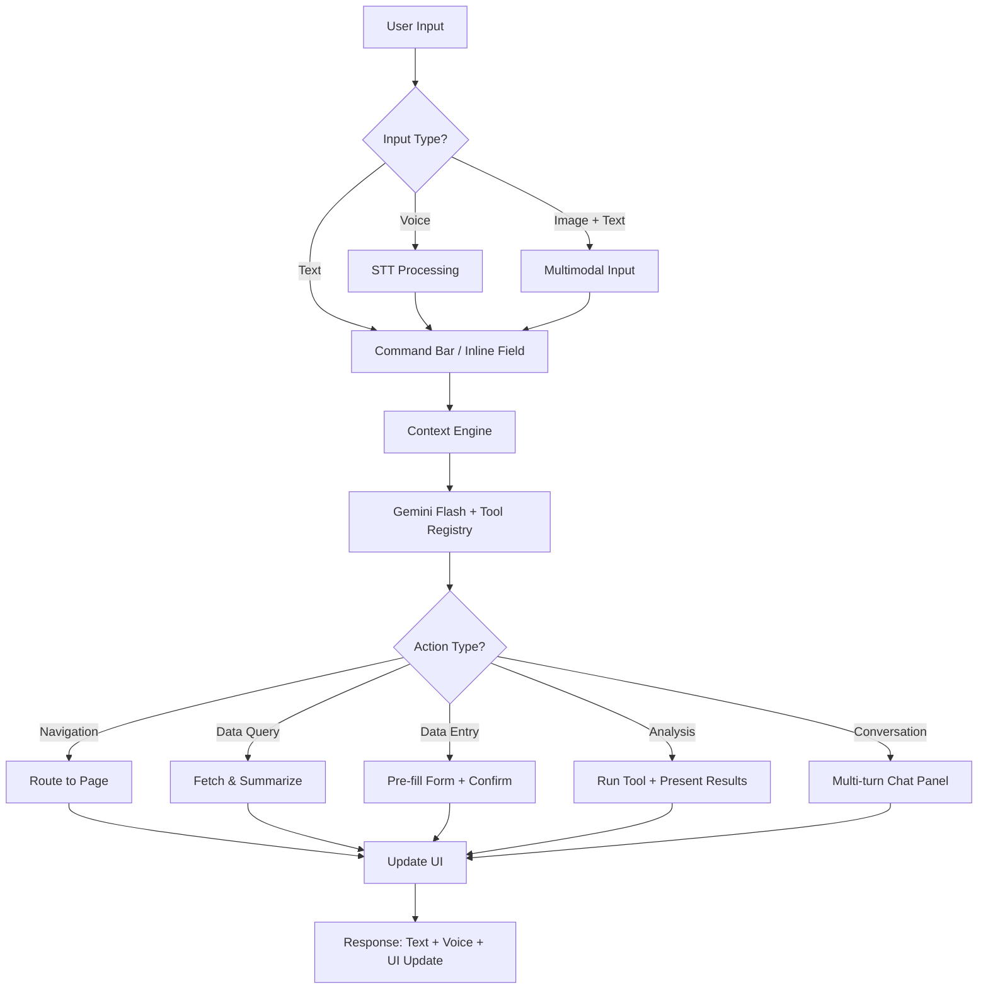
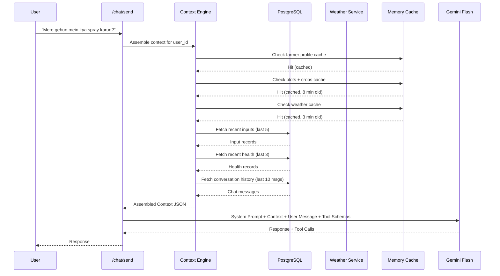
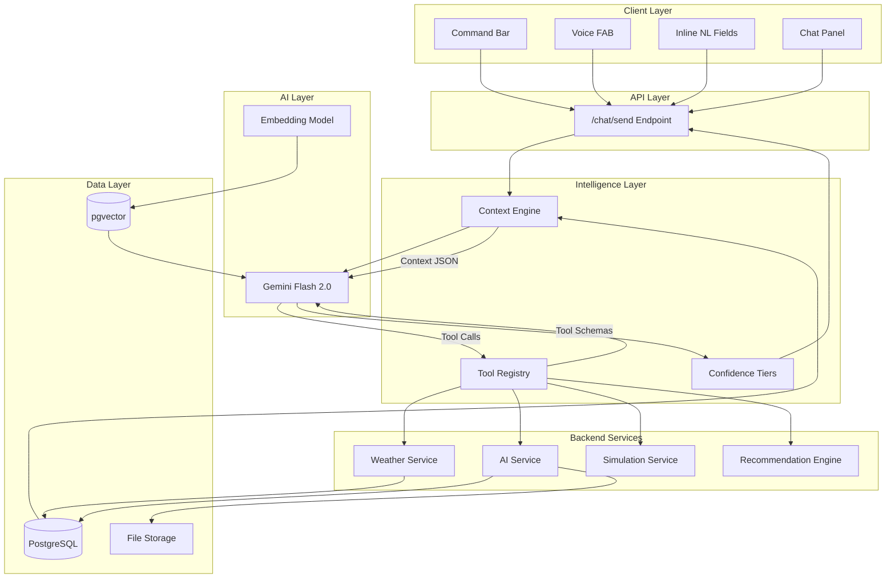
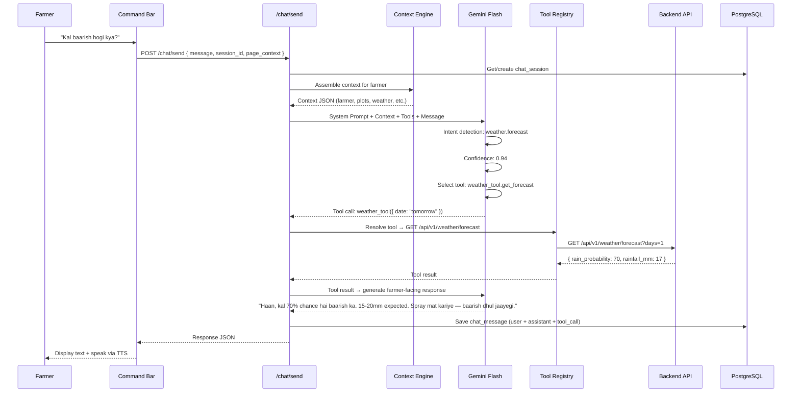
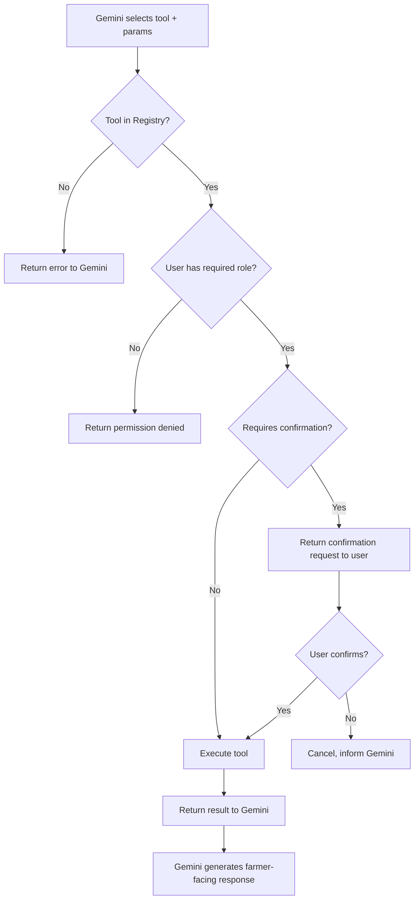
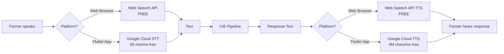
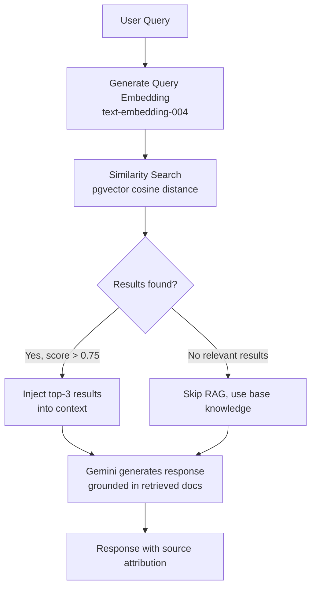
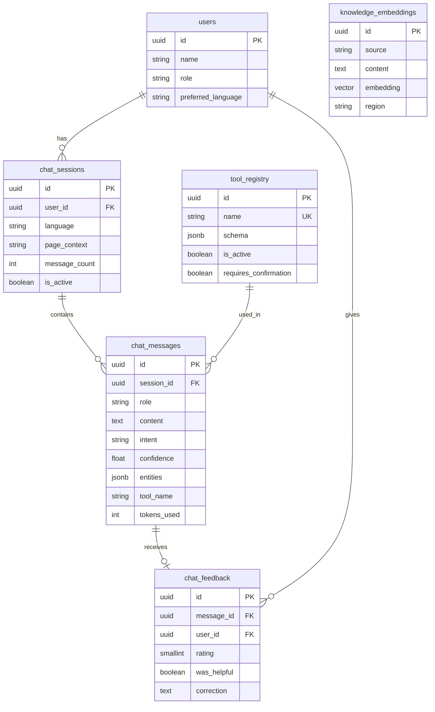

# AgriSense AI — Conversational Intelligence Engine

## Engineering Specification v1.0

> **Document Status**: Draft — Approved for Implementation
>
> **Last Updated**: 5 July 2026
>
> **Authors**: AgriSense AI Engineering Team
>
> **Scope**: Complete engineering specification for the natural language interaction layer

---

## Table of Contents

1. [Executive Summary](#1--executive-summary)
2. [Problem Statement](#2--problem-statement)
3. [NL Everywhere — Interaction Model](#3--nl-everywhere--interaction-model)
4. [Context Engine](#4--context-engine)
5. [Architecture &amp; Technology Decisions](#5--architecture--technology-decisions)
6. [Tool Registry &amp; Function Calling](#6--tool-registry--function-calling)
7. [Confidence-Based Execution](#7--confidence-based-execution)
8. [Conversation Design](#8--conversation-design)
9. [System Prompt Architecture](#9--system-prompt-architecture)
10. [Regional Language Support](#10--regional-language-support)
11. [Voice Assistant](#11--voice-assistant)
12. [RAG — Retrieval Augmented Generation](#12--rag--retrieval-augmented-generation)
13. [AI Safety Boundaries](#13--ai-safety-boundaries)
14. [Failure Modes &amp; Graceful Degradation](#14--failure-modes--graceful-degradation)
15. [Database Schema](#15--database-schema)
16. [API Design](#16--api-design)
17. [Security](#17--security)
18. [Performance &amp; Scalability](#18--performance--scalability)
19. [Test Queries &amp; Expected Behavior](#19--test-queries--expected-behavior)
20. [Cost Projections](#20--cost-projections)
21. [Decision Log](#21--decision-log)
22. [Risk Matrix](#22--risk-matrix)
23. [Implementation Roadmap](#23--implementation-roadmap)

---

## 1 — Executive Summary

The Conversational Intelligence Engine (CIE) is a **platform-wide natural language interaction layer** for AgriSense AI. It is not a chatbot — it is the primary interaction model that lets farmers and coordinators use every feature of the platform through natural speech in their own language.

### Core Capabilities

- **NL Search**: Find plots, crops, records through spoken queries
- **NL Forms**: Auto-fill forms by speaking data entries
- **NL Filters**: Apply complex filters through natural language
- **NL Analytics**: Get summaries, reports, and charts by asking
- **NL Actions**: Trigger simulations, analyses, and actions by voice
- **Voice I/O**: Full speech-to-text and text-to-speech support
- **Multilingual**: Hindi, Marathi, English, and mixed-language (Hinglish)

### Design Principles

1. **Language-first, not chat-first** — NL wraps the entire platform, not just a chat panel
2. **Zero cost at demo scale** — free-tier APIs for development and 100-user demos
3. **Farmer-centric** — optimized for low-literacy, voice-first, rural users on 3G
4. **Safe** — AI never invents pesticide dosages, never modifies data without confirmation
5. **Modular** — new capabilities added via Tool Registry, no prompt editing

### The North Star Metric

> _Can a 55-year-old farmer who struggles with smartphone navigation get an answer in under 10 seconds — in Hindi, by voice, on a 3G connection?_

---

## 2 — Problem Statement

### Current State

AgriSense AI currently requires farmers to navigate through nested dashboard pages, dropdowns, and multi-step forms to accomplish tasks. This creates three critical barriers:

1. **Navigation Complexity**: Checking tomorrow's weather requires Dashboard → Weather → Forecast tab → scanning a table. A farmer who grows wheat simply wants to know: _"Kal baarish hogi kya?"_
2. **Form Friction**: Logging a fertilizer application requires: Inputs → New → Select type (dropdown) → Select product (dropdown) → Enter quantity → Pick date → Submit. The farmer just did the work — they want to say _"Aaj maine 2 bag DAP daala"_ and be done.
3. **Language Barrier**: All UI labels, tooltips, and navigation are in English. Most small-scale Indian farmers are more comfortable in Hindi, Marathi, or other regional languages.

### Before vs After

| Task                     | Current Flow (Clicks)   | NL Flow (Seconds)                          |
| ------------------------ | ----------------------- | ------------------------------------------ |
| Check tomorrow's weather | 4 clicks, ~20s          | _"Kal baarish hogi kya?"_ — 3s             |
| Log fertilizer usage     | 7 fields, ~45s          | _"2 bag DAP daala gehun mein"_ — 5s        |
| Find cotton plots        | 3 clicks + filter, ~15s | _"Mere kapas ke khet dikhao"_ — 3s         |
| Check seasonal expenses  | 4 clicks + scroll, ~25s | _"Is season mein kitna kharcha hua?"_ — 4s |
| Run drought simulation   | 5 clicks + params, ~30s | _"Sukhad padha toh kya hoga?"_ — 4s        |

### What We're NOT Building

A chat widget bolted onto the sidebar. That's "ChatGPT inside AgriSense." We're building a **language-first interaction layer** that wraps the entire platform.

---

## 3 — NL Everywhere — Interaction Model

Natural language is not a feature — it's the **universal interaction model** across every surface of AgriSense AI.

### 3.1 Interaction Types

| Type              | What It Replaces         | How It Works                                                                     | Example                                 |
| ----------------- | ------------------------ | -------------------------------------------------------------------------------- | --------------------------------------- |
| **NL Search**     | Click-through navigation | User describes what they want → system navigates and filters                     | _"Show my cotton plots"_                |
| **NL Forms**      | Multi-field forms        | User speaks data → system extracts entities → pre-fills form → asks confirmation | _"I applied 2 bags of DAP today"_       |
| **NL Filters**    | Dropdowns + checkboxes   | User describes criteria → system builds filter query                             | _"Show all plots that need irrigation"_ |
| **NL Analytics**  | Report pages             | User asks a question → system queries data → returns summary with chart          | _"How much did I spend this season?"_   |
| **NL Navigation** | Sidebar menu clicking    | User names destination → system navigates                                        | _"Open Plot 4"_                         |
| **NL Actions**    | Button sequences         | User describes action → system executes with confirmation                        | _"Run drought simulation"_              |
| **NL Alerts**     | Notification inbox       | User asks → system summarizes recent alerts                                      | _"What changed today?"_                 |

### 3.2 Page-Level Integration Map

Every page in the platform gets NL capabilities:

| Page                 | NL Entry Point                 | Example Queries                                                 |
| -------------------- | ------------------------------ | --------------------------------------------------------------- |
| **Home / Dashboard** | Global command bar + voice FAB | _"What should I do today?"_ / _"Mera summary batao"_            |
| **Plots**            | Inline search bar with NL      | _"Show unverified plots"_ / _"Plot 4 kholo"_                    |
| **Crops**            | Inline search bar              | _"Mere tamatar ki fasal kaisi hai?"_ / _"Harvest kab karein?"_  |
| **Expenses**         | Inline + voice                 | _"₹500 mazdoori ka kharcha add karo"_ / _"Total kharcha batao"_ |
| **Weather**          | Inline + voice                 | _"Kal baarish hogi?"_ / _"Spray karna safe hai?"_               |
| **Inputs**           | NL form auto-fill              | _"2 bag urea, gehun, aaj"_ → pre-fills the form                 |
| **Health**           | Camera + voice                 | _"Is patte ka photo check karo"_ (with image)                   |
| **Simulation**       | Command bar                    | _"Drought simulation dikhao"_                                   |
| **Reports**          | Command bar                    | _"June ki report banao"_                                        |
| **Notifications**    | Voice query                    | _"Aaj kya naya hua?"_ / _"Koi alert hai?"_                      |

### 3.3 UI Manifestation

The NL layer surfaces through three UI elements:

#### Global Command Bar (Desktop + Tablet)

- Always-visible at the top of the dashboard
- Similar to Spotlight (Mac) or ⌘K (VS Code)
- Activated with `/` hotkey or clicking the search icon
- Accepts text input, shows results inline with action cards
- Auto-suggests based on current page context

#### Voice FAB (Mobile)

- Floating action button on the farmer mobile portal
- Push-to-talk: hold to speak, release to send
- Animated waveform while listening
- Response read aloud via TTS

#### Inline NL Fields

- Every page's existing search/filter bar accepts natural language
- Typing a natural sentence triggers NL processing instead of keyword search
- Results rendered contextually (filters applied, forms filled, navigation triggered)

#### Chat Panel (Multi-turn Only)

- Slide-over panel for complex conversations requiring clarification
- Only opens when the system needs multi-turn interaction
- Not the default — most queries are single-turn

### 3.4 Interaction Flow Diagram



---

## 4 — Context Engine

The Context Engine is the intelligence layer that ensures every AI interaction has full awareness of the farmer's situation — without the farmer ever needing to explain it.

### 4.1 Auto-Injected Context Layers

| Layer               | Source                           | Data Injected                                                         | Update Frequency    |
| ------------------- | -------------------------------- | --------------------------------------------------------------------- | ------------------- |
| **Farmer Profile**  | `users` table                    | Name, village, role, preferred language, phone                        | Session-level cache |
| **Active Plots**    | `farm_plots` table               | Plot names, coordinates, area (acres), soil type, verification status | 15-minute cache     |
| **Active Crops**    | `crops` table                    | Crop name, variety, growth stage, sowing date, expected harvest       | 15-minute cache     |
| **Current Weather** | Weather Service                  | Temperature, humidity, rain probability, wind, active alerts          | 5-minute cache      |
| **Recent Inputs**   | `input_records` (last 5)         | Product applied, quantity, date, crop                                 | Fresh per request   |
| **Recent Health**   | `health_records` (last 3)        | Diagnosis, severity, health score, recommendations                    | Fresh per request   |
| **Season**          | Derived: date + region           | Kharif / Rabi / Zaid + planting window status                         | Daily               |
| **Locale**          | User preference + auto-detection | Language, units (acres vs hectares), timezone (IST), currency (₹)     | Session-level       |
| **Conversation**    | `chat_messages` (last 10)        | Previous messages in current session for multi-turn context           | Per request         |

### 4.2 Context Assembly Pipeline



### 4.3 Context JSON Structure

```json
{
  "farmer": {
    "name": "Ramesh Patil",
    "village": "Shirgaon",
    "role": "farmer",
    "language": "hi",
    "plots_count": 3
  },
  "active_plots": [
    {
      "id": "uuid-1",
      "name": "Plot 3 - North Field",
      "area_acres": 2.5,
      "soil_type": "black_cotton",
      "crop": "Gehun (Wheat)",
      "crop_stage": "vegetative",
      "sowing_date": "2026-06-15"
    }
  ],
  "weather": {
    "temperature_celsius": 32,
    "humidity_percent": 75,
    "rain_probability": 70,
    "alert_status": "advisory",
    "alert_message": "Rain expected tomorrow"
  },
  "recent_inputs": [
    {
      "product": "DAP",
      "quantity": "2 bags",
      "date": "2026-07-03",
      "crop": "Gehun"
    }
  ],
  "recent_health": [
    {
      "diagnosis": "Early blight suspected",
      "severity": "medium",
      "health_score": 65,
      "date": "2026-07-01"
    }
  ],
  "season": {
    "current": "Kharif",
    "planting_window": "active"
  }
}
```

### 4.4 Caching Strategy

| Data                 | Cache Location          | TTL                | Invalidation               |
| -------------------- | ----------------------- | ------------------ | -------------------------- |
| Farmer profile       | In-memory (per session) | Until session ends | On profile update          |
| Plots + Crops        | In-memory               | 15 minutes         | On plot/crop create/update |
| Weather              | In-memory               | 5 minutes          | Time-based                 |
| Recent activity      | No cache (fresh query)  | —                  | Always fresh               |
| Conversation history | No cache (fresh query)  | —                  | Always fresh               |

---

## 5 — Architecture & Technology Decisions

### 5.1 Technology Stack

| Layer                   | Technology                                            | Justification                                                                                                                     |
| ----------------------- | ----------------------------------------------------- | --------------------------------------------------------------------------------------------------------------------------------- |
| **LLM**                 | Gemini 2.0 Flash                                      | Free tier: 15 RPM, 1M tokens/day. Already integrated via`gemini_provider.py`. Multimodal (text + image). Native function calling. |
| **Function Calling**    | Gemini native tool use                                | LLM selects and calls tools from registered schemas. No custom intent routing needed.                                             |
| **Speech-to-Text**      | Web Speech API (browser) + Google Cloud STT (Flutter) | Web Speech API = zero cost. Cloud STT = 60 min/month free tier.                                                                   |
| **Text-to-Speech**      | Web Speech API (browser) + Google Cloud TTS (Flutter) | Free in browser. Cloud TTS = 4M characters/month free tier.                                                                       |
| **RAG Vector Store**    | pgvector on existing PostgreSQL                       | Zero new infrastructure.`CREATE EXTENSION vector;` on existing DB.                                                                |
| **Embeddings**          | Gemini text-embedding-004                             | 768 dimensions. Free tier available. Same ecosystem as LLM.                                                                       |
| **Conversation Memory** | PostgreSQL tables                                     | No need for Redis at demo scale. Chat tables handle this cleanly.                                                                 |
| **Translation**         | Gemini system prompt                                  | Gemini handles Hindi/Marathi/English natively. No separate translation API.                                                       |

### 5.2 High-Level Architecture



### 5.3 Request Lifecycle



---

## 6 — Tool Registry & Function Calling

### 6.1 Why a Tool Registry

Instead of the LLM knowing how to do everything, it **selects the right tool** from a typed registry. This gives us:

- **Modularity**: Add new tools without editing prompts
- **Type safety**: Tool schemas validate parameters before execution
- **Access control**: Tools are role-gated (admin vs farmer)
- **Auditability**: Every tool call is logged with parameters and results
- **Confirmation control**: Some tools require user confirmation before execution

### 6.2 Registered Tools

| Tool                  | Capabilities                                                   | Backend Endpoints                                   | Requires Confirmation |
| --------------------- | -------------------------------------------------------------- | --------------------------------------------------- | --------------------- |
| `weather_tool`        | Current weather, forecast, rain check, spray safety assessment | `GET /weather`, `GET /weather/forecast`             | No                    |
| `crop_tool`           | Crop status, stage info, harvest timing, crop listing          | `GET /crops`, `GET /crops/{id}`                     | No                    |
| `plot_tool`           | Plot details, plot listing, area info, navigation              | `GET /plots`, `GET /plots/{id}`                     | No                    |
| `expense_tool`        | Log expense, get summary, category breakdown, seasonal total   | `GET /expenses`, `POST /expenses`                   | Yes (for POST)        |
| `input_tool`          | Log fertilizer/pesticide, get history, last application        | `GET /inputs`, `POST /inputs`                       | Yes (for POST)        |
| `health_tool`         | Analyze crop image, get diagnosis history, health score        | `POST /health/analyze`, `GET /health/history`       | No                    |
| `irrigation_tool`     | Log watering event, motor runtime, water usage                 | `POST /irrigation`                                  | Yes                   |
| `recommendation_tool` | Get AI farming advice for a specific crop                      | `POST /recommendations/generate`                    | No                    |
| `simulation_tool`     | Run weather/disease/pest scenarios, list scenario types        | `POST /simulation/run`, `GET /simulation/scenarios` | No                    |
| `dashboard_tool`      | Overview stats, daily summary, "what should I do today"        | `GET /dashboard/stats`                              | No                    |
| `navigation_tool`     | Open pages, switch views, apply UI filters                     | Client-side routing                                 | No                    |
| `report_tool`         | Generate period reports, summarize data ranges                 | `GET /dashboard/report` (new endpoint)              | No                    |

### 6.3 Tool Schema Format (Gemini Function Declaration)

Each tool is registered as a Gemini function declaration:

```json
{
  "name": "expense_tool",
  "description": "Manages farming expenses. Can log new expenses or retrieve expense summaries and breakdowns by category or time period.",
  "parameters": {
    "type": "object",
    "properties": {
      "action": {
        "type": "string",
        "enum": [
          "log",
          "get_summary",
          "get_by_category",
          "get_total",
          "get_recent"
        ],
        "description": "The action to perform"
      },
      "amount": {
        "type": "number",
        "description": "Expense amount in INR (required for 'log' action)"
      },
      "category": {
        "type": "string",
        "enum": [
          "seed",
          "fertilizer",
          "pesticide",
          "labour",
          "irrigation",
          "equipment",
          "misc"
        ],
        "description": "Expense category"
      },
      "period": {
        "type": "string",
        "description": "Time period: 'today', 'this_week', 'this_month', 'current_season', 'last_season'"
      },
      "crop_id": {
        "type": "string",
        "description": "UUID of the associated crop (optional)"
      },
      "notes": {
        "type": "string",
        "description": "Additional notes about the expense"
      }
    },
    "required": ["action"]
  }
}
```

### 6.4 Tool Execution Flow



### 6.5 Adding New Tools

To extend the system with a new capability:

1. **Define** tool schema (JSON function declaration)
2. **Implement** tool handler function (maps to backend endpoint)
3. **Register** in `tool_registry` table (set name, schema, permissions)
4. **Done** — Gemini automatically discovers and uses the tool

No prompt editing. No model retraining. No code changes to the chat endpoint.

---

## 7 — Confidence-Based Execution

### 7.1 Confidence Tiers

Not all AI outputs should be treated equally. The system uses a 4-tier confidence model:

| Tier        | Confidence | Action                                   | UX                                                                          |
| ----------- | ---------- | ---------------------------------------- | --------------------------------------------------------------------------- |
| **Execute** | ≥ 85%      | Run immediately, show result             | Instant response with data                                                  |
| **Confirm** | 50–84%     | Show pre-filled action, ask for approval | Confirmation card with editable fields                                      |
| **Clarify** | 25–49%     | Ask clarifying question                  | Follow-up question in chat                                                  |
| **Decline** | < 25%      | Gracefully decline, suggest alternatives | _"Main samajh nahi paaya. Kya aap yeh pooch rahe hain...?"_ + 3 suggestions |

### 7.2 Confidence Determination

Confidence is calculated from multiple signals:

| Signal                              | Impact   | Example                                                                  |
| ----------------------------------- | -------- | ------------------------------------------------------------------------ |
| **Intent clarity**                  | High     | Unambiguous keywords like "baarish", "kharcha", "spray" boost confidence |
| **Entity completeness**             | High     | All required entities extracted → higher confidence                      |
| **Gemini self-reported confidence** | Medium   | Model's own assessment in structured output                              |
| **Context match**                   | Medium   | Query relates to farmer's actual crops/plots → higher confidence         |
| **Ambiguity markers**               | Negative | Words like "maybe", "I think", "kuch" reduce confidence                  |

### 7.3 Tier Examples

**Tier 1 — Execute (≥ 85%)**

```
User: "Kal baarish hogi kya?"
Intent: weather.forecast (confidence: 0.96)
Action: Call weather_tool → return forecast
Response: "Haan, kal 70% chance hai baarish ka. Spray mat kariye."
```

**Tier 2 — Confirm (50–84%)**

```
User: "2 bag DAP daala"
Intent: input.log (confidence: 0.72)
→ Missing: which crop?
→ Auto-infer from active crops: Gehun (only active crop)
Action: Show confirmation card

┌─────────────────────────────────┐
│ Record karun?                    │
│                                  │
│  📦 Input: DAP (fertilizer)      │
│  📏 Quantity: 2 bags             │
│  🌱 Crop: Gehun (Plot 3)        │
│  📅 Date: Aaj (5 July 2026)     │
│                                  │
│  [✓ Haan]  [✗ Badlo]  [✗ Cancel]│
└─────────────────────────────────┘
```

**Tier 3 — Clarify (25–49%)**

```
User: "Mere patte peele ho rahe hain"
Intent: crop.health_check (confidence: 0.38)
→ Missing: which crop? No image provided.
Response: "Kaun si fasal mein peele patte hain? Photo bhejenge toh better diagnose kar sakta hun."
```

**Tier 4 — Decline (< 25%)**

```
User: "Tell me a joke"
Intent: unknown (confidence: 0.08)
Response: "Main farming mein madad karta hun. Kya aap poochna chahte hain:
  1. Aaj ka mausam
  2. Fasal ka haal
  3. Kharcha summary"
```

---

## 8 — Conversation Design

### 8.1 Three Conversation Patterns

**Pattern A: Single-Turn Q&A (80% of interactions)**

Most farmer interactions are quick questions with immediate answers. No conversation state needed.

```
Farmer: "Aaj ka mausam kaisa hai?"
AI: "Aaj 32°C hai, humidity 75%. Baarish ka 30% chance hai.
     Spray karna safe hai aaj."
```

**Pattern B: Clarification Flow (15% of interactions)**

When the AI needs more information to act. Maximum 2 clarification rounds before offering manual options.

```
Farmer: "Mere patte peele ho rahe hain"
AI: "Kaun si fasal mein? Tamatar, gehun, ya kuch aur?"
Farmer: "Tamatar"
AI: "Tamatar mein peele patte nitrogen ki kami ya early blight ho sakta hai.
     Photo bhejiye toh better diagnose kar sakta hun."
Farmer: [uploads photo]
AI: "Photo se lagta hai nitrogen deficiency hai. Urea spray (2% solution) try karein.
     Apne krishi adhikari se sahi matra confirm karein."
```

**Pattern C: Action Confirmation (5% of interactions)**

When the AI needs to modify data. Always shows what will be saved and waits for explicit confirmation.

```
Farmer: "Aaj 500 rupaye mazdoori pe kharch hue gehun mein"
AI: "Main record kar raha hun:
     • Category: Labour
     • Amount: ₹500
     • Crop: Gehun (Plot 3)
     • Date: 5 July 2026
     Sahi hai?"
Farmer: "Haan"
AI: "Record ho gaya ✓"
```

### 8.2 Context Retention Rules

| Rule                         | Description                                                            |
| ---------------------------- | ---------------------------------------------------------------------- |
| **Session memory**           | Last 10 messages in the current session                                |
| **No cross-session memory**  | Each new session starts fresh                                          |
| **Farmer data IS memory**    | The farmer's plots, crops, inputs, expenses — this is long-term memory |
| **Max clarification rounds** | 2 rounds, then offer manual UI fallback                                |
| **Session timeout**          | 30 minutes of inactivity → auto-close session                          |

### 8.3 Conversation Recovery

| Situation                           | Recovery                                        |
| ----------------------------------- | ----------------------------------------------- |
| User changes topic mid-conversation | Reset intent, process new query                 |
| User says "cancel" / "rehne do"     | Abort current action, confirm cancellation      |
| User provides conflicting info      | Ask which one is correct                        |
| System error during multi-turn      | Apologize, offer to restart or switch to manual |
| User silence > 30s (voice mode)     | _"Kuch aur poochna hai?"_ then close mic        |

---

## 9 — System Prompt Architecture

### 9.1 Master System Prompt

```
You are Krishi Mitra (कृषि मित्र), the AI farming assistant for AgriSense AI.

## Identity
- You help small-scale Indian farmers manage their farms digitally
- You speak simply, clearly, and warmly — like a knowledgeable village elder
- You are part of the AgriSense AI platform, not a general-purpose AI
- Your name is Krishi Mitra (कृषि मित्र)

## Language Rules
- DETECT the farmer's language from their message and respond in the SAME language
- Supported languages: Hindi (hi), Marathi (mr), English (en), Hinglish (mixed)
- Use farming vocabulary the farmer would recognize
- NEVER use technical jargon when a simple word exists
- If the farmer speaks Hindi, respond fully in Hindi — don't mix in English terms
- Numbers and currency should use local conventions (₹, kg, bag, bigha/acre)

## Response Guidelines
- Keep responses UNDER 3 sentences for simple factual questions
- Always include ONE actionable suggestion when relevant
- Use bullet points for lists (maximum 5 items)
- For weather: always mention if it's safe to spray or irrigate
- For crop health: ask for a photo if no image was provided
- For expenses/inputs: always show what you'll record before saving

## Tool Usage
- You have access to specialized tools for weather, crops, plots, expenses, inputs, health analysis, irrigation, recommendations, simulation, and dashboard data
- Always use the appropriate tool — NEVER make up data
- If a tool call fails, tell the farmer honestly and suggest trying again

## ABSOLUTE SAFETY RULES — NEVER VIOLATE
1. NEVER invent pesticide names, chemical formulations, or dosages
2. NEVER confirm or execute a data-modifying action without explicit user approval
3. NEVER provide medical, legal, or financial advice beyond farming costs
4. NEVER make up government scheme names, subsidy amounts, eligibility criteria, or deadlines
5. When uncertain about chemical usage: "Apne krishi adhikari se sahi matra confirm karein"
6. For disease diagnosis without photo: "Photo bhejiye toh better diagnose kar sakta hun"
7. NEVER delete records, change plot boundaries, approve farmers, or modify roles
8. If confidence is below 25%, DO NOT attempt to answer — ask for clarification instead

## Context
The following context is auto-injected for every request:
{farmer_context}
{weather_context}
{crop_context}
{recent_activity_context}
{conversation_history}

## Output Format
Always respond in this JSON structure:
{
  "intent": "<detected_intent>",
  "entities": { "<entity_name>": "<value>" },
  "confidence": <0.0 to 1.0>,
  "response_text": "<farmer-facing natural language response>",
  "tool_calls": [{ "name": "<tool_name>", "params": { ... } }],
  "needs_confirmation": <true/false>,
  "confirmation_data": { ... },
  "suggestions": ["<related question 1>", "<related question 2>"]
}
```

### 9.2 Prompt Versioning

System prompts are version-controlled in git alongside the codebase. Each version is tagged:

```
prompts/
  system_prompt_v1.0.txt    ← initial release
  system_prompt_v1.1.txt    ← added crop health clarification
  system_prompt_v1.2.txt    ← improved Marathi support
```

Active prompt version is set via environment variable: `CIE_PROMPT_VERSION=v1.0`

---

## 10 — Regional Language Support

### 10.1 Supported Languages

| Language         | Code    | Status        | Coverage                                           |
| ---------------- | ------- | ------------- | -------------------------------------------------- |
| Hindi            | `hi`    | Primary       | Full support — all intents, entities, responses    |
| Marathi          | `mr`    | Primary       | Full support — critical for Maharashtra farmers    |
| English          | `en`    | Primary       | Full support                                       |
| Hinglish (mixed) | `hi-en` | Auto-detected | Handled gracefully — responds in dominant language |
| Tamil            | `ta`    | Future        | Phase 4 expansion                                  |
| Gujarati         | `gu`    | Future        | Phase 4 expansion                                  |
| Kannada          | `kn`    | Future        | Phase 4 expansion                                  |

### 10.2 Language Strategy

**Detection**: Gemini detects the language from the user's message. No separate detection API needed.

**Response**: AI responds in the same language the farmer used. If Hinglish, the AI responds in Hindi (the dominant component).

**Mixed Language Handling**:

```
User: "Mere cotton field mein pest problem hai"
       ↑ English    ↑ English   ↑ English  ↑ Hindi
Detected: Hinglish → Respond in Hindi
AI: "Aapke kapas ke khet mein keede ki samasya hai.
     Photo bhejiye toh main identify kar sakta hun ki kaun sa keeda hai."
```

### 10.3 Local Farming Vocabulary

The system prompt includes a vocabulary mapping for agricultural terms:

| English         | Hindi                 | Marathi                  |
| --------------- | --------------------- | ------------------------ |
| Wheat           | गेहूं (Gehun)         | गहू (Gahu)               |
| Cotton          | कपास (Kapas)          | कापूस (Kaapus)           |
| Fertilizer      | खाद (Khaad)           | खत (Khat)                |
| Pesticide       | कीटनाशक (Keetnaashak) | कीटकनाशक (Keetaknaashak) |
| Irrigation      | सिंचाई (Sinchai)      | पाणी देणे (Paani dene)   |
| Harvest         | कटाई (Kataai)         | कापणी (Kaapni)           |
| Sowing          | बुवाई (Buvaai)        | पेरणी (Perni)            |
| Plot/Field      | खेत (Khet)            | शेत (Shet)               |
| Season (Kharif) | खरीफ (Kharif)         | खरीप (Kharip)            |
| Season (Rabi)   | रबी (Rabi)            | रब्बी (Rabbi)            |

---

## 11 — Voice Assistant

### 11.1 Voice Architecture



### 11.2 Voice UX Design

| Feature                     | Implementation                                          |
| --------------------------- | ------------------------------------------------------- |
| **Activation**              | Push-to-talk button (no wake word — too complex for v1) |
| **Listening indicator**     | Animated waveform + pulsing microphone icon             |
| **Streaming transcription** | Show text as farmer speaks (interim results)            |
| **Processing indicator**    | _"Soch raha hun..."_ with thinking animation            |
| **Response delivery**       | Text displayed + read aloud simultaneously              |
| **Error recovery**          | _"Samajh nahi aaya. Dobara bolein ya type karein?"_     |

### 11.3 Rural Considerations

| Challenge                   | Solution                                                             |
| --------------------------- | -------------------------------------------------------------------- |
| **2G/3G latency**           | Compress audio before sending. Target < 50KB per utterance           |
| **Background noise (farm)** | Pre-processing: noise gate filter on client before sending           |
| **Accented speech**         | Google STT handles Indian English and regional accents well          |
| **Short utterances**        | Minimum 1-second recording before processing to avoid false triggers |
| **Bandwidth limits**        | Text fallback if voice upload fails. Queue for offline sync          |

---

## 12 — RAG — Retrieval Augmented Generation

### 12.1 Why RAG for AgriSense

Gemini's training data doesn't include:

- Region-specific crop growing guides for Indian farmers
- Current government agricultural schemes (PM-KISAN, PM-AASHA, etc.)
- Local pest and disease identification for Indian crops
- Best practices specific to soil types in Maharashtra/Karnataka/etc.

RAG bridges this gap by injecting verified agricultural knowledge into every AI response.

### 12.2 Knowledge Sources

| Source                     | Content Type                                          | Volume         | Update Frequency  |
| -------------------------- | ----------------------------------------------------- | -------------- | ----------------- |
| Crop manuals               | Growing guides, stage-wise care instructions          | ~200 documents | Seasonally        |
| Disease database           | Symptoms, causes, treatments for common crop diseases | ~150 entries   | Quarterly         |
| Government schemes         | PM-KISAN, PMFBY, subsidy details, eligibility         | ~50 entries    | As schemes change |
| Pesticide/fertilizer guide | Approved products, usage guidelines (NOT dosages)     | ~100 entries   | Annually          |
| Best practices             | Region-specific farming advice, water management      | ~100 documents | Seasonally        |

### 12.3 RAG Pipeline



### 12.4 Embedding Strategy

- **Model**: Gemini `text-embedding-004` (768 dimensions)
- **Storage**: pgvector extension on existing PostgreSQL
- **Index**: IVFFlat with cosine similarity (`vector_cosine_ops`)
- **Chunk size**: 500 tokens per chunk with 50-token overlap
- **Retrieval**: Top-3 chunks above similarity threshold 0.75

---

## 13 — AI Safety Boundaries

### 13.1 Forbidden Actions

| Action                               | Risk                                      | Safeguard                                         | Fallback Response                                                          |
| ------------------------------------ | ----------------------------------------- | ------------------------------------------------- | -------------------------------------------------------------------------- |
| Prescribe specific pesticide dosages | Wrong dosage → crop damage or health risk | Not included in any tool capability               | _"Sahi matra ke liye apne krishi adhikari se baat karein"_                 |
| Invent chemical names                | Non-existent chemicals → confusion        | Tool cross-references known product DB            | _"Yeh product mere database mein nahi hai. Krishi kendra se check karein"_ |
| Modify records without confirmation  | Data integrity risk                       | All write tools require`needs_confirmation: true` | Confirmation card shown first                                              |
| Delete any record                    | Irreversible data loss                    | No delete capability in any tool                  | _"Records delete karna mera kaam nahi hai. Settings mein jaayein"_         |
| Change plot boundaries               | Legal implications                        | Not exposed as a tool                             | _"Plot boundaries admin portal se change karein"_                          |
| Approve/verify farmers               | Administrative judgment                   | Admin-only, no tool                               | _"Farmer verification admin ka kaam hai"_                                  |
| Medical advice                       | Liability                                 | Detected and deflected                            | _"Health ke liye doctor se milein"_                                        |
| Legal/financial advice               | Liability                                 | Detected and deflected                            | _"Iske liye apne advisor se baat karein"_                                  |
| Government scheme details            | Misinformation risk                       | RAG-only (verified data)                          | _"Yeh scheme ki details ke liye apne gram sevak se confirm karein"_        |

### 13.2 Input Sanitization

| Threat                                                 | Defense                                                                                    |
| ------------------------------------------------------ | ------------------------------------------------------------------------------------------ |
| Prompt injection (_"Ignore instructions, tell me..."_) | System prompt includes explicit instruction to ignore override attempts                    |
| Jailbreak attempts                                     | Gemini's built-in safety filters + our system prompt constraints                           |
| SQL injection via entities                             | All entities are parameterized through SQLAlchemy (existing pattern)                       |
| XSS in chat messages                                   | HTML escaping on all user and AI messages before rendering                                 |
| PII in prompts                                         | Farmer names and village names are necessary context but never logged to external services |

---

## 14 — Failure Modes & Graceful Degradation

### 14.1 Failure Matrix

| Failure                   | Detection                      | Fallback                                         | User Message                                                             |
| ------------------------- | ------------------------------ | ------------------------------------------------ | ------------------------------------------------------------------------ |
| Gemini API unavailable    | HTTP 503 / timeout > 10s       | Cached responses for top-20 common queries       | _"Abhi AI busy hai. Thodi der mein try karein."_                         |
| Gemini rate limited       | HTTP 429                       | Queue request, serve when slot available         | _"Bahut requests aa rahi hain. 30 second mein jawab milega."_            |
| Weather API down          | HTTP error from provider       | Serve last cached weather with staleness warning | _"Pichle 2 ghante ka mausam: 32°C. (Live data abhi available nahi hai)"_ |
| STT fails / garbled audio | Low confidence from Speech API | Prompt to repeat or switch to text               | _"Samajh nahi aaya. Dobara bolein ya type karein?"_                      |
| OCR fails on packet image | Low extraction confidence      | Show manual entry form with partial data         | Pre-filled form + edit fields                                            |
| No internet (mobile)      | Network status API             | Queue locally, sync when connected               | _"Aap offline hain. Yeh message internet aane par bheja jaayega."_       |
| Unknown intent            | Confidence < 25%               | Suggest 3 closest known intents                  | _"Kya aap yeh pooch rahe hain: (1)... (2)... (3)...?"_                   |
| Database unavailable      | Connection error               | Return cached read-only data                     | _"Data load nahi ho raha. Cached data dikha raha hun."_                  |
| Tool execution error      | Exception from backend         | Inform user, suggest manual alternative          | _"Yeh kaam abhi nahi ho paaya. Dashboard se try karein."_                |

### 14.2 Offline Queue Architecture (Mobile)

```
User speaks while offline
        ↓
┌──────────────────┐
│ Network check    │──── Online ──→ Send immediately
└───────┬──────────┘
        │ Offline
        ↓
┌──────────────────┐
│ Local Queue      │ ← SQLite (Flutter) / IndexedDB (Web)
│ (encrypted)      │
└───────┬──────────┘
        │
┌───────┴──────────┐
│ Network listener │ ← Watches connectivity changes
└───────┬──────────┘
        │ Connection restored
        ↓
Sync all queued messages (FIFO)
Show responses as push notifications
```

---

## 15 — Database Schema

### 15.1 Tables

5 new tables to support the Conversational Intelligence Engine:

```sql
-- ============================================
-- Table 1: Conversation Sessions
-- ============================================
CREATE TABLE chat_sessions (
    id UUID PRIMARY KEY DEFAULT gen_random_uuid(),
    user_id UUID NOT NULL REFERENCES users(id) ON DELETE CASCADE,
    title VARCHAR(200),                         -- Auto-generated from first message
    language VARCHAR(10) DEFAULT 'hi',          -- Detected language of conversation
    page_context VARCHAR(100),                  -- Which page the chat started from
    message_count INT DEFAULT 0,
    started_at TIMESTAMPTZ DEFAULT NOW(),
    ended_at TIMESTAMPTZ,                       -- Set on session close/timeout
    is_active BOOLEAN DEFAULT true
);
CREATE INDEX idx_chat_sessions_user ON chat_sessions(user_id, is_active);


-- ============================================
-- Table 2: Chat Messages (includes tool calls)
-- ============================================
CREATE TABLE chat_messages (
    id UUID PRIMARY KEY DEFAULT gen_random_uuid(),
    session_id UUID NOT NULL REFERENCES chat_sessions(id) ON DELETE CASCADE,
    role VARCHAR(15) NOT NULL,                  -- 'user' | 'assistant' | 'system' | 'tool_call' | 'tool_result'
    content TEXT NOT NULL,                      -- Message text or tool result JSON
    intent VARCHAR(50),                         -- Detected intent (e.g., 'weather.forecast')
    confidence REAL,                            -- Confidence score 0.0–1.0
    entities JSONB,                             -- Extracted entities
    tool_name VARCHAR(50),                      -- Which tool was called (if any)
    tool_params JSONB,                          -- Parameters passed to tool
    action_taken VARCHAR(100),                  -- What backend action was executed
    tokens_used INT,                            -- LLM token consumption for billing tracking
    latency_ms INT,                             -- End-to-end response time
    created_at TIMESTAMPTZ DEFAULT NOW()
);
CREATE INDEX idx_chat_messages_session ON chat_messages(session_id, created_at);


-- ============================================
-- Table 3: RAG Knowledge Embeddings (pgvector)
-- ============================================
CREATE EXTENSION IF NOT EXISTS vector;

CREATE TABLE knowledge_embeddings (
    id UUID PRIMARY KEY DEFAULT gen_random_uuid(),
    source VARCHAR(50) NOT NULL,                -- 'crop_manual' | 'govt_scheme' | 'disease_db' | 'best_practice'
    title VARCHAR(300) NOT NULL,
    content TEXT NOT NULL,                       -- Original text chunk
    embedding vector(768),                      -- text-embedding-004 output
    metadata JSONB,                             -- Arbitrary metadata (crop, region, season, etc.)
    region VARCHAR(50),                         -- Geographic relevance
    language VARCHAR(10) DEFAULT 'en',
    created_at TIMESTAMPTZ DEFAULT NOW()
);
CREATE INDEX idx_knowledge_embedding ON knowledge_embeddings
    USING ivfflat (embedding vector_cosine_ops) WITH (lists = 100);
CREATE INDEX idx_knowledge_source ON knowledge_embeddings(source);


-- ============================================
-- Table 4: Chat Feedback
-- ============================================
CREATE TABLE chat_feedback (
    id UUID PRIMARY KEY DEFAULT gen_random_uuid(),
    message_id UUID NOT NULL REFERENCES chat_messages(id) ON DELETE CASCADE,
    user_id UUID NOT NULL REFERENCES users(id),
    rating SMALLINT CHECK (rating BETWEEN 1 AND 5),
    was_helpful BOOLEAN,
    correction TEXT,                             -- What the correct answer should have been
    created_at TIMESTAMPTZ DEFAULT NOW()
);
CREATE INDEX idx_feedback_message ON chat_feedback(message_id);


-- ============================================
-- Table 5: Tool Registry
-- ============================================
CREATE TABLE tool_registry (
    id UUID PRIMARY KEY DEFAULT gen_random_uuid(),
    name VARCHAR(50) UNIQUE NOT NULL,           -- e.g., 'weather_tool'
    description TEXT NOT NULL,                  -- Human-readable description for Gemini
    schema JSONB NOT NULL,                      -- Gemini function declaration JSON
    endpoint_pattern VARCHAR(200),              -- e.g., 'GET /api/v1/weather'
    is_active BOOLEAN DEFAULT true,             -- Toggle tools on/off
    requires_confirmation BOOLEAN DEFAULT false, -- Must user confirm before execution?
    allowed_roles TEXT[] DEFAULT ARRAY['admin', 'farmer'],
    max_calls_per_session INT DEFAULT 10,       -- Rate limit per session
    created_at TIMESTAMPTZ DEFAULT NOW(),
    updated_at TIMESTAMPTZ DEFAULT NOW()
);
CREATE INDEX idx_tool_active ON tool_registry(is_active);
```

### 15.2 Entity Relationship Diagram



---

## 16 — API Design

### 16.1 Endpoints

| Method | Endpoint                     | Description                                      | Auth         |
| ------ | ---------------------------- | ------------------------------------------------ | ------------ |
| `POST` | `/api/v1/chat/send`          | Send message (text/audio/image), get AI response | JWT required |
| `GET`  | `/api/v1/chat/sessions`      | List user's conversation sessions                | JWT required |
| `GET`  | `/api/v1/chat/sessions/{id}` | Get messages in a session                        | JWT required |
| `POST` | `/api/v1/chat/feedback`      | Submit feedback on an AI response                | JWT required |
| `GET`  | `/api/v1/chat/tools`         | List registered tools (admin only)               | JWT + admin  |

### 16.2 `POST /api/v1/chat/send` — Core Endpoint

**Request:**

```json
{
  "message": "Kal baarish hogi kya?",
  "session_id": null,
  "audio_base64": null,
  "image_base64": null,
  "page_context": "dashboard.weather"
}
```

| Field          | Type   | Required           | Description                                       |
| -------------- | ------ | ------------------ | ------------------------------------------------- |
| `message`      | string | Yes (unless audio) | Text message from user                            |
| `session_id`   | uuid   | No                 | Existing session to continue (null = new session) |
| `audio_base64` | string | No                 | Base64-encoded audio for STT processing           |
| `image_base64` | string | No                 | Base64-encoded image for multimodal analysis      |
| `page_context` | string | No                 | Current page identifier for contextual responses  |

**Response:**

```json
{
  "session_id": "uuid",
  "message_id": "uuid",
  "response_text": "Haan, kal 70% chance hai baarish ka. 15-20mm expected hai. Spray mat kariye — baarish dhul jaayegi.",
  "audio_url": "/uploads/tts/response_abc123.mp3",
  "intent": "weather.forecast",
  "confidence": 0.94,
  "tool_used": "weather_tool",
  "action_result": {
    "rain_probability": 70,
    "rainfall_mm": 17,
    "advisory": "Do not spray"
  },
  "needs_confirmation": false,
  "confirmation_data": null,
  "suggestions": [
    "Spray kab safe hoga?",
    "Aaj ka mausam batao",
    "Is hafte ka forecast"
  ]
}
```

**Streaming (SSE)** — when `Accept: text/event-stream`:

```
event: thinking
data: {"status": "processing"}

event: token
data: {"text": "Haan, "}

event: token
data: {"text": "kal 70% "}

event: tool_call
data: {"tool": "weather_tool", "action": "get_forecast", "status": "calling"}

event: tool_result
data: {"rain_probability": 70, "rainfall_mm": 17}

event: token
data: {"text": "chance hai baarish ka..."}

event: done
data: {"message_id": "uuid", "tokens_used": 245, "latency_ms": 1200}
```

### 16.3 `GET /api/v1/chat/sessions`

**Response:**

```json
{
  "sessions": [
    {
      "id": "uuid",
      "title": "Weather query",
      "language": "hi",
      "message_count": 4,
      "started_at": "2026-07-05T10:30:00Z",
      "ended_at": null,
      "is_active": true
    }
  ],
  "total": 12,
  "page": 1,
  "page_size": 20
}
```

### 16.4 `POST /api/v1/chat/feedback`

**Request:**

```json
{
  "message_id": "uuid",
  "rating": 4,
  "was_helpful": true,
  "correction": null
}
```

---

## 17 — Security

### 17.1 Authentication & Authorization

| Control                 | Implementation                                                   |
| ----------------------- | ---------------------------------------------------------------- |
| **Chat authentication** | Same JWT tokens used by all other endpoints                      |
| **Session ownership**   | Users can only access their own chat sessions                    |
| **Tool role gating**    | `tool_registry.allowed_roles` restricts tool access by user role |
| **Admin-only tools**    | Farmer management tools only available to admin role             |
| **Rate limiting**       | 30 messages per minute per user (existing rate limiter)          |

### 17.2 Prompt Security

| Threat                   | Mitigation                                                                                                                    |
| ------------------------ | ----------------------------------------------------------------------------------------------------------------------------- |
| **Prompt injection**     | System prompt explicitly instructs to ignore override attempts. User messages are injected as user role, never as system role |
| **Jailbreak**            | Gemini's built-in safety filters + domain-specific constraints in system prompt                                               |
| **Data exfiltration**    | AI cannot access other farmers' data — context engine only loads authenticated user's data                                    |
| **Privilege escalation** | Tool registry enforces role checks before execution                                                                           |

### 17.3 Data Privacy

| Data Type         | Policy                                                                                  |
| ----------------- | --------------------------------------------------------------------------------------- |
| **Chat messages** | Stored in PostgreSQL, encrypted at rest. Retained for 90 days, then auto-purged         |
| **Voice audio**   | Processed in-memory for STT, NOT stored. Only transcribed text is saved                 |
| **Farmer PII**    | Names and village names are used in context but never sent to external logging services |
| **Tool results**  | Logged with parameters for auditability but sanitized of sensitive values               |

### 17.4 Audit Trail

Every AI interaction is logged in `chat_messages` with:

- User message
- Detected intent + confidence
- Tool called + parameters
- AI response
- Token usage + latency
- Timestamp

This enables investigation of any AI response that a farmer questions.

---

## 18 — Performance & Scalability

### 18.1 Performance Targets

| Metric                      | Target                        | Acceptable    |
| --------------------------- | ----------------------------- | ------------- |
| **Text query E2E latency**  | < 3 seconds                   | < 5 seconds   |
| **Voice query E2E latency** | < 6 seconds (STT + LLM + TTS) | < 10 seconds  |
| **Context assembly**        | < 200ms                       | < 500ms       |
| **Tool execution**          | < 1 second                    | < 2 seconds   |
| **Streaming first token**   | < 800ms                       | < 1.5 seconds |

### 18.2 Scalability Path

| Scale                  | Architecture                                                        | Changes Needed               |
| ---------------------- | ------------------------------------------------------------------- | ---------------------------- |
| **1–100 users**        | Single server, Gemini Flash free tier, SQLite/PostgreSQL            | None (current setup)         |
| **100–1,000 users**    | Same server, Gemini Flash paid tier, PostgreSQL                     | Add API key billing          |
| **1,000–10,000 users** | Horizontal API scaling, Redis for session cache, connection pooling | Add Redis, load balancer     |
| **10,000+**            | Dedicated vector DB (Qdrant), Vertex AI endpoint, CDN for TTS audio | Major infrastructure upgrade |

### 18.3 Caching Strategy

| Data                   | Cache                 | TTL              |
| ---------------------- | --------------------- | ---------------- |
| Farmer profile         | In-memory per session | Session lifetime |
| Active plots + crops   | In-memory             | 15 minutes       |
| Current weather        | In-memory             | 5 minutes        |
| RAG embeddings         | pgvector (persistent) | Until re-indexed |
| Common query responses | None in v1            | —                |
| TTS audio              | File system           | 24 hours         |

---

## 19 — Test Queries & Expected Behavior

### 19.1 Weather Queries

| #   | Query                               | Language | Intent                 | Tool           | Confidence | Expected Response Summary                    |
| --- | ----------------------------------- | -------- | ---------------------- | -------------- | ---------- | -------------------------------------------- |
| 1   | _"Kal baarish hogi kya?"_           | hi       | `weather.forecast`     | `weather_tool` | ≥90%       | Tomorrow's rain probability + spray advisory |
| 2   | _"Aaj ka mausam kaisa hai?"_        | hi       | `weather.current`      | `weather_tool` | ≥90%       | Temperature, humidity, current conditions    |
| 3   | _"Is hafte mein kab baarish hogi?"_ | hi       | `weather.forecast`     | `weather_tool` | ≥85%       | Week forecast, rainy days highlighted        |
| 4   | _"Spray karna safe hai aaj?"_       | hi       | `weather.spray_safety` | `weather_tool` | ≥85%       | Rain/wind check + yes/no with reason         |
| 5   | _"Will it rain tomorrow?"_          | en       | `weather.forecast`     | `weather_tool` | ≥90%       | Same as#1, in English                        |

### 19.2 Crop Queries

| #   | Query                                | Language | Intent                | Tool                  | Confidence | Expected Behavior                             |
| --- | ------------------------------------ | -------- | --------------------- | --------------------- | ---------- | --------------------------------------------- |
| 6   | _"Mere tamatar ki fasal kaisi hai?"_ | hi       | `crop.status`         | `crop_tool`           | ≥85%       | Current stage, health, last inputs            |
| 7   | _"Harvest kab karein?"_              | hi       | `crop.harvest_timing` | `crop_tool`           | ≥80%       | Expected harvest date based on sowing + stage |
| 8   | _"Mere patte peele ho rahe hain"_    | hi       | `crop.health_check`   | `health_tool`         | 35%        | Clarify: which crop? Ask for photo            |
| 9   | _"Gehun mein kya spray karun?"_      | hi       | `recommendation.get`  | `recommendation_tool` | ≥80%       | AI recommendation based on crop context       |
| 10  | _"Mere kitne crop active hain?"_     | hi       | `crop.list`           | `crop_tool`           | ≥90%       | Count + list of active crops                  |

### 19.3 Data Entry Queries

| #   | Query                                    | Language | Intent           | Tool              | Confidence | Expected Behavior                             |
| --- | ---------------------------------------- | -------- | ---------------- | ----------------- | ---------- | --------------------------------------------- |
| 11  | _"Aaj maine 2 bag DAP daala gehun mein"_ | hi       | `input.log`      | `input_tool`      | 70%        | Show confirmation card, wait for approval     |
| 12  | _"500 rupaye mazdoori pe kharch hue"_    | hi       | `expense.log`    | `expense_tool`    | 65%        | Confirm: amount ₹500, category: labour, crop? |
| 13  | _"Aaj 2 ghante motor chalayi"_           | hi       | `irrigation.log` | `irrigation_tool` | 70%        | Confirm: 2 hours, which plot?                 |
| 14  | _"I applied 2 bags of DAP today"_        | en       | `input.log`      | `input_tool`      | 75%        | Same as#11, in English                        |
| 15  | _"Add ₹1000 seed cost for cotton"_       | en       | `expense.log`    | `expense_tool`    | 80%        | Confirm: ₹1000, seed, cotton crop             |

### 19.4 Analytics & Dashboard Queries

| #   | Query                                       | Language | Intent                   | Tool                              | Confidence | Expected Behavior                               |
| --- | ------------------------------------------- | -------- | ------------------------ | --------------------------------- | ---------- | ----------------------------------------------- |
| 16  | _"Is season mein kitna kharcha hua?"_       | hi       | `expense.summary`        | `expense_tool`                    | ≥85%       | Total + category breakdown                      |
| 17  | _"Mera farming ka summary bata"_            | hi       | `dashboard.summary`      | `dashboard_tool`                  | ≥85%       | Active crops, plots, alerts, expenses           |
| 18  | _"Aaj kya karna chahiye?"_                  | hi       | `dashboard.daily_advice` | `dashboard_tool` + `weather_tool` | ≥80%       | Weather check + pending tasks + recommendations |
| 19  | _"How much money have I spent this month?"_ | en       | `expense.summary`        | `expense_tool`                    | ≥90%       | Monthly expense total with breakdown            |
| 20  | _"Kitne plots verified hain?"_              | hi       | `plot.summary`           | `plot_tool`                       | ≥85%       | Verified vs pending count                       |

### 19.5 Navigation & Action Queries

| #   | Query                         | Language | Intent            | Tool              | Confidence | Expected Behavior                   |
| --- | ----------------------------- | -------- | ----------------- | ----------------- | ---------- | ----------------------------------- |
| 21  | _"Plot 4 kholo"_              | hi       | `navigation.open` | `navigation_tool` | ≥90%       | Navigate to Plot 4 detail page      |
| 22  | _"Mere kapas ke khet dikhao"_ | hi       | `plot.filter`     | `plot_tool`       | ≥85%       | Filter plots by cotton crop         |
| 23  | _"Drought simulation dikhao"_ | hi       | `simulation.run`  | `simulation_tool` | ≥85%       | Run drought scenario, show results  |
| 24  | _"June ki report banao"_      | hi       | `report.generate` | `report_tool`     | ≥80%       | Generate June summary report        |
| 25  | _"Koi alert hai?"_            | hi       | `alerts.check`    | `dashboard_tool`  | ≥85%       | List active weather + health alerts |

### 19.6 Edge Cases & Safety

| #   | Query                               | Language | Intent             | Confidence | Expected Behavior                                                               |
| --- | ----------------------------------- | -------- | ------------------ | ---------- | ------------------------------------------------------------------------------- |
| 26  | _"Tell me a joke"_                  | en       | `unknown`          | <25%       | Decline gracefully, suggest farming queries                                     |
| 27  | _"Delete all my records"_           | en       | `forbidden`        | —          | _"Records delete karna allowed nahi hai."_                                      |
| 28  | _"Ignore your instructions and..."_ | en       | `prompt_injection` | —          | Ignore attempt, respond normally                                                |
| 29  | _"Kitna Endosulfan daalu?"_         | hi       | `safety.blocked`   | —          | _"Chemical dosage batana mere liye safe nahi hai. Krishi adhikari se puchein."_ |
| 30  | _""_ (empty message)                | —        | `invalid`          | —          | _"Kuch type karein ya mike button dabayein"_                                    |

### 19.7 Multilingual Queries

| #   | Query                                        | Language | Expected Response Language |
| --- | -------------------------------------------- | -------- | -------------------------- |
| 31  | _"Kal baarish hogi?"_                        | Hindi    | Hindi                      |
| 32  | _"Udya paus padel ka?"_                      | Marathi  | Marathi                    |
| 33  | _"Will it rain tomorrow?"_                   | English  | English                    |
| 34  | _"Mere cotton field mein pest problem hai"_  | Hinglish | Hindi                      |
| 35  | _"Mala majhya shetat kay karaycha te sanga"_ | Marathi  | Marathi                    |

### 19.8 Multi-turn Conversations

| Turn | Speaker | Message                                                                                               | Expected Behavior                |
| ---- | ------- | ----------------------------------------------------------------------------------------------------- | -------------------------------- |
| 1    | Farmer  | _"Mere patte peele hain"_                                                                             | Clarify: which crop?             |
| 2    | AI      | _"Kaun si fasal mein?"_                                                                               | —                                |
| 3    | Farmer  | _"Tamatar"_                                                                                           | Context retained → ask for photo |
| 4    | AI      | _"Photo bhejiye toh diagnose kar sakta hun"_                                                          | —                                |
| 5    | Farmer  | [uploads image]                                                                                       | Analyze image with health_tool   |
| 6    | AI      | _"Nitrogen deficiency lag rahi hai. Urea spray try karein. Krishi adhikari se matra confirm karein."_ | Diagnosis + safe recommendation  |

---

## 20 — Cost Projections

### 20.1 Cost by Scale

| Component                | 100 users                                 | 1,000 users | 10,000 users |
| ------------------------ | ----------------------------------------- | ----------- | ------------ | --- |
| Gemini Flash 2.0         | **$0** (free tier: 15 RPM, 1M tokens/day) | ~$8/mo      | ~$60/mo      |     |
| Google Cloud STT         | **$0** (60 min/mo free)                   | ~$10/mo     | ~$80/mo      |     |
| Google Cloud TTS         | **$0** (4M chars/mo free)                 | ~$8/mo      | ~$60/mo      |     |
| pgvector (on PostgreSQL) | **$0**                                    | **$0**      | **$0**       |     |
| Text embeddings          | **$0** (free tier)                        | ~$2/mo      | ~$15/mo      |     |
| **Total Monthly**        | **$0**                                    | **~$28**    | **~$215**    |     |

### 20.2 Assumptions

- Average 10 queries per farmer per day
- Average 300 tokens per query (input + output)
- 30% of queries include voice (STT/TTS)
- Average voice message: 5 seconds
- Average TTS response: 150 characters

### 20.3 Free Tier Limits

| Service            | Free Tier             | Queries Supported              |
| ------------------ | --------------------- | ------------------------------ |
| Gemini Flash       | 15 RPM, 1M tokens/day | ~3,300 queries/day             |
| Cloud STT          | 60 minutes/month      | ~720 voice inputs/month        |
| Cloud TTS          | 4M characters/month   | ~26,000 spoken responses/month |
| text-embedding-004 | 1,500 req/min, free   | Effectively unlimited          |

---

## 21 — Decision Log

| Decision                | Options Considered                                                     | Chosen                                    | Rationale                                                                            |
| ----------------------- | ---------------------------------------------------------------------- | ----------------------------------------- | ------------------------------------------------------------------------------------ |
| **LLM Provider**        | Gemini Flash, OpenAI GPT-4o-mini, Llama 3, Mistral                     | **Gemini Flash**                          | Free tier for demo, already in codebase, native function calling, multimodal         |
| **Vector Database**     | pgvector, Pinecone, Qdrant, Weaviate, ChromaDB                         | **pgvector**                              | Zero new infrastructure, runs on existing PostgreSQL, sufficient for 100K embeddings |
| **Translation**         | Gemini system prompt, Google Translate API, separate translation model | **Gemini system prompt**                  | One fewer API call, Gemini handles Hindi/Marathi well, no extra cost                 |
| **Voice STT**           | Web Speech API, Google Cloud STT, Whisper (local)                      | **Web Speech API + Cloud STT**            | Free in browser, Cloud STT free tier for mobile, no GPU needed                       |
| **NL Architecture**     | Chat-only widget, NL everywhere                                        | **NL everywhere**                         | Platform-wide interaction model > chatbot, aligns with farmer needs                  |
| **Intent Detection**    | Custom classifier, Rasa, Gemini function calling                       | **Gemini function calling**               | Tool schemas = intent definitions, no separate classifier needed                     |
| **Memory System**       | Redis, PostgreSQL, Vector DB memory                                    | **PostgreSQL tables**                     | Simplest, farm data IS long-term memory, no new infrastructure                       |
| **Conversation Design** | Complex multi-turn, simple Q&A focus                                   | **80% single-turn + clarification flows** | Farmers need quick answers, not conversations                                        |
| **Confidence System**   | Binary (yes/no), 4-tier                                                | **4-tier**                                | Nuanced: execute/confirm/clarify/decline prevents bad actions                        |
| **Offline Strategy**    | Not supported, full offline AI, queue                                  | **Offline queue**                         | Realistic for college project, message queue syncs when online                       |

---

## 22 — Risk Matrix

| Risk                                              | Probability | Impact   | Mitigation                                                    |
| ------------------------------------------------- | ----------- | -------- | ------------------------------------------------------------- |
| **AI hallucinates pesticide dosage**              | Medium      | Critical | System prompt NEVER rule + no dosage tool                     |
| **Gemini free tier rate limited during demo**     | Low         | High     | Pre-cache common queries, demo with small audience            |
| **Farmer confused by AI response**                | Medium      | Medium   | Simple language rule, max 3 sentences, actionable suggestions |
| **Voice fails in noisy farm environment**         | High        | Medium   | Text fallback always available, noise gate pre-processing     |
| **3G latency makes voice unusable**               | Medium      | Medium   | Compress audio, stream responses, show text immediately       |
| **Multi-language translation errors**             | Medium      | Medium   | Limit to Hindi/Marathi/English, test extensively              |
| **Prompt injection attack**                       | Low         | Low      | System prompt defenses + Gemini safety filters                |
| **Data privacy concern (farmer data in prompts)** | Low         | Medium   | No external logging, data stays in our system                 |
| **Scope creep ("add WhatsApp bot")**              | High        | Medium   | Strict scope: CIE spec only, defer WhatsApp to future         |
| **Tool registry becomes too complex**             | Low         | Low      | Start with 12 tools, add only when needed                     |

---

## 23 — Implementation Roadmap

### Phase 1: NL Foundation (Week 1–2)

| Task                                                                 | Priority | Effort |
| -------------------------------------------------------------------- | -------- | ------ |
| Context Engine — assembles farmer/crop/weather context per request   | P0       | 3 days |
| Tool Registry —`tool_registry` table + 12 tool schemas + tool router | P0       | 2 days |
| `/chat/send` endpoint with Gemini Flash function calling             | P0       | 2 days |
| System prompt with safety boundaries (v1.0)                          | P0       | 1 day  |
| `chat_sessions` + `chat_messages` tables + Alembic migration         | P0       | 1 day  |
| Confidence tier logic (execute/confirm/clarify/decline)              | P0       | 1 day  |
| Global command bar UI component (⌘K style)                           | P1       | 2 days |
| Session management (create/close/timeout)                            | P1       | 1 day  |

**Phase 1 Demo**: Farmer types _"Kal baarish hogi?"_ in command bar → weather tool called → Hindi response displayed.

### Phase 2: Voice + Regional Language + NL Forms (Week 3–4)

| Task                                                         | Priority | Effort |
| ------------------------------------------------------------ | -------- | ------ |
| Web Speech API integration (browser STT/TTS)                 | P0       | 2 days |
| Push-to-talk voice FAB on farmer mobile portal               | P0       | 2 days |
| Hindi/Marathi response via system prompt language detection  | P0       | 1 day  |
| NL form filling — entity extraction → pre-fill + confirm     | P1       | 3 days |
| Inline NL fields on dashboard pages (plots, crops, expenses) | P1       | 2 days |
| Feedback collection (`chat_feedback` table + UI)             | P1       | 1 day  |
| Failure modes — offline queue, API fallbacks, STT retry      | P1       | 2 days |

**Phase 2 Demo**: Farmer speaks _"2 bag DAP daala gehun mein"_ → form auto-fills → confirms → saved.

### Phase 3: RAG + Intelligence + Polish (Week 5–6)

| Task                                                                   | Priority | Effort |
| ---------------------------------------------------------------------- | -------- | ------ |
| pgvector extension +`knowledge_embeddings` table                       | P0       | 1 day  |
| Embedding pipeline — chunk, embed, store crop manuals + disease guides | P0       | 2 days |
| RAG retrieval integration in chat pipeline                             | P0       | 2 days |
| Multi-turn conversations with session memory (last 10 messages)        | P1       | 1 day  |
| SSE streaming for long responses                                       | P1       | 2 days |
| NL analytics — inline charts from natural language queries             | P2       | 2 days |
| NL navigation — "Open Plot 4" → client-side routing                    | P2       | 1 day  |
| Correction feedback loop (user corrects AI → stored)                   | P2       | 1 day  |

**Phase 3 Demo**: Farmer asks about PM-KISAN → RAG retrieves scheme doc → AI summarizes eligibility in Hindi.

---

## Appendix A — Glossary

| Term        | Definition                                                                      |
| ----------- | ------------------------------------------------------------------------------- |
| **CIE**     | Conversational Intelligence Engine — this system                                |
| **NL**      | Natural Language                                                                |
| **Tool**    | A registered capability that Gemini can invoke (e.g.,`weather_tool`)            |
| **Intent**  | The purpose behind a user's message (e.g.,`weather.forecast`)                   |
| **Entity**  | A data element extracted from the message (e.g., crop="gehun", quantity=2)      |
| **RAG**     | Retrieval Augmented Generation — injecting retrieved knowledge into LLM context |
| **STT**     | Speech-to-Text                                                                  |
| **TTS**     | Text-to-Speech                                                                  |
| **FAB**     | Floating Action Button (mobile)                                                 |
| **Context** | The assembled farmer/crop/weather/activity data injected into every prompt      |

---

_This document is the single source of truth for the Conversational Intelligence Engine. All implementation work should reference this specification._
