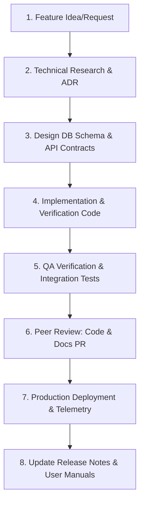
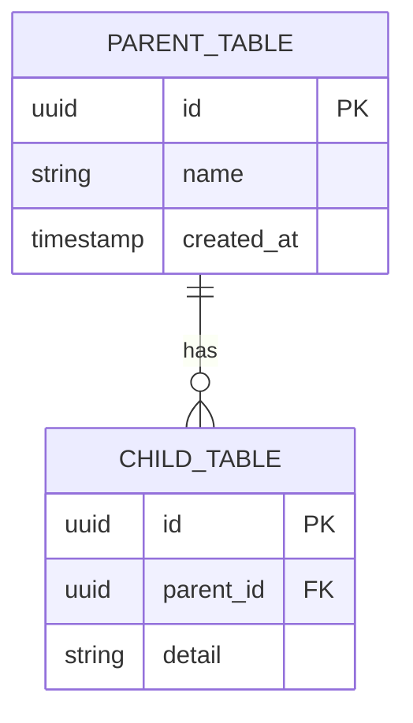

# AgriSense AI — Documentation System Architecture
**Version**: 1.0.0  
**Classification**: Technical Architecture Blueprint  
**Status**: Approved & Active  
**Author**: Lead Software Architect & Principal Technical Writer  

---

## 1. Documentation Philosophy & General Guidelines

The AgriSense AI documentation ecosystem is designed as a modular, version-controlled, single-source-of-truth repository. It scales seamlessly alongside the codebase from MVP (Version 1.0) to enterprise-scale distributed deployments (Version 10.0+). 

### 1.1 Core Documentation Pillars
- **Doc-as-Code**: Documentation lives in the same Git repository as the code, ensuring sync, tracking, and peer reviews via PRs.
- **Strict Modularity**: No monolithic documents. Each markdown file has one, and only one, clear technical responsibility.
- **Audience Separation**: Documents are specifically targeted at distinct roles (e.g., DevOps, AI Engineers, Frontend Devs, Mobile Devs) to reduce cognitive load.
- **Actionability**: Technical guides must prioritize actionable steps, copyable commands, and structured schema examples over narrative prose.
- **Traceability**: All diagrams, decision records, and API routes must link back to their parent requirements and models.

### 1.2 File Naming & Directory Conventions
- **Case**: Always lowercase with hyphens or underscores (snake_case/kebab-case) for folders and files. Use kebab-case for documentation files: `monitoring-guide.md` instead of `MonitoringGuide.md`.
- **Extension**: All documents must use `.md` (GitHub Flavored Markdown).
- **Paths**: Absolute paths within the repository must be referenced using standard Markdown link notation with the `file://` scheme where appropriate, or relative paths for cross-document links.

### 1.3 Diagram Standards
- **Format**: All architectural, structural, and sequence diagrams must be generated using **Mermaid.js** code blocks inside markdown files. This ensures diagrams are text-searchable, version-controlled, and easily editable without external vector drawing software.
- **Style**: Flowcharts, sequence charts, and state charts must follow the standard C4 Model (Context, Container, Component, Code) where applicable.

---

## 2. Documentation Directory Map

```text
/docs
├── README.md                      # Entry point, portal index, and repository navigation map
├── /architecture                  # System-wide design, C4 diagrams, and topologies
│   ├── system-context.md          # C4 level 1 context
│   ├── container-topology.md      # C4 level 2 container layout
│   └── service-dependency-map.md  # Inter-service connection graph
├── /adr                           # Architecture Decision Records (immutable history)
│   ├── 0001-record-architecture-decisions.md
│   └── 0002-conversational-engine-sse.md
├── /api                           # OpenAPI specification and custom protocol formats
│   ├── rest-spec.md               # REST endpoints metadata
│   ├── sse-streaming.md           # Server-Sent Events contract for CIE
│   └── rate-limits-security.md    # Auth rules, throttling, and scopes
├── /database                      # Schema definition, migrations, and performance tuning
│   ├── schema-dictionary.md       # Tables, columns, constraints, and relationships
│   ├── pgvector-indexing.md       # Vector search parameters, dimensions, and indexing methods
│   └── disaster-recovery.md       # Backup schedules, WAL archiving, and failover
├── /ai-systems                    # Prompts, function call specs, and RAG configuration
│   ├── prompt-registry.md         # Versioned system prompts and variables
│   ├── rag-pipeline.md            # Chunking strategies, embeddings, and vector store tuning
│   └── evaluation-metrics.md      # Hallucination scores, confidence scores, and safety guards
├── /design-system                 # Typography, HSL color tokens, and layout guidelines
│   ├── token-spec.md              # Core tokens (HSL, spacing, scale)
│   └── motion-principles.md       # Animations, hover micro-interactions, and transitions
├── /deployment                    # GCP infrastructure, Docker setups, and CI/CD
│   ├── gcp-infrastructure.md      # GKE, Cloud Run, Cloud SQL setup scripts and specifications
│   ├── secrets-environment.md     # Secret manager configurations and environment profiles
│   └── monitoring-logging.md      # Prometheus alerts, Grafana telemetry, and log formatting
├── /developer-guides              # Onboarding, environment bootstrap, and testing
│   ├── local-setup.md             # Docker compose local bootstrap and virtual environments
│   ├── testing-framework.md       # Pytest, NextJS Jest, and Flutter unit/integration rules
│   └── troubleshooting.md          # Diagnostic runbooks and common error resolutions
├── /user-guides                   # Product workflows and manuals
│   ├── admin-portal.md            # Portal operation workflows
│   └── farmer-companion.md        # Mobile app capabilities and off-grid offline sync rules
└── /releases                      # Changelogs and migration guides
    ├── v1.0.0-release.md          # Initial release specification
    └── migration-guides.md        # Data schema migration steps between versions
```

---

## 3. Mandatory Document Attribute Specification

Every technical document created inside the `/docs` namespace **must** begin with a YAML frontmatter block containing the following 15 metadata attributes. This guarantees consistency, searchability, and clear lifecycle ownership:

```yaml
---
id: doc-unique-identifier
title: Document Human Readable Name
purpose: "One sentence describing why this document exists and what goal it serves."
audience: "The exact role(s) target: DevOps | AI Engineer | Frontend | QA | Architect"
owner: "Name or Team (e.g., Backend Engineering Team)"
versioning_strategy: "semver | immutable | live"
maintenance_frequency: "weekly | monthly | per-release | per-sprint"
prerequisites:
  - "Links to preceding concepts or workspace setup files"
dependencies:
  - "Systems, databases, or API routes discussed in this doc"
related_documents:
  - "[Name](file:///docs/path/to/doc.md)"
expected_length: "approximate page count or word count limits"
required_diagrams:
  - "List of Mermaid or sequence diagrams expected to remain in-sync"
code_examples: "boolean: presence of production-grade code syntax blocks"
review_checklist:
  - "Itemized verification tasks to perform before merging modifications"
completion_criteria: "What constitutes a ready-to-publish document"
---
```

---

## 4. Sub-System Documentation Standards

### 4.1 Architecture Documentation
Architecture must be documented following the **C4 Model** to allow readers to drill down from context to component code layers:
1. **Context Diagrams (Level 1)**: Show actors, external weather APIs, GCS buckets, and mobile app interactions.
2. **Container Diagrams (Level 2)**: Detail FastAPI, Next.js web application, Flutter farmer app, Postgres, Redis, and Celery worker scopes.
3. **Component Diagrams (Level 3)**: Document class diagrams and interfaces within a container (e.g., the Conversational Intelligence Engine's interaction with the Tool Registry and Vector Store).
4. **Deployment Diagrams (Level 4)**: Define pod counts, load balancers, cloud run setups, secret manager mounts, and VPC peering structures.

### 4.2 API Documentation
Standardize the API contract templates to ensure frontends, mobile, and server teams stay in sync:
- **REST Endpoints**: Define URL, Verb, Headers (Bearer JWT tokens), Path/Query Params, request payloads (with TypeScript equivalent types), and accurate HTTP response codes (`200 OK`, `201 Created`, `400 Bad Request`, `401 Unauthorized`, `403 Forbidden`, `422 Unprocessable Entity`, `429 Too Many Requests`).
- **SSE Streams (CIE)**: Define data message structures, event types (`token`, `thinking`, `done`), heartbeat frames, reconnect timeouts, and Bearer authorization injection strategies.
- **Error JSON Schema**: Every error response must follow a single standard structure:
  ```json
  {
    "error_code": "RESOURCE_NOT_FOUND",
    "message": "Detailed localized error message explaining what failed",
    "timestamp": "2026-07-07T13:45:00Z",
    "request_id": "req-xyz123456",
    "validation_errors": []
  }
  ```

### 4.3 Database Documentation
Database documents must provide a comprehensive map of storage layers:
- **Schema Maps**: Table definitions with column names, types (e.g., `UUID`, `TIMESTAMP WITH TIME ZONE`, `JSONB`), default values, and foreign keys.
- **pgvector Configuration**: Explicit dimension counts (e.g., 384 for `all-MiniLM-L6-v2` or 1536 for text-embedding models), distance metrics (e.g., cosine, L2), index methods (e.g., IVFFlat or HNSW), and query optimizer targets.
- **Migration Runbooks**: Alembic/dbt execution scripts, rollbacks, and schema change strategies for zero-downtime deployments.

### 4.4 AI & Conversational Engine Documentation
To avoid black-box AI logic, document the exact lifecycle of AI interactions:
- **System Prompts**: Store and version-control prompts as raw text files. The documentation must index each version, their parameters, and intent classification rules.
- **RAG & Chunking Contract**: Document chunk size, overlap counts, embedding model, vector similarity threshold, metadata filtering rules, and source document citation guidelines.
- **Safety & Evaluation**: Document validation guardrails (safety thresholds, toxic content detection) and the evaluation rubric for monitoring hallucination rates.

### 4.5 UI/UX Design System Documentation
Ensure visual design system files explicitly map tokens and variables:
- **Color Variables**: Map HSL/CSS tokens (`--color-primary`, `--color-primary-light`, etc.).
- **Typography Matrix**: Font weights, sizing tables (Rem scale), line heights, and fallback families.
- **Motion Guidelines**: Hover timings, entry transitions (using Framer Motion parameters like durations, springs, damping), and interactive states.

### 4.6 Cloud & DevOps Documentation
Infrastructure must be fully reproducible from configuration guides:
- **GCP Provisioning**: Terraform structures, IAM permissions, service accounts, and workload identity federations.
- **Secret Allocation**: Mount locations, environment variable mapping, and credential rotation intervals.
- **Monitoring Rules**: Alert thresholds (e.g., Pod CPU > 85% for 3 mins, API latency > 500ms, DB connection exhaustion > 90%).

---

## 5. Engineering Integration & Documentation Lifecycle

Documentation is not an afterthought; it is integrated directly into the software development life-cycle (SDLC):



### Documentation Checkpoints:
1. **Design Phase**: Create/update the **ADR** (Architecture Decision Record) and document the API endpoints.
2. **Implementation Phase**: Update the database schema dictionary and code module specifications.
3. **QA Phase**: Update testing frameworks and troubleshooting diagnostics with edge cases found.
4. **Release Phase**: Publish v-release changes, user manuals, and update tracking indices.

---

## 6. Standard Document Templates

To maintain design uniformity across the codebase, developers must use the following standard templates.

### 6.1 Template: Architecture Decision Record (ADR)
Save inside `/docs/adr/NNNN-decision-title.md` (where NNNN is sequential index):
```markdown
# ADR [Number]: [Decision Title]

* **Status**: [Proposed | Accepted | Rejected | Superseded]  
* **Date**: [YYYY-MM-DD]  
* **Deciders**: [Architects/Engineers involved]  
* **Superseded by**: [Link to ADR if applicable]

## Context and Problem Statement
Define the architectural challenge, constraints, and requirements we are addressing.

## Decision Drivers
* [Driver 1, e.g., low-latency requirements]
* [Driver 2, e.g., compatibility with offline mobile SQLite]

## Considered Options
1. **[Option 1]**: Brief description, pros, and cons.
2. **[Option 2]**: Brief description, pros, and cons.

## Decision Outcome
Chosen Option: **[Option name]** because [detailed reasoning].

### Consequences
* **Good**: [Immediate benefits]
* **Bad**: [Trade-offs, tech debt created, or runtime risks]
```

### 6.2 Template: API Endpoint Specification
Save inside `/docs/api/` subfolders:
```markdown
# [HTTP Verb] [Endpoint Path]

* **Auth Scope**: [Anonymous | JWT Bearer: Farmer | JWT Bearer: Admin]  
* **Rate Limit**: [e.g., 60 requests/minute]

## Request Headers
| Header Name | Required | Description / Expected Value |
| :--- | :--- | :--- |
| `Authorization` | Yes | Bearer token format |
| `Content-Type` | Yes | `application/json` |

## Path / Query Parameters
| Parameter | Type | Required | Description |
| :--- | :--- | :--- | :--- |
| `plot_id` | UUID | Yes | Filter metrics by this plot |

## Request Body Schema
```typescript
interface RequestBody {
  parameter_one: string;
  parameter_two?: number;
}
```

## Responses
### Success (200 OK)
```json
{
  "status": "success",
  "data": {
    "id": "11111111-2222-3333-4444-555555555555"
  }
}
```

### Client Error (400 Bad Request)
```json
{
  "error_code": "VALIDATION_FAILED",
  "message": "Field 'parameter_one' cannot be empty"
}
```
```

### 6.3 Template: Database Module Specification
Save inside `/docs/database/` subfolders:
```markdown
# Module: [Database Schema Area]

## Entity Relationship Diagram


## Table Specifications
### Table: `parent_table`
* **Purpose**: [Brief explanation]
* **Indexes**: 
  - `idx_parent_name`: B-Tree on `name` column.

| Column | Type | Nullable | Default | Constraints |
| :--- | :--- | :--- | :--- | :--- |
| `id` | UUID | No | `uuid_generate_v4()` | Primary Key |
| `name` | VARCHAR(255) | No | None | Unique |
| `created_at` | TIMESTAMPTZ | No | `NOW()` | None |
```

### 6.4 Template: Developer Local Onboarding Guide
Save inside `/docs/developer-guides/local-setup.md`:
```markdown
# Local Development Environment Setup

## System Prerequisites
Ensure your local development machine has:
* Docker (v24.0+) & Docker Compose (v2.20+)
* Python (v3.12+)
* NodeJS (v20+)
* Git

## 1. Step-by-Step Repository Setup
1. Clone the project:
   ```bash
   git clone https://github.com/agrisense/ecosystem.git
   cd ecosystem
   ```
2. Configure local environment variables:
   ```bash
   cp .env.example .env
   ```

## 2. Bootstrapping Backend Services
```bash
cd server
python -m venv .venv
source .venv/bin/activate  # Or .venv\Scripts\activate on Windows
pip install -r requirements.txt
python seed_db.py
python seed_knowledge.py
```

## 3. Running Services
Start Docker containers (Postgres, Redis):
```bash
docker-compose up -d
```
Run FastAPI server:
```bash
uvicorn app.main:app --reload
```
Run NextJS web application:
```bash
cd ../client
npm install
npm run dev
```
```

### 6.5 Template: Troubleshooting & Diagnostic Runbook
Save inside `/docs/developer-guides/troubleshooting.md`:
```markdown
# Troubleshooting: [Issue Topic Name]

## Symptom
Describe what the developer/user sees (e.g., error screens, timeouts, console errors).

## 1. Initial Diagnostic Checks
1. Run this command to check logs:
   ```bash
   docker logs -f backend-container
   ```
2. Check database connection status:
   ```bash
   pg_isready -h localhost -p 5432
   ```

## 2. Resolution Steps
### Case A: Connection Timeout
If you see `Connection Refused` in console logs:
1. Verify the container is running:
   ```bash
   docker ps | grep postgres
   ```
2. Re-create the docker networks if overlapping:
   ```bash
   docker-compose down -v && docker-compose up -d
   ```

## 3. Validation Check
Verify the resolution by querying the health check endpoint:
```bash
curl http://localhost:8000/api/v1/health
```
Expected response: `{"status": "healthy"}`
```

### 6.6 Template: Release Notes & Changelog
Save inside `/docs/releases/vN.N.N-release.md`:
```markdown
# Release Notes — Version [N.N.N]
**Date**: [YYYY-MM-DD]  
**Lead Releaser**: [Name]

## Summary of Release
Provide a high-level summary of what this release introduces (e.g., feature additions, performance optimizations, bug fixes).

## Added Features
* **[Feature Name]**: Detailed explanation.
* **[Feature Name]**: Detailed explanation.

## Fixed Issues
* **[Issue Title]**: Fixed the SQLite database collision during concurrent requests.
* **[Issue Title]**: Prevented Web Speech API crashes when browser microphone permissions are blocked.

## Migration Steps Required
* **Database**: Run migrations using:
  ```bash
  alembic upgrade head
  ```
* **Environment variables**: Ensure `GEMINI_API_KEY` is updated in your active orchestration configurations.
```
