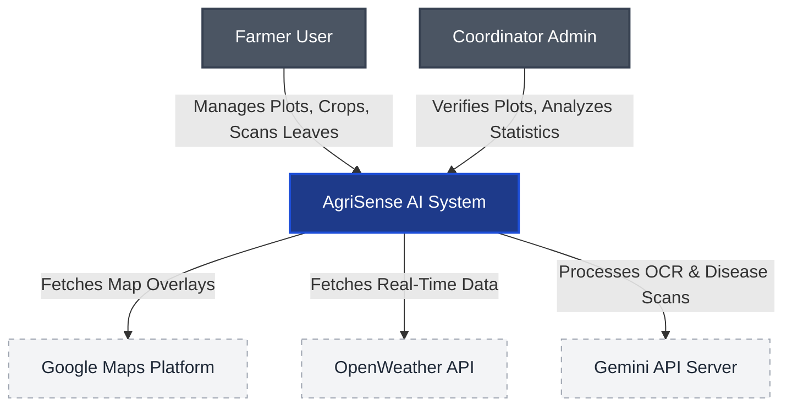

# Engineering Standard: Visual Diagrams, Media Assets, and C4 Layouts
> **System Status**: ACTIVE | **Version**: 1.0.0 | **Classification**: TECHNICAL STANDARDS

---

## 1. Document Specification

- **Purpose**: Governs visual architecture representation standards (specifically implementing C4 Model principles), diagram styles, asset directories, and naming constraints for illustrations or screenshots.
- **Audience**: Solution architects, system designers, technical writers, and frontend designers.
- **Prerequisites**: High-level understanding of C4 Model design, UML syntax, or Mermaid visualization frameworks.
- **Dependencies**: None.
- **Related Documents**: `standards/writing_and_markdown.md`.
- **Expected Length**: 800 - 1000 words.
- **Maintenance Frequency**: Annually or when adopting a new vector rendering system.
- **Required Diagrams**: Core C4 Level 1 context rendering.
- **Owner**: Cloud Solutions Architect / Senior DevOps Engineer.
- **Review Checklist**: Ensure Mermaid syntax is properly closed, verify asset paths use absolute root directory maps, ensure color palettes conform to high-contrast requirements, check that all images have meaningful alt-text.
- **Completion Criteria**: Complete uniformity of visual elements across all sub-system architectural briefs with zero broken media references.
- **Versioning Strategy**: Minor version changes for tool or utility updates (1.0.x), major version changes for core diagram framework migrations (1.x.0).

---

## 2. Visual Diagram Philosophy: The C4 Model

To prevent visual clutter, non-standard visual blocks, and mismatched layout structures, AgriSense AI standardizes on the **C4 Model** for software architecture representation.

```text
  Level 1: System Context  ──>  Level 2: Container  ──>  Level 3: Component  ──>  Level 4: Code
```

Every sub-system diagram in AgriSense AI must state its C4 level in its description header.

---

## 3. C4 Level Specifications and Styles

### 3.1 Level 1: System Context
*   **Purpose**: Illustrates the boundary of AgriSense AI, showing external users (Farmers, Admins) and external system dependencies (Google Maps API, OpenWeather API, Gemini API, Cloud Engine).
*   **Target Audience**: Developers, project leads, stakeholders.
*   **Style Rules**:
    *   The primary system must be highlighted in dark blue.
    *   Users should be colored in deep gray.
    *   External systems must be colored in light gray with dashed outlines.



### 3.2 Level 2: Container Diagram
*   **Purpose**: Shows the high-level technical architecture of the platform, outlining runnable boundaries such as the Landing Web SPA, Coordinator Admin SPA, Farmer Mobile SPA, and backend API container.
*   **Target Audience**: Software engineers, DevOps, and deployment technicians.
*   **Style Rules**:
    *   Indicate explicit communication protocols over every connector line (e.g., `HTTPS/REST`, `WSS/WebSockets`, `HTTP/SSE`).
    *   Indicate exact container runtime boundaries.

### 3.3 Level 3: Component Diagram
*   **Purpose**: Details structural components inside a specific container, such as the controllers, database service wrappers, or security filters inside the API Gateway.
*   **Target Audience**: Module owners and software engineers.
*   **Style Rules**: Show clear inputs, outputs, schemas, and processing sequence boundaries.

---

## 4. Diagram Styling and Mermaid Standards

To maintain standard rendering across dark/light mode interfaces, we enforce strict Mermaid markdown styling:

### 4.1 Class Definitions
All Mermaid diagrams in documentation must use explicit tail class-def styling to ensure color accessibility:
```text
classDef main fill:#1E3A8A,stroke:#1D4ED8,stroke-width:2px,color:#FFFFFF;
classDef secondary fill:#0D9488,stroke:#0F766E,stroke-width:2px,color:#FFFFFF;
```

### 4.2 High Contrast and Accessibility
Ensure a minimum contrast ratio of `4.5:1` for any text inside diagram elements against its block background color. Never use pure black text on a dark blue block.

---

## 5. Media Asset and Screenshot Management

### 5.1 Storage Directory Structure
All static visual media assets (PNGs, JPEGs, SVGs) must be stored systematically inside dedicated directory structures:
```text
/public/assets/docs/
├── architecture/                       # System-wide topology charts and sequence diagrams
├── landing/                            # Landing page illustrations and screenshots
├── admin/                              # Admin dashboard UI workflow captures
└── farmer/                             # Mobile-responsive app screenshots and diagnostic captures
```

### 5.2 Naming Conventions for Images
*   Use all lowercase, words separated by underscores.
*   Include the category prefix matching the directory.
*   Example: `farmer_dashboard_map_mobile.png`, `admin_plot_verification_desktop.svg`.

### 5.3 Format and Compression Rules
*   **Vector Graphics (SVGs)**: Prefer SVG format for all charts, wireframes, and diagrams. SVGs scale infinitely and have minimal storage footprint.
*   **Raster Images (PNGs/JPEGs)**: Use PNG for screenshots where pixel precision is required. All raster screenshots must be compressed using lossy-free algorithms to keep file sizes below **300KB** per asset.

---

## 6. Document Checklist and Completion Criteria
Before merging a documentation change introducing visual elements:
- [ ] Diagram uses standard class colors and avoids bright red/neon highlights.
- [ ] Every communication line explicitly specifies its network protocol (e.g. `HTTPS`, `WebSockets`).
- [ ] No image exceeds 300KB.
- [ ] Media asset uses the correct, lowercase underscore naming format.
- [ ] Image paths are mapped as absolute paths starting from the workspace root (e.g., `/public/assets/docs/...`).
