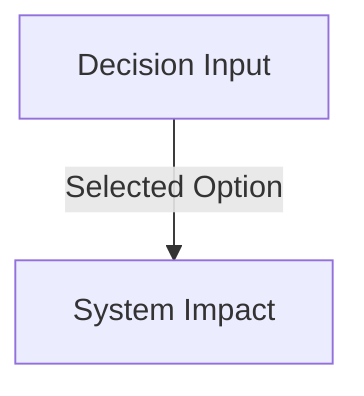

# Technical Template: Architecture Decision Record (ADR)
> **System Status**: MODEL TEMPLATE | **Version**: 1.0.0 | **Classification**: TECHNICAL STANDARDS

---

## 1. Document Specification

- **Purpose**: Provides a standard, structured template for documenting critical architectural trade-offs, tech stacks, and system decisions.
- **Audience**: Solution architects, senior developers, and system maintainers.
- **Prerequisites**: Identification of an architectural problem or change.
- **Dependencies**: None.
- **Related Documents**: `processes/engineering_workflow.md`.
- **Expected Length**: 500 - 1000 words.
- **Maintenance Frequency**: Fixed once approved; revised by spawning a subsequent ADR.
- **Owner**: Lead Software Architect.
- **Review Checklist**: Ensure decisions are thoroughly rationalized, check that alternative solutions are explicitly detailed, verify cost impact, validate security status.
- **Completion Criteria**: Formal sign-off by structural leads.
- **Versioning Strategy**: Non-applicable (ADRs are immutable chronological logs; corrections are handled by spawning a new ADR).

---

## 2. ADR Frontmatter (Copy and Complete)

```markdown
---
id: ADR-000  # Chronological order sequence, e.g. ADR-001, ADR-002
title: <SHORT-DESCRIPTIVE-DECISION-TITLE>
status: <proposed | accepted | rejected | superseded-by-ADR-XXX>
author: <NAME / ROLE>
date: YYYY-MM-DD
deciders: <LIST-OF-TECHNICAL-LEADS-APPROVING>
tags: <backend, database, security, ai, frontend>
---
```

---

## 3. Structural Sections

### 3.1 Context and Problem Statement
*Describe the technical context, business constraints, or operational limitations that necessitate this decision. Avoid vague statements. Include metrics where possible.*

- **Problem Statement**: What is the exact problem we are solving?
- **Business Drivers**: How does this map to product scaling, performance targets, or developer speed?
- **Technical Constraints**: Describe any environment limits (such as frame limits, container storage sizes, network port constraints).

### 3.2 Decision Drivers
*What are the core parameters guiding this decision? Prioritize them in order of importance.*

1.  **Driver 1**: (e.g., Cost efficiency on server-side compute)
2.  **Driver 2**: (e.g., Latency overhead on real-time weather feeds)
3.  **Driver 3**: (e.g., Type safety across the REST endpoints)

### 3.3 Considered Options
*Provide an objective analysis of at least three options considered. Do not include strawman alternatives.*

#### Option A: [Title]
*   **Description**: Technical description of this alternative.
*   **Pros**:
    *   Pro 1
    *   Pro 2
*   **Cons**:
    *   Con 1
    *   Con 2

#### Option B: [Title]
*   **Description**: Technical description of this alternative.
*   **Pros**:
    *   ...
*   **Cons**:
    *   ...

#### Option C: [Title]
*   **Description**: Technical description of this alternative.
*   **Pros**:
    *   ...
*   **Cons**:
    *   ...

### 3.4 Decision Outcome
*Explicitly state which option was selected and why.*

- **Chosen Option**: [Option Name]
- **Justification**: Detailed reasoning mapping the chosen option directly back to the Decision Drivers. Prove why the chosen option outperforms the alternatives.

---

## 4. Impact and Consequences

*Document the immediate and long-term implications of accepting this decision.*

*   **Engineering Impact**: How does this alter the daily code patterns? Are new libraries introduced?
*   **Performance Impact**: Describe changes to CPU cycles, DB indexing overhead, API query response time, or storage footprints.
*   **Cost Impact**: Estimate the operational cost changes in cloud hosting, database writes, or token usage.
*   **Security Impact**: Detail how access boundaries, auth scopes, or encryption vectors are affected.

---

## 5. Architectural Diagram Reference
*Embed any design sequence, activity flow, or C4 component map explaining this change. Ensure compliance with `standards/diagrams_and_assets.md`.*



---

## 6. Implementation Plan
*What are the sequential steps to execute this architectural transition?*

- [ ] Step 1: Database Migration Schema draft
- [ ] Step 2: Implement integration endpoints
- [ ] Step 3: Run comprehensive performance profiling
- [ ] Step 4: Revise the module developer guides
