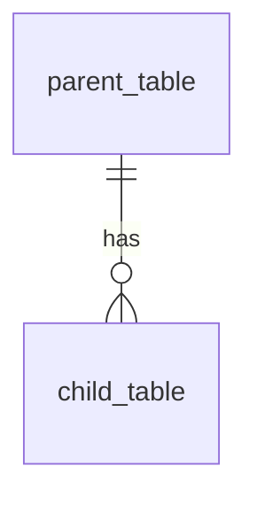

# Technical Template: Database Architecture, Migrations, and Scaling
> **System Status**: MODEL TEMPLATE | **Version**: 1.0.0 | **Classification**: TECHNICAL STANDARDS

---

## 1. Document Specification

- **Purpose**: Governs database structural schemas, relationships, constraints, indexes, scaling rules, performance tuning, and backup strategies.
- **Audience**: Database administrators, backend engineers, cloud data architects, and security officers.
- **Prerequisites**: Clear definition of structural domain models.
- **Dependencies**: Cloud SQL PostgreSQL engine configuration.
- **Related Documents**: `processes/engineering_workflow.md`.
- **Expected Length**: 800 - 1500 words.
- **Maintenance Frequency**: Updated with every database migration or major indexing change.
- **Owner**: Database Architect / Lead Backend Engineer.
- **Review Checklist**: Verify correct type declarations, check index selections, ensure cascading delete rules are safe, validate backup schedules.
- **Completion Criteria**: Complete and fully mapped relational schemas and migration runbooks with zero undefined constraints.
- **Versioning Strategy**: Minor updates reflect schema-level corrections or indexing additions; major updates represent platform structural migrations.

---

## 2. Relational Schema Blueprint (Copy and Complete)

Every database table specification in AgriSense AI must follow this structure:

```markdown
### 2.1 Table Name: `[table_name_plural]`
*Describe the table's structural purpose within the application.*

#### Entity Relationship Diagram (ERD) Fragment


#### Field Specifications
| Field Name | Data Type | Constraints | Default | Description |
| :--- | :--- | :--- | :--- | :--- |
| `id` | UUID | PRIMARY KEY | `gen_random_uuid()` | Unique entity identifier |
| `created_at` | TIMESTAMPTZ | NOT NULL | `now()` | Timestamp of record creation |

#### Indexes and Constraints
*Detail the indexes designed to speed up search queries, and specific foreign-key cascades.*

*   **Primary Key**: `id`
*   **Foreign Keys**:
    *   `parent_id` REFERENCES `parent_table(id)` ON DELETE CASCADE
*   **Indexes**:
    *   `idx_table_field_name` ON `table_name` USING btree(`field_name`)
    *   `idx_table_composite` ON `table_name` USING btree(`col_a`, `col_b`)
```

---

## 3. Migration and Deployment Runbook

### 3.1 Migration File Guidelines
*   All migrations must be written using declarative SQL or standard ORM migration scripts.
*   Every migration must define an `Up` sequence (apply changes) and a corresponding `Down` sequence (rollback changes).
*   **Zero-Downtime Rule**: Migrations that drop columns, rename tables, or add `NOT NULL` constraints to existing columns without defaults must be run using a multi-phase roll-out strategy.

### 3.2 Verification Check
Before executing any migration on production systems:
1.  Verify database state with a current schema snapshot.
2.  Test the migration rollback (`Down` path) on a staging database containing copy-accurate seed data.
3.  Ensure database backup is successfully completed and verified.

---

## 4. Performance Tuning and Indexing Standards

*   **Index Strategy**: Never index columns with low cardinality (e.g., boolean values). Use indexes on frequently filtered foreign key columns.
*   **Query Profiling**: Slow queries exceeding **100ms** execution time must be profiled using `EXPLAIN ANALYZE` and optimized via rewritten joins, indexes, or materialized views.
*   **Locking and Concurrency**: Suspend long-running database transactions inside transaction blocks to prevent lock contention and memory spikes on live production instances.

---

## 5. Scaling and Replication

*   **Read-Write Splitting**: Write operations are directed strictly to the primary instance. Reading dashboards, history logs, and analytics can be distributed to Read Replicas.
*   **Connection Pooling**: Limit connection leaks. Use connection pooling (e.g., PgBouncer) to restrict total open connections below Cloud Run limits.

---

## 6. Disaster Recovery and Backup Policies

*   **Recovery Point Objective (RPO)**: Under 1 hour.
*   **Recovery Time Objective (RTO)**: Under 15 minutes.
*   **Backup Retention Schedule**:
    *   **Daily Backups**: Automated snapshots retained for 30 days.
    *   **Weekly Backups**: Retained for 12 weeks.
    *   **Monthly Backups**: Retained for 1 year.
*   **Backup Verification**: Restore operations must be simulated and tested on isolated sandboxes quarterly to guarantee backup integrity.
