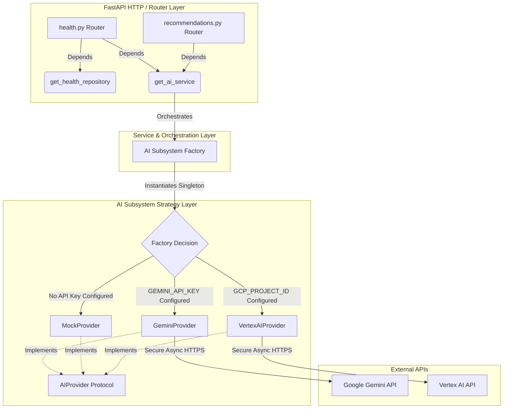

# AgriSense AI — AI Subsystem & GCP Deployment Master Blueprint

> **Publication-Ready Documentation Template**  
> *Ready to be imported or copy-pasted directly into Google Docs.*

---

## Document Index (Table of Contents)

1. [GCP Cloud Architecture Visual Blueprint](#1-gcp-cloud-architecture-visual-blueprint)
2. [Subsystem Architecture & Strategy Pattern](#2-subsystem-architecture-strategy-pattern)
3. [Domain Dataclasses & Strongly-Typed Outputs](#3-domain-dataclasses-strongly-typed-outputs)
4. [The AIProvider Protocol Contract](#4-the-aiprovider-protocol-contract)
5. [Core Subsystem Implementations](#5-core-subsystem-implementations)
   - 5.1 [GeminiProvider (Development API)](#51-geminiprovider-development-api)
   - 5.2 [VertexAIProvider (Enterprise GCP Native)](#52-vertexaiprovider-enterprise-gcp-native)
   - 5.3 [MockProvider (Offline Development & Testing)](#53-mockprovider-offline-development-testing)
6. [Factory Selector & FastAPI Dependency Injection](#6-factory-selector-fastapi-dependency-injection)
7. [Google Cloud Platform Deployment & Setup Guide](#7-google-cloud-platform-deployment-setup-guide)
8. [Extending the Subsystem & Unit Testing](#8-extending-the-subsystem-unit-testing)

---

## 1. GCP Cloud Architecture Visual Blueprint

Below is the visual schematic of AgriSense AI deployed natively on Google Cloud Platform, representing the target cloud topology:


---

## 2. Subsystem Architecture & Strategy Pattern

The AI Subsystem is designed around the **Strategy Pattern** to decouple the core business logic of AgriSense AI from specific machine learning models and cloud API providers (e.g., Google Gemini). 

By abstracting provider interactions behind a unified interface, the system achieves:
- **Provider Agnosticism:** Swap between Gemini, OpenAI, Claude, or local offline LLMs with configuration changes.
- **Local Dev Resilience:** Run the entire stack locally without internet or API keys using a mock provider.
- **Strict Testability:** Mock AI behavior deterministically in unit and integration tests.

### System Topology & Data Flow



---

## 3. Domain Dataclasses & Strongly-Typed Outputs

The subsystem resides in `server/app/services/ai/` and enforces strong typing across all implementations. Rather than returning raw dictionaries, all providers return strictly structured dataclasses defined in [`base.py`](file:///c:/Users/HEMANT/AgriSense%20AI/server/app/services/ai/base.py).

### 3.1 `CropAnalysisResult`
Encapsulates the structured output from visual crop health scans:
```python
@dataclass
class CropAnalysisResult:
    health_score: float = 75.0
    diagnosis: str = "unknown"
    confidence: float = 0.0
    severity: str = "none"  # "none", "low", "medium", "high", "critical"
    symptoms_observed: list[str] = field(default_factory=list)
    recommendation: str = ""
    additional_notes: str = ""
```

### 3.2 `LabelExtractionResult`
Encapsulates structured data extracted from fertilizer/pesticide packet images via OCR:
```python
@dataclass
class LabelExtractionResult:
    product_name: str = ""
    brand: str = ""
    active_ingredients: list[str] = field(default_factory=list)
    dosage_instructions: str = ""
    application_method: str = ""
    safety_warnings: list[str] = field(default_factory=list)
    batch_number: str = ""
    expiry_date: str = ""
    full_extracted_text: str = ""
    confidence: float = 0.0
    error: str | None = None
```

---

## 4. The AIProvider Protocol Contract

The [`AIProvider`](file:///c:/Users/HEMANT/AgriSense%20AI/server/app/services/ai/base.py) protocol defines the structural contract that all providers must implement:

```python
@runtime_checkable
class AIProvider(Protocol):
    async def analyze_crop_health(self, image_path: str) -> CropAnalysisResult:
        """Analyze a crop image for health issues."""
        ...

    async def extract_label_text(self, image_path: str) -> LabelExtractionResult:
        """Extract structured text from product packaging label images."""
        ...

    async def generate_recommendation(
        self,
        crop_name: str,
        crop_stage: str,
        health_data: dict | None = None,
        weather_data: dict | None = None,
        input_history: list[dict] | None = None,
    ) -> str:
        """Generate context-aware farming recommendations."""
        ...
```

---

## 5. Core Subsystem Implementations

### 5.1 GeminiProvider (Development API)
The developer implementation ([`gemini_provider.py`](file:///c:/Users/HEMANT/AgriSense%20AI/server/app/services/ai/gemini_provider.py)) utilizes Google's Generative AI SDK to process multimodal payloads (images + text prompt) via public API keys.

- **Lazy Initialization:** Configures Generative AI only on demand, optimizing app startup times.
- **Defensive Parsing:** Cleans markdown JSON fences gracefully, falling back to defaults if serialization fails.

### 5.2 VertexAIProvider (Enterprise GCP Native)
The production-grade enterprise provider ([`vertex_provider.py`](file:///c:/Users/HEMANT/AgriSense%20AI/server/app/services/ai/vertex_provider.py)) utilizes Google Cloud's official Vertex AI SDK.

- **IAM Auth:** Runs under Application Default Credentials (ADC) without requiring hardcoded API keys in environment files.
- **Multimodal Part Payload:** Reads binary image parts directly and passes them using `Part.from_data` for speed and safety.

### 5.3 MockProvider (Offline Development & Testing)
The fallback/offline provider ([`mock_provider.py`](file:///c:/Users/HEMANT/AgriSense%20AI/server/app/services/ai/mock_provider.py)).

- **Deterministic Logic:** Returns mock data instantly without making API network queries.
- **Zero Budget Exhaustion:** Avoids running up costs during CI/CD test runs or local front-end UI design loops.

---

## 6. Factory Selector & FastAPI Dependency Injection

The selection of the active provider is controlled by a central factory integrated with FastAPI's Dependency Injection system.

### 6.1 Factory Implementation
Defined in [`factory.py`](file:///c:/Users/HEMANT/AgriSense%20AI/server/app/services/ai/factory.py):
```python
_provider_instance: AIProvider | None = None

def get_ai_provider() -> AIProvider:
    global _provider_instance
    if _provider_instance is not None:
        return _provider_instance

    settings = get_settings()
    if settings.GCP_PROJECT_ID:
        from app.services.ai.vertex_provider import VertexAIProvider
        _provider_instance = VertexAIProvider()
    elif settings.GEMINI_API_KEY:
        from app.services.ai.gemini_provider import GeminiProvider
        _provider_instance = GeminiProvider()
    else:
        from app.services.ai.mock_provider import MockProvider
        _provider_instance = MockProvider()
    return _provider_instance
```

### 6.2 Router DI Usage
Exposed in [`dependencies.py`](file:///c:/Users/HEMANT/AgriSense%20AI/server/app/dependencies.py) as a FastAPI dependency:
```python
def get_ai_service() -> AIProvider:
    from app.services.ai.factory import get_ai_provider
    return get_ai_provider()
```

---

## 7. Google Cloud Platform Deployment & Setup Guide

To deploy this subsystem natively in Google Cloud:

1. **Activate Services:**
   Enable Google Cloud APIs using the `gcloud` CLI:
   ```bash
   gcloud services enable aiplatform.googleapis.com storage.googleapis.com run.googleapis.com
   ```

2. **Configure Settings:**
   Provide settings via Cloud Run Environment Variables:
   - `GCP_PROJECT_ID` = `your-gcp-project-id`
   - `GCP_LOCATION` = `us-central1` (or your nearest Vertex AI region)
   - `GCS_BUCKET_NAME` = `agrisense-uploads`

3. **Grant IAM Permissions:**
   Assign the Vertex AI User role to the service account executing the container:
   ```bash
   gcloud projects add-iam-policy-binding your-gcp-project-id \
       --member="serviceAccount:your-cloud-run-identity@your-project.iam.gserviceaccount.com" \
       --role="roles/aiplatform.user"
   ```

---

## 8. Extending the Subsystem & Unit Testing

### 8.1 Registering a New Provider
1. Inherit from `AIProvider` Protocol in a new provider class.
2. Add provider configuration fields to [`config.py`](file:///c:/Users/HEMANT/AgriSense%20AI/server/app/config.py).
3. Update [`factory.py`](file:///c:/Users/HEMANT/AgriSense%20AI/server/app/services/ai/factory.py) with loading logic.

### 8.2 Mocking in Tests
Inject mock dependencies cleanly:
```python
import pytest
from app.main import app
from app.dependencies import get_ai_service
from app.services.ai.mock_provider import MockProvider

@pytest.fixture
def client_with_mock_ai():
    app.dependency_overrides[get_ai_service] = lambda: MockProvider()
    yield TestClient(app)
    app.dependency_overrides.clear()
```
